# MARA: the Multi-Agent Review Assistant

## The problem — peer review is breaking

- **An explosion of scientific publications** – 3.3 million articles were published in 2022 alone and increases yearly​ [1]
- **Weeks-to-months delays:** the median end-to-end time can be 160 days to acceptance [2]
- **Editor & reviewer overload:** 80 % of review requests go to the same small cohort of scholars [3]

**In short, human editors are drowning in administrative and analytic checks; authors wait; reviewers burn out; good science stalls.**

## MARA: the Multi-Agent Review Assistant

Our project turns the slow, overloaded peer-review pipeline into a “living editorial board” of cooperating reasoning agents that deliver the same checks a journal editor needs, in hours instead of weeks, while giving every stakeholder a clear, auditable report.



We performed a small-scale benchmark by retrieving papers from openreview.net and evaluating our system on them. The results are presented below:


## How to use?

A dockerized application for reviewing academic papers, consisting of a FastAPI backend, React frontend, and PostgreSQL database.

## Getting Started

### Prerequisites

- Docker
- Docker Compose

### Environment Variables

The application uses environment variables for configuration. You can customize them by:

1. Creating a `.env` file in the project root with the following variables:

```
# Database Configuration
POSTGRES_USER=postgres
POSTGRES_PASSWORD=postgres
POSTGRES_DB=postgres

# Backend Configuration
ALLOWED_ORIGINS=http://localhost:5173

# Frontend Configuration
VITE_API_URL=http://localhost:8000
```

### Running the Application

1. Build and start the containers:

```bash
docker-compose up -d
```

2. Access the application:
   - Frontend: http://localhost:5173
   - Backend API: http://localhost:8000

3. Stop the application:

```bash
docker-compose down
```

### Development Mode

The application is configured for development with hot-reloading:

- Frontend changes will automatically refresh the browser
- Backend changes will automatically restart the API server
- Volume mounts ensure local changes are reflected in the containers

## Architecture

- **Frontend**: React/TypeScript with Vite
- **Backend**: FastAPI (Python)
- **Database**: PostgreSQL

## Containers

- **postgres**: Database service
- **backend**: FastAPI application
- **frontend**: React application

## Troubleshooting

- If you encounter database connection issues, ensure PostgreSQL has fully started before the backend attempts to connect.
- For permission issues with volumes, check Docker's volume permissions.


## References

- [1] https://ncses.nsf.gov/pubs/nsb202333/publication-output-by-region-country-or-economy-and-by-scientific-field
- [2] https://www.cell.com/heliyon/home
- [3] https://eon.pubpub.org/pub/3ana9ey0/release/2