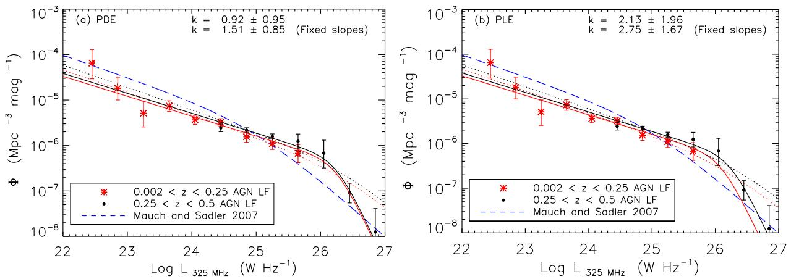

# Galaxy And Mass Assembly (GAMA): The 325 MHz Radio Luminosity Function of AGN and Star Forming Galaxies

 Matthew Prescott1⋆ , T. Mauch2 , M.J. Jarvis1,3 , K. McAlpine1 , D.J.B. Smith4 , S. Fine1 , R. Johnston1 , M.J. Hardcastle4 , I.K. Baldry5 , S. Brough6 , M.J.I. Brown7 , M.N. Bremer8 , S.P. Driver9,10, A.M Hopkins6 , L.S. Kelvin5 ,

J. Loveday11, P. Norberg12, D. Obreschkow9 and E.M. Sadler13

1Department of Physics and Astronomy, University of the Western Cape, Private Bag X17, Bellville 7535, South Africa

2SKA Africa, Third Floor, The Park, Park Road, Pinelands 7405, South Africa

4Centre for Astrophysics Research, Science & Technology Research Institute, University of Hertfordshire, Hatfield, Herts, AL10 9AB, UK

5 Astrophysics Research Institute, Liverpool John Moores University, IC2, Liverpool Science Park, 146 Brownlow Hill, Liverpool, L3 5RF 6 Australian Astronomical Observatory, PO Box 915, North Ryde, NSW 1670, Australia

- 
- 7 School of Physics and Astronomy, Monash University, Clayton, Victoria 3800, Australia
- 8 H.H. Wills Physics Laboratory, University of Bristol, Tyndall Avenue, Bristol BS8 1TL, UK 9
- ICRAR, University of Western Australia, 35 Stirling Highway, Crawley, WA 6009, Australia
- 10 SUPA, School of Physics and Astronomy, University of St Andrews, North Haugh, St Andrews, KY16 9SS, UK
- 11 Astronomy Centre, University of Sussex, Falmer, Brighton BN1 9QH, UK
- 12 Institute for Computational Cosmology, Department of Physics, Durham University, South Road, Durham DH1 3LE, UK
- 13 School of Physics, University of Sydney, NSW 2006, Australia

Accepted 2015 December 30. Received 2015 December 24; in original form 2015 August 27.

#### ABSTRACT

Measurement of the evolution of both active galactic nuclei (AGN) and star-formation in galaxies underpins our understanding of galaxy evolution over cosmic time. Radio continuum observations can provide key information on these two processes, in particular via the mechanical feedback produced by radio jets in AGN, and via an unbiased dust-independent measurement of star-formation rates. In this paper we determine radio luminosity functions at 325 MHz for a sample of AGN and star-forming galaxies by matching a 138 deg2 radio survey conducted with the Giant Metrewave Radio Telescope (GMRT), with optical imaging and redshifts from the Galaxy And Mass Assembly (GAMA) survey. We find that the radio luminosity function at 325 MHz for star-forming galaxies closely follows that measured at 1.4 GHz. By fitting the AGN radio luminosity function out to z = 0.5 as a double power law, and parametrizing the evolution as Φ ∝ (1 + z) k , we find evolution parameters of k = 0.92 ± 0.95 assuming pure density evolution and k = 2.13 ± 1.96 assuming pure luminosity evolution. We find that the Low Excitation Radio Galaxies are the dominant population in space density at lower luminosities. Comparing our 325 MHz observations with radio continuum imaging at 1.4 GHz, we determine separate radio luminosity functions for steep and flat-spectrum AGN, and show that the beamed population of flat-spectrum sources in our sample can be shifted in number density and luminosity to coincide with the un-beamed population of steep-spectrum sources, as is expected in the orientation based unification of AGN.

Key words: surveys – galaxies:luminosity function – galaxies: evolution – galaxies: formation – radio continuum: galaxies – galaxies: active

# 1 INTRODUCTION

In recent years it has become apparent that Active Galactic Nuclei (AGN) play an important role in the formation and evolution of galaxies. Every massive galaxy is now thought

3Oxford Astrophysics, Denys Wilkinson Building, Keble Road, Oxford OX1 3RH, UK

to contain a central supermassive black hole that can undergo periods of rapid gas accretion to produce an AGN. The accretion activity of AGN may also have a strong interplay with star formation. Indirect evidence for this comes from comparisons made between the evolution of AGN activity and the star-formation rate of the Universe, which have been shown to follow each other over cosmic history (e.g. [Franceschini et al. 1999](#page-14-0)). In the local Universe more evidence comes from the correlation between the black hole and bulge masses of galaxies [\(Kormendy & Richstone 1995;](#page-14-1) [Magorrian et al. 1998](#page-14-2)). Although more recent results have shown this relationship deviates from being linear when probing lower masses [\(Graham & Scott 2015](#page-14-3)), the relationship for more massive galaxies is thought to arise from the regulation of star formation in the bulge due to 'AGN feedback' (for a review see [Fabian 2012\)](#page-14-4). AGN feedback has also been incorporated into semi-analytical models [\(Croton et al.](#page-14-5) [2006](#page-14-5); [Bower et al. 2006](#page-14-6)), as a way to quench star formation and produce the observed colour bimodality of galaxies [\(Strateva et al. 2001](#page-15-0); [Baldry et al. 2004](#page-14-7)).

The radio source population probed by the current generation of radio surveys probes a mixture of galaxies powered by star-formation and AGN activity. At 1.4 GHz flux densities of ∼ 10 mJy and above, the majority of radio sources are radio-loud AGN. Below 10 mJy there is an increasing number of star-forming galaxies [\(Condon 1989](#page-14-8)). [Fanaroff & Riley](#page-14-9) [\(1974](#page-14-9)) found that radio-loud AGN could be subdivided into two types (known as Fanaroff-Riley (FR) types I and II), based on their radio morphologies, which were found to show a division at approximately L178−MHz = 1025 W Hz−1 . Those having brighter cores and diffuse lobes are labelled as FR I sources and those with highly collimated jets, which produce 'hot-spots' of high surface brightness at their edges, as FR IIs.

A different classification system based on the presence or absence of narrow emission lines in the optical spectra of radio-loud AGN has also been used over the years [\(Hine & Longair 1979](#page-14-10); [Laing et al. 1994;](#page-14-11) [Jackson & Rawlings 1997](#page-14-12); [Willott et al. 2001\)](#page-15-1). Those with high-excitation emission lines being referred to as High Excitation Radio Galaxies (HERGs) and those without as Low Excitation Radio Galaxies (LERGs). HERGs are the dominant population above L1.4−GHz = 1026 W Hz−1 [\(Best & Heckman 2012](#page-14-13)) and are more likely to be associated with the more powerful FR II sources, compared to the LERGs which are more associated with FR Is (although not exclusively). The dichotomy in these populations is believed to be due to two different modes of accretion, with the LERG population undergoing radiatively inefficient accretion of hot gas from the galaxies' interstellar medium and surrounding galaxies, and the HERG population undergoing radiatively efficient accretion of cold gas by mergers and interactions between the host galaxy and gas rich systems [\(Allen et al. 2006](#page-14-14); [Evans et al. 2006;](#page-14-15) [Hardcastle et al. 2007;](#page-14-16) [Smolˇci´c et al. 2009](#page-15-2); [Heckman & Best 2014;](#page-14-17) [Fernandes et al.](#page-14-18) [2015](#page-14-18)). Both accretion modes are thought to be important processes in the AGN feedback mechanism. In order to fully understand these different mechanisms, the evolution of these populations has to be determined, usually conducted by either a V /Vmax analysis or by producing radio luminosity functions, whose evolution is parametrized in some way.

It is now established that the most powerful radio-loud

AGN (with L1.4−GHz > 1025 W Hz−1 ) evolve strongly over the course of cosmic history, with studies finding an increase in their number densities by a factor of 1000 from z ∼ 0 − 2 [\(Longair 1966](#page-14-19); [Laing et al. 1983](#page-14-20); [Dunlop & Peacock 1990;](#page-14-21) [Willott et al. 2001](#page-15-1)), which then declines beyond z ∼ 3 [\(Shaver et al. 1996](#page-15-3); [Jarvis & Rawlings 2000;](#page-14-22) [Jarvis et al.](#page-14-23) [2001](#page-14-23); [Wall et al. 2005](#page-15-4); [Rigby et al. 2011](#page-15-5)). At lower luminosities, however, the picture is much more uncertain.

In an early study by [Laing et al.](#page-14-20) [\(1983\)](#page-14-20), observations at 178 MHz conducted as part of the 3CRR survey, revealed that sources with L178−MHz < 1026 W Hz−1 exhibit no evolution via a V /Vmax analysis. [Jackson & Wall](#page-14-24) [\(1999](#page-14-24)) also found little or no evolution in the FR I population, compared to FR IIs at frequencies of 151 MHz. The trend that low luminosity sources (L < 1025 W Hz−1 ) evolve much less than higher luminosity sources was also seen by [Waddington et al.](#page-15-6) [\(2001](#page-15-6)). At 325 MHz, [Clewley & Jarvis](#page-14-25) [\(2004](#page-14-25)) found no significant evolution for sources with L325−MHz < 1026.1 W Hz−1 sr−1 out to z = 0.8, from matching radio data from the Westerbork Northern Sky Survey (WENSS; [Rengelink et al. 1997](#page-15-7)) with optical SDSS DR1 data and performing a V /Vmax analysis.

These results are in contrast to those of [Brown et al.](#page-14-26) [\(2001](#page-14-26)) who found strong evolution in the low luminosity radio population at 1.4 GHz out to z = 0.55, and by assuming pure luminosity density evolution of the form L ∝ (1 + z) k found 3 < k < 5 for AGN with 1023 < L1.4−GHz < 1025 W Hz−1 . [Sadler et al.](#page-15-8) [\(2007\)](#page-15-8) also found significant evolution for AGN with 1024 < L1.4−GHz < 1025 W Hz−1 consistent with pure luminosity evolution where L ∝ (1+z) 2.0±0.3 from z = 0.7, using the 2SLAQ [\(Cannon et al. 2006\)](#page-14-27) catalogue combined with Faint Images of the Radio Sky at Twenty-Centimeters (FIRST, [Becker et al. 1995](#page-14-28)) and NRAO VLA Sky Survey (NVSS, [Condon et al. 1998\)](#page-14-29).

More recent studies, probing fainter fluxes, have found milder evolution in low-luminosity AGN. [Smolˇci´c et al.](#page-15-2) [\(2009](#page-15-2)) produced 1.4 GHz luminosity functions using the VLA-COSMOS survey for AGN with 1021 < L1.4−GHz < 1026 W Hz−1 to z = 1.3 and found modest evolution, with L ∝ (1 + z) 0.8±0.1 , or Φ ∝ (1 + z) 1.1±0.1 , assuming pure luminosity and density evolution respectively.

[McAlpine & Jarvis](#page-15-9) [\(2011](#page-15-9)) found that low-luminosity sources evolve differently from their high-luminosity counterparts out to a redshift of z = 0.8 and the measured radio luminosity function was found to be consistent with an increase in the comoving space density of low-luminosity sources by a factor of 1.5.

[Simpson et al.](#page-15-10) [\(2012\)](#page-15-10) using deep S1.4 > 100 µJy radio imaging in the Suburu/XMM-Newton Deep Field, produced 1.4 GHz luminosity functions divided into the radio-loud and radio-quiet AGN populations. They found that radioquiet population evolves more strongly than the radio-loud population. Again very little or no evolution in the number density of the radio-loud AGN with L1.4−GHz ≤ 1024 W Hz−1 out to z = 1.5 was observed.

Using 1.4 GHz VLA data combined with photometric redshifts from the VIDEO survey, [McAlpine et al.](#page-15-11) [\(2013](#page-15-11)) found that AGN evolve as L ∝ (1 + z) 1.18±0.21 at relatively low radio luminosities, assuming pure luminosity evolution.

Finally, using deep from deep (∼ 30µJy) 1.4 GHz VLA observations of the Chandra Deep Field South (CDFS) [Padovani et al.](#page-15-12) [\(2015](#page-15-12)) find that the number density of radio loud AGN evolves as ∝ (1 + z) 2 out to z = 0.5, after which it declines steeply as ∝ (1 + z) −4 .

As well as tracing the population of AGN, radio emission is produced from electrons in the Hii regions near massive stars (free-free emission) and cosmic ray electrons produced by supernova remnants (synchrotron emission), and offers a probe of recent star-formation in galaxies without the need for an uncertain extinction correction [\(Condon](#page-14-30) [1992](#page-14-30)). It has become well established that the star-formation rate of the Universe has declined by a factor of ∼ 10, from z = 1.0 to z = 0.0 [\(Lilly et al. 1996;](#page-14-31) [Madau et al.](#page-14-32) [1996](#page-14-32); [Hopkins & Beacom 2006](#page-14-33); [Madau & Dickinson 2014](#page-14-34)). Studies such as [Hopkins](#page-14-35) [\(2004](#page-14-35)) for example, incorporated 1.4 GHz measurements into a compilation of star-formation indicators to show that the star-formation rate in galaxies evolves as L ∝ (1 + z) 2.7±0.6 for pure luminosity evolution and φ ∝ (1+z) 0.15±0.6 for density evolution. [Padovani et al.](#page-15-13) [\(2011](#page-15-13)) also found that star forming galaxies evolve as L ∝ (1 + z) 2.89±0.1 , out to z = 2.3, at 1.4 GHz using VLA observations of the Chandra Deep Field South (CDFS). More recently, [McAlpine et al.](#page-15-11) [\(2013](#page-15-11)) measured the 1.4 GHz radio luminosity function of star-forming galaxies, from VLA data combined with photometric redshifts from the VIDEO survey. They measured evolution in the star-formation rate density as L ∝ (1 + z) 2.47±0.12 out to z = 1.

In this paper we present a measurement of the evolution of radio-loud AGN and star forming galaxies to z = 0.5, by matching a catalogue of radio sources measured at a frequency of 325 MHz from the Giant Metrewave Radio Telescope (GMRT) to their optical counterparts in the Galaxy And Mass Assembly (GAMA) survey. The 325 MHz GMRT survey is the deepest available to date, over a sky area significant enough to alleviate the effects of cosmic variance. The GAMA survey provides reliable spectroscopic redshifts, allowing us to spectroscopically classify AGN and star-forming galaxies, in addition to providing more accurate redshift and luminosity estimates than studies using photometric redshifts. At present, studies of the evolution in the radio source population made from samples selected at frequencies below 1.4 GHz have primarily relied on radio data with a relatively shallow flux density limit and on photometric redshifts in the optical (e.g. [Clewley & Jarvis 2004](#page-14-25)). Radio-loud AGN samples selected at lower radio frequencies are of interest because the detected population is less dependent on the orientations of the jets. The steep-spectrum lobes of radio galaxies dominate at lower radio frequencies, whereas in the GHz regime the doppler boosted flat-spectrum cores of poleon sources are more likely to be detected [\(Jarvis & McLure](#page-14-36) [2002](#page-14-36)).

The structure of this paper is as follows. In Section 2 we outline the GAMA survey and the GMRT data used in this study. In Section 3 we explain the technique to match the radio sources to their optical counterparts. In Section 4 we describe the way we have classified AGN and star forming galaxies. In Section 5 we highlight some of the sample properties and show how the spectral indices of the sources vary as a function of luminosity and redshift. In Section 6 we present our radio luminosity functions, and determine the evolution in low-luminosity radio sources. We go on to produce RLFs for the HERG and LERG populations, and RLFs for AGN with steep and flat spectral indices. In Section 7 we compare our results to other studies. Finally in Section 8 we summarise our main results.

Throughout this paper we assume H0 = 70 kms−1 Mpc−1 , Ωm = 0.3 and ΩΛ = 0.7.

# 2 DATA

#### 2.1 Galaxy And Mass Assembly

GAMA is a multi-wavelength (far-UV to radio) survey of ∼ 290 000 galaxies selected to be complete to r = 19.8 mag, combining photometry and spectroscopy from the latest wide-field survey facilities [\(Driver et al. 2009](#page-14-37), [2011;](#page-14-38) [Liske et al. 2015](#page-14-39)). Covering ∼ 290 deg2 and probing galaxies to z ∼ 0.5, GAMA allows the study of galaxies and cosmology on scales between 1 kpc and 1 Mpc and provides the link between wide-shallow surveys, such as the SDSS Main Galaxy Sample [\(Strauss et al. 2002,](#page-15-14) SDSS MGS) and 2dFGRS [\(Colless et al. 2001](#page-14-40)), and narrow-deep surveys such as DEEP2 [\(Davis et al. 2003](#page-14-41)), zCOSMOS [\(Lilly et al. 2007](#page-14-42)) and VVDS [\(Le F`evre et al. 2005](#page-14-43)).

Optical spectroscopy for the GAMA survey was conducted at the 3.9-m Anglo-Australian Telescope (AAT) using the AAOmega spectrograph [\(Sharp et al. 2006](#page-15-15)) on 210 nights, over 6 years, between January 2008 and September 2014. For further details about spectroscopic target selection and the tiling strategy used for GAMA, the reader is referred to [Baldry et al.](#page-14-44) [\(2010\)](#page-14-44) and [Robotham et al.](#page-15-16) [\(2010](#page-15-16)) respectively. In brief, galaxies are selected for spectroscopy using an input catalogue drawn from the Sloan Digital Sky Survey (SDSS) Data Release 7 [\(Abazajian et al.](#page-13-1) [2009](#page-13-1)) and UKIRT Infrared Deep Sky Survey (UKIDDS) [\(Lawrence et al. 2007](#page-14-45)). Raw spectra are reduced and calibrated using a pipeline described in [Hopkins et al.](#page-14-46) [\(2013](#page-14-46)). GAMA makes extensive use of SDSS photometry, which is obtained for five broad-band filters (ugriz) using a dedicated 2.5-m telescope at Apache Point, New Mexico, equipped with a mosaic CCD camera [\(Gunn et al. 1998](#page-14-47)) and calibrated with a 0.5-m telescope [\(Hogg et al. 2001](#page-14-48)). For greater detail regarding the SDSS the reader is referred to [York et al.](#page-15-17) [\(2000\)](#page-15-17) and [Stoughton et al.](#page-15-18) [\(2002](#page-15-18)).

In the following analysis we use imaging data for galaxies which make up the r-band limited Main Survey, observed in three 12 × 5 deg2 GAMA fields located along the celestial equator at 9h, 12h and 14.5h (known as G09, G12 and G15). In order to measure the radio luminosity function and its evolution, we select galaxies from GAMA TilingCat43 with redshifts between 0.002 < z < 0.6, nQ ≥ 3, r ≤ 19.8 mag and a Survey Class ≥ 4 which ensures we are using reliable redshifts and have a well defined selection limit in which we are > 98 per cent complete. This results in a sample of 185, 125 galaxies over G09, G12 and G15.

# 2.2 GMRT data

The 325 MHz radio survey covering the GAMA fields, using the Giant Meterwave Radio Telescope (GMRT), is fully described in [Mauch et al.](#page-14-49) [\(2013](#page-14-49)) [1](#page-2-0) . A total of 212, 15 minute pointings were observed over 8 nights in January 2009, 3

1 See also: http://www.extragalactic.info/mjh/gmrt/

nights in May 2010 and 1 night in June 2010. These pointings overlap with 138 deg2 of the GAMA G09, G12 and G15 regions. Flagging, calibration, self-calibration and source detection of each pointing was conducted using a pipeline making use of the AIPS software package. After reduction, the pointings in each field were mosaiced, producing images with resolutions of 14′′, 15′′ and 23.5 ′′ with minimum rms noises of ∼ 0.8 mJy beam−1 , ∼ 1 mJy beam−1 and ∼ 1.5 mJy beam−1 , for fields G09, G12 and G15, respectively. A source catalogue was produced by fitting elliptical Gaussians in the mosaics, which resulted in a final catalogue that contains 5, 264 sources. To remove spurious detections, we limited the GMRT catalogue to include only sources brighter than 5σ (Peak flux density/local RMS ≥ 5), resulting in a catalogue of 4 931 radio sources.

# 3 GAMA/GMRT CROSS-MATCHING

Cross-matching between the GAMA and the GMRT catalogues was conducted by visual inspection of radio contours onto optical images. This was done because the elliptical Gaussian model fitted to GMRT radio sources is insufficient to describe the wide range of source morphologies at the resolution of the survey and the Gaussian fits are also sometimes affected by image artefacts. Automated cross-matching of the catalogues based on position separation will be unable to take account of these errors. We treat the cross-matching of single and multiple component radio sources separately, where radio sources within a radius of 50′′ of each other are considered as being potential multiple component sources. Sources with no other radio source within 50′′ are treated as single component sources. Using this method we are considering every potential optical counterpart from GAMA within 50′′ of a GMRT radio source.

# 3.1 Single Component Sources

There are 3 616 single component radio sources (i.e. sources with no other radio source within 50′′) in the GMRT catalogue. In order to find optical counterparts, each radio source is matched to the nearest object in the selected GAMA spectroscopic catalogue with a maximum offset of 15′′. Contour maps of each GMRT source were then produced and overlaid on top of a 3′ × 3 ′ SDSS r-band images of the potential counterpart, and inspected to establish whether the radio source has a robust optical counterpart. Visual inspection was performed by two of us to ensure its reliability. As a double-check to ensure the GMRT indentifications were real, contour maps from the 1.4 GHz surveys FIRST and NVSS, where available, were also overlaid on the SDSS image. The FIRST and NVSS contours complement the GMRT data when matching, as FIRST provides resolved (6.4 ′′×5.4 ′′ resolution in the GAMA regions) detections of the sources and the NVSS, despite its lower resolution of 45′′, has greater surface brightness sensitivity.

Of the 3 616 single component sources, we found 573 lie within 15′′ of a GAMA source in the selected spectroscopic catalogue. We then visually matched 370 out of these GMRT sources with their optical counterparts in GAMA.

For comparison, we also looked for single component counterparts using the likelihood ratio technique [\(Sutherland & Saunders 1992;](#page-15-19) [Smith et al. 2011;](#page-15-20) [McAlpine et al. 2012](#page-15-21)). This resulted in 330 GAMA/GMRT matches with reliabilities > 0.8. This method resulted in fewer matches overall, mainly due to the non-trivial structure of many radio sources at the GMRT resolution (e.g. [McAlpine et al. 2012\)](#page-15-21), so we use our visually classified sample for the rest of this paper. At present visual classifcation is acknowledged as being the most reliable method of cross matching radio source catalogues with optical datasets (e.g. [Fan et al. 2015](#page-14-50)).

# 3.2 Multiple Component Sources

To find the counterparts of multiple component sources (i.e. radio sources with a radio counterpart within 50′′), GMRT contour maps of all radio sources were again overlaid with FIRST and NVSS contours, on top of a 5′ ×5 ′ SDSS r-band image of the nearest GAMA object. Visual inspection of candidate multiple component radio sources was performed in the same way as was done for single component sources.

From the initial GMRT catalogue of 4 931 5σ radio source components, we found 757 potential multiple component sources. After inspection we identified 84 multiple component radio sources, together with a further 46 objects that turned out to be separate single component sources near unrelated GMRT sources that could not be matched (bringing the total number of single component sources to 414). The flux densities of multiple component objects are simply the sum of the flux density of each individual component in the GMRT catalogue.

Figure [1](#page-4-0) shows an example of one of the GAMA/GMRT matches, GAMAJ085701.76+013130.9, with the SDSS rband image overlaid with radio contours from the GMRT (blue), FIRST (yellow) and NVSS (red). At z = 0.27 this galaxy has a projected size of ∼ 1.3 Mpc and is a previously undiscovered Giant Radio Galaxy (GRG; [Schoenmakers et al. 2001](#page-15-22); [Saripalli et al. 2005\)](#page-15-23). Automated methods such as the likelihood ratio technique in this case would be able to match the core of the radio source to an optical counterpart, but would incorrectly match the lobes to some other optical source, if considered separately.

# 3.3 Positional Offsets

Figure [2](#page-4-1) shows the positional offsets between the GAMA and GMRT positions of the 414 single component sources. The median positional offset between the coordinates is found to be 1.51′′ .

To test our matching process, in Figure [3](#page-4-2) we show the distribution of the positional offsets between each of the 185, 125 GAMA sources and the 4, 931 GMRT sources (blue dashed line). Here, this is compared to the positional offsets between the mean of 10 GAMA catalogues with randomised positions and again matched to the nearest GMRT source (black solid line). The curves converge at a separation of 15′′ , which implies that genuine GMRT/GAMA matches should all lie with 15′′ of one another.

Integrating both curves out to 15′′, yields 778 matches between the real GAMA/GMRT catalogues and 267 matches between the random/GMRT catalogue which indicates 511 genuine GAMA/GMRT matches are expected,

15 10 05 8:57:00 55 56:50 28:00Right ascension Figure 1. An example of one of the GMRT/GAMA matches GAMAJ085701.76+013130.9, showing the SDSS r-band image, overlaid with radio contours from the GMRT (blue), FIRST (yellow) and NVSS (red). At z = 0.27, the FR II AGN has a projected

size of 1.3 Mpc, making it a previously undiscovered giant radio

35:00

34:00

33:00

32:00

31:00

Declination

1:30:00

29:00

galaxy (GRG).

Figure 2. The positional offsets between the GAMA and GMRT for the 414 single component matches out to z =0.6. The circular line represents a radius of 15′′ .

Figure 3. Histogram displaying the positional offset between each of the 185, 125 GAMA sources in the spectroscopic catalogue, with z < 0.6 and nQ ≥ 3 and r ≤ 19.8, matched to the nearest of the 4, 931 5σ GMRT sources within 3′ (blue dashed line). This is compared to the positional offsets between the mean of 10 random GAMA catalogues matched to the nearest GMRT source (black solid line).

which is consistent with our final sample of 499 (414 single and 84 multiple component) GAMA/GMRT matches.

We find that ∼ 10 per cent (499/4931) of the radio sources are matched to GAMA. This is a higher fraction than other matched radio/optical samples with similar radio flux density limits, for example [Sadler et al.](#page-15-24) [\(2002\)](#page-15-24) and [Mauch & Sadler](#page-14-51) [\(2007](#page-14-51)) find that ∼ 1–2 per cent of NVSS radio sources are detected in the 2dFGRS and 6 degree Field Galaxy Survey (6dFGS [Jones et al. 2004](#page-14-52)). This is due to the fainter optical limits of GAMA, which probes a larger range of redshifts.

# 4 SOURCE CLASSIFICATION

After matching the optical/radio counterparts, we divided our sample into AGN and star-forming (SF) galaxies, by inspecting their individual optical spectra, in a similar fashion to [Sadler et al.](#page-15-24) [\(2002](#page-15-24)) and [Mauch & Sadler](#page-14-51) [\(2007\)](#page-14-51). AGN can have spectra with either pure absorption features like that of an elliptical galaxy, broadened emission features (known as Type I AGN), strong nebular emission [Oii], [Oiii] and [Nii] lines compared to the Balmer series (known as Type II AGN), or spectra with absorption lines with weak narrow emission lines (LINERS). In this work, sources with optical spectra revealing strong narrow emission lines consistent with Hii regions, were classified as being star-forming galaxies. Examples of spectra for AGN and star-forming galaxies can be seen in Figure [4.](#page-5-0) The spectrum for each object was inspected independently by three people to ensure that each classification was reliable and subsequently double-checked with the AGN/SF [Kewley et al.](#page-14-53) [\(2001](#page-14-53)) classifications, if it was available in GAMA's emission line catalogue.

From the sample of 499 GAMA/GMRT matches out to z = 0.6, we classified 453 sources as AGN and 45 as star-forming galaxies. Upon further inspection, one source, GAMA J142831.94+014331.4, was found serendipitously to

(c) Star forming galaxy.

Figure 4. Example optical spectra found in our GAMA/GMRT matched sample (black lines). Also plotted is the 1 sigma error (green lines) and sky (blue). AGN are classified as having either pure absorption features (a) or broadened emission features (b). A spectrum of a typical star forming galaxy that have strong, narrow, emission lines such as Hα can be seen in (c).

be an F5 type radio star in the catalogue of [Kimball et al.](#page-14-54) [\(2009](#page-14-54)).

# 5 SAMPLE PROPERTIES

Each source in our GAMA/GMRT catalogue was detected by the NVSS and we assigned an NVSS identifcation (and 1.4 GHz flux density) during the visual cross-matching process. In order to determine radio luminosities of each object, we k-correct the observed flux densities assuming Sν ∝ ν α and use spectral indices determined from the ratios between the 325 MHz and 1.4 GHz fluxes retrieved from the NVSS catalogue.

Median redshifts were found to be z = 0.36 for the AGN, and z = 0.06 for the star forming galaxies. In Figure [5](#page-6-0) and Figure [6](#page-6-1) we show the redshift distribution histogram and the redshift versus radio luminosity plane respectively, for both the AGN and star-forming galaxies. These figures illustrate that star forming galaxies become the dominant population of radio sources in the local Universe (z < 0.1) at the limit of ∼ 10 mJy at 325 MHz.

# 5.1 Spectral Indices

Given that every 325 MHz GMRT source has a detection at 1.4 GHz from the NVSS, we can investigate the spectral index distribution for both star-forming galaxies and AGN. Figure [7](#page-7-0) shows the distribution of the spectral indices across the whole sample. We find that the median spectral indices for AGN and star forming galaxies are α = −0.68 ± 0.22 and α = −0.82 ± 0.28 respectively, which agree well with values reported by [Mauch et al.](#page-14-55) [\(2003\)](#page-14-55), [Owen et al.](#page-15-25) [\(2009](#page-15-25)), [Mauch et al.](#page-14-49) [\(2013](#page-14-49)), [Randall et al.](#page-15-26) [\(2012](#page-15-26)), [Smolˇci´c et al.](#page-15-27) [\(2014](#page-15-27)) and [Coppejans et al.](#page-14-56) [\(2015](#page-14-56)).

Figure [8](#page-7-1) shows how the spectral indices of AGN and star forming galaxies vary as a function of redshift. In the past, steep spectral indices have been used to select high-redshift radio galaxy candidates from low-frequency radio surveys (e.g. [Jarvis et al. 2001;](#page-14-23) [De Breuck et al. 2001](#page-14-57); [Cruz et al.](#page-14-58) [2006](#page-14-58)), however we find that there is no significant steepening of the spectral index in our sample with redshift, albeit over a relatively low redshift range. This trend was also found by [Smolˇci´c et al.](#page-15-27) [\(2014](#page-15-27)) out to z = 2.5, in a 325 MHz VLA survey of the COSMOS field.

In Figure [9,](#page-7-2) we show the spectral indices as a function of luminosity. Although there is large scatter in the data, we find there is a slight decrease in spectral index with increasing luminosity for the AGN. This decrease may arise due to an increasing contribution from higher luminosity FR II sources whose emission will be dominated by steep-spectrum optically-thin lobes. A straight line of best fit to the AGN datapoints yields a gradient of m = −0.077±0.022 and constant of c = 1.23 ± 0.55. A Spearman Rank correlation test gives a coefficient of ρ = −0.229 with a significance of the deviation from zero of 1.02 × 10−6 , indicating a weak but significant correlation.

# 6 RADIO LUMINOSITY FUNCTIONS

#### 6.1 Measuring the Radio Luminosity Function

To measure the cosmic evolution of the radio sources, we determine the radio luminosity functions (RLFs) for different redshift slices using the 1/Vmax method, where Vmax is the maximum comoving volume within which a galaxy could lie within a redshift slice and within the flux limits of the sur-

Figure 5. Redshift distribution of GAMA-GMRT matched AGN (solid red line) and star forming galaxies (dashed blue line). The median redshift for the AGN is z = 0.36, and 0.06 for the star forming galaxies.

Figure 6. The luminosity-redshift distribution of the matched GAMA-GMRT sources, showing single component AGN (red filled circles), multiple component AGN (red diamonds), and star forming galaxies (blue stars). Star forming galaxies become the dominant radio sources at z < 0.1 at the limits of the GMRT survey.

vey [\(Schmidt 1968](#page-15-28)). The RLF for a given luminosity bin is given by:

$$\Phi\_z(L) = \sum\_{i=1}^{N} \frac{1}{C\_i \times V\_{\text{max},i}},\tag{1}$$

Here Ci is the completeness of the survey. We determine upper and lower 1σ Poisson confidence limits using the approximation prescribed in [Gehrels](#page-14-59) [\(1986](#page-14-59)). As our sample is a matched radio/optical sample we have to take into account both the optical and radio limits of the surveys, where Vmax is the taken as the minimum from the optical and radio Vmax for each source:

$$V\_{\text{max}} = \min(V\_{\text{max}, \text{radlo}}, V\_{\text{max}, \text{optical}}) \tag{2}$$

Vmax,optical was computed from zmax,optical, the maximum redshift in which a galaxy can be observed, calculated

Figure 7. The spectral index distribution for AGN (red, solid line) and star forming galaxies (blue, dashed line). The spectral indices of the sources are calculated from the ratios between 325 MHz GMRT and 1.4 GHz NVSS flux densities.

Figure 8. The spectral index distribution for AGN (red dots) and star forming galaxies (blue stars) as a function of redshift. The black crosses and error bars indicate the mean and standard error on the mean of the spectral index for the AGN in bins of ∆z = 0.05. The red line shows the line of best fit for the AGN datapoints. The average spectral indices remains more or less constant with increasing redshift.

via SED fitting of the optical spectra described fully in [Taylor et al.](#page-15-29) [\(2011\)](#page-15-29). As the GMRT mosaics have nonuniform sensitivity, the effective area of the survey changes as a function of the flux limit. The volume of space available to a source of a given luminosity L(Vmax,radio) has to be calculated by taking into account the variation of survey area as a function of flux density limit. Figure [10](#page-7-3) shows how the cumulative area of the survey varies as a function of rms noise for each of the GMRT mosaics covering G09, G12 and G15. We use the same method of calculating Vmax,radio described in [Smolˇci´c et al.](#page-15-2) [\(2009](#page-15-2)). Firstly the differential area in the survey in small bins of rms noise is determined for each field from Figure [10.](#page-7-3) To calculate Vmax,radio for a radio source with luminosity L, we compute the maximum redshift (zmax,i) that the source would have in each differential rms bin i across the 3 survey fields. zmax,i is the redshift the source would have before it drops out of the survey at 5 times the rms of the bin i. Vmax,radio for the source is then

Figure 9. The spectral index distribution for AGN (red dots) and star forming galaxies (blue stars) as a function of luminosity. The red solid line shows the line of best fit for the AGN datapoints. The black crosses and error bars indicate the mean and standard error on the mean of the spectral index for the AGN in bins of ∆ log10(L325) W Hz−1 = 1. There is a slight decrease in the spectral index with increasing luminosity.

Figure 10. Figure showing the cumulative area as a function of rms noise level, for each of the three GAMA regions. The total areal coverages for G09, G12 and G15 are 50.9, 42.3 and 45.0 deg 2 respectively.

just the sum of all of the individual Vmax,radio,i normalised by the survey area of that rms bin Ai:

$$V\_{\text{max,radlo}} = \sum\_{i=1}^{n} F\_i \times V\_{\text{max,radlo},1}(z\_{\text{max,l}}),\tag{3}$$

where Fi is the fraction of sky corresponding to the area in the bin i, and the sum is over all bins in each of the three fields.

The completeness, Ci, in Equation [1](#page-6-2) for the RLFs is a combination of the redshift success and a radio completeness (Ci = Credshift success×CR). The redshift success is defined as the number of sources with a reliable redshift determination (NQ ≥ 3) divided by the total number of sources in the input catalogue within a given r-band fiber magnitude. In [Loveday et al.](#page-14-60) [\(2015\)](#page-14-60), the redshift success is shown to be well fitted by a modified sigmoid function (see their Equation 1)

Figure 11. Radio completeness as a function of the signal-tonoise ratio. Red data points show the fraction of simulated sources detected in the GMRT images fitted with a cumulative distribution function (black line). In this study we only use sources with an SNR≥ 5, and so CR > 0.5 for each source.

which we apply here. The GAMA survey is highly complete and has a redshift success of 99 per cent at rPetro = 19.2 and 96 per cent at the survey limit of rPetro = 19.8 (see [Liske et al.](#page-14-39) [\(2015](#page-14-39)) for more details).

Errors in fitting fainter sources in the GMRT catalogue can cause it to be incomplete near the radio survey limit. We have derived the completeness as a function of signal-tonoise for the GMRT catalogue by inserting 6000 simulated sources over a range of flux densities at random positions into 3 images from the survey, one from each of the G09, G12 and G15 fields. We then used the same source finding procedure outlined in Section 4 of [Mauch et al.](#page-14-49) [\(2013](#page-14-49)) to detect the simulated sources. Figure [11](#page-8-0) shows the fraction of simulated sources detected in the GMRT images (i.e. the completeness) as a function signal-to-noise ratio. We have fitted the data with the cumulative distribution function:

$$C\_R = 0.5 \left[ 1 + \text{erf} \left( \frac{\text{SNR} - \mu}{\sqrt{2}\sigma} \right) \right] \tag{4}$$

Where CR is the radio completeness correction, SNR is the local signal-to-noise ratio, µ = 5.1 and σ = 1.4.

#### 6.2 Star-forming galaxies

The 325 MHz radio luminosity function for star-forming galaxies between 0.002 < z < 0.1 for our sample can be seen in Figure [12](#page-9-0) (and Table [1\)](#page-8-1). The sample is truncated at z < 0.1 to minimise the effects of evolution. The shape of the RLF is broadly consistent with the local RLF of [Mauch & Sadler](#page-14-51) [\(2007](#page-14-51)) converted to 325 MHz from 1.4 GHz assuming a spectral index of α = −0.7. One key difference between these surveys is the short baseline coverage that allows extended sources to be recovered in the study of [Mauch & Sadler](#page-14-51) [\(2007](#page-14-51)), whereas such sources may be missed in the GMRT survey. We therefore may not be sensitive to such extended sources, and our measured RLF should be treated as a lower limit.

Assuming synchrotron self-absorption becomes important in star forming galaxies, at lower frequencies we would expect a population of flatter spectrum sources to shift the

| Luminosity (log10(L325−MHz)) | Number Density (Mpc−3mag−1 ) | Number |
|---------------------------------|------------------------------------|--------|
| 22.15                           | 2.72+2.22 −1.32 × 10−4          | 4      |
| 22.55                           | 1.00+2.11 −0.81 × 10−3          | 7      |
| 22.95                           | 6.10+2.36 −1.76 × 10−5          | 14     |
| 23.35                           | 1.63+0.73 −0.53 × 10−5          | 10     |
| 23.75                           | 2.09+2.75 −1.35 × 10−6          | 2      |
| 24.15                           | 1.86+4.26 −1.54 × 10−6          | 1      |
| Total                           |                                    | 38     |

Table 1. The 325 MHz Radio Luminosity Function for star forming galaxies.

median spectral index above α = −0.7. In Figure [9](#page-7-2) we see no significant population of flat spectrum sources in the star forming population, which, assuming sychrotron self absorption means we are likely to be missing sources in the flux density range of the SF galaxies. These may be missing due to resolution bias; i.e. they have a peak flux density below the survey limit, but their total flux density would be above the limit, if they were detected. This may even be occuring at the relatively low-resolution and surface brightness sensitivity of the GMRT data.

No evolution measurement is possible from our data, as only six star forming galaxies are detected above z = 0.1, with the majority actually at z < 0.1 (Figure [5\)](#page-6-0). It is evident we are missing the faintest star forming galaxies with log10 L325 < 22.0. To rectify this, deeper radio data with µJy flux limits, over the same area of sky, would be needed to further constrain the faint-end of the luminosity function at frequencies of 325 MHz. Indeed this is one of the key science cases for current and future deep radio surveys covering much smaller areas [\(Jarvis et al. 2014](#page-14-61); [McAlpine et al.](#page-15-30) [2015](#page-15-30)).

With these caveats in mind we can derive a lower limit of the local star-formation rate density, using the 1.4 GHz luminosities of the galaxies and converting them to star formation rates (in M⊙ yr−1 ) via the relation presented in [Bell](#page-14-62) [\(2003](#page-14-62)), we estimate the total star formation rate density as ρSFR = Σ(SFR/Vmax) = 0.013 ± 0.002 M⊙ yr−1 Mpc−3 .

Many different estimators have been used to determine the star formation rate density of the Universe. At 1.4 GHz [Mauch & Sadler](#page-14-51) [\(2007](#page-14-51)) find the star formation rate of the local Universe to be ρSFR = 0.022 ± 0.001 M⊙ yr−1 Mpc−3 , which is slightly greater than our result. Using Hα measurements [Gunawardhana et al.](#page-14-63) [\(2013](#page-14-63)) have also estimated the evolution of the star formation density out to z < 0.34. Using values from their Table 3, ρSFR = 0.024 ± 0.006 M⊙ yr−1 Mpc−3 between 0 < z < 0.24. [Westra et al.](#page-15-31) [\(2010](#page-15-31)) using data from the Smithsonian Hectospec Lensing Survey (SHELS) measured a value of ρSFR = 0.018 M⊙ yr−1 Mpc−3 out to z < 0.2. [James et al.](#page-14-64) [\(2008\)](#page-14-64) found the star formation density of local star forming galaxies to lie between ρSFR = 0.016 and ρSFR = 0.023 M⊙ yr−1 Mpc−3 from a sample of galaxies in the Hα Galaxy Survey.

Figure 12. The 325 MHz radio luminosity function for star forming in the redshift range 0.002 < z < 0.1 shown in blue. This is compared to the local RLF of [Mauch & Sadler](#page-14-51) [\(2007\)](#page-14-51), which has converted to 325 MHz from 1.4 GHz assuming a spectral index of α = −0.7, shown in black. Error bars are determined using the prescription of [Gehrels](#page-14-59) [\(1986](#page-14-59)).

#### 6.3 AGN

The RLFs for AGN in two redshift slices (0.002 < z < 0.25 and 0.25 < z < 0.5) are shown in Figure [13](#page-11-0) (See Table [2](#page-10-0) for the RLF values). We find that the 325 MHz RLF at these redshifts is comparable to the local 1.4 GHz RLF of [Mauch & Sadler](#page-14-51) [\(2007](#page-14-51)) converted to 325 MHz assuming a spectral index of α = −0.7. There also appears to be evidence for positive evolution, at least at L325 > 1025 W Hz−1 .

In order to quantify the cosmic evolution of the AGN, following [Dunlop & Peacock](#page-14-21) [\(1990](#page-14-21)), we fit a double power law function to the data given by:

$$\Phi(L) = \frac{C}{(L\_\ast/L)^A + (L\_\ast/L)^B},\tag{5}$$

where C is the normalisation, L∗ is the luminosity corresponding to the break in the RLF and A and B are the bright and faint end slopes. We simultaneously fit both redshift slices for evolution assuming two scenarios for the RLF, one in which the luminosity of the radio sources is fixed and undergoes pure density evolution parametrized by:

$$
\Phi\_z(L) = (1+z)^k \Phi\_0(L),
\tag{6}
$$

and another in which the number density of radio sources is fixed and the population undergoes pure luminosity evolution:

$$\Phi\_z(L) = \Phi\_0 \left( \frac{L}{(1+z)^k} \right),\tag{7}$$

where Φz(L) is the RLF at redshift z, Φ0(L) the normalisation of the local RLF, and k denotes the strength of the evolution.

Figure [13](#page-11-0) shows the best fits for both evolution scenarios. We fit these assuming both a fixed and variable bright and faint-end slopes of the RLF. For the fixed slopes, we use those found in the local 1.4 GHz luminosity function of [Mauch & Sadler](#page-14-51) [\(2007](#page-14-51)), with A = 1.27 and B = 0.49. The parameter values obtained from the fits are shown in Table [3.](#page-10-1)

We find evidence of mild evolution in the AGN RLF. Evolution parameters of k = 0.92 ± 0.95 in the case of pure density evolution and k = 2.13 ± 1.96 for pure luminosity evolution, are obtained without fixing the faint and bright-end slopes. Fixing the slopes to the values found by [Mauch & Sadler](#page-14-51) [\(2007](#page-14-51)), we find k = 1.51 ± 0.92 for pure density evolution and k = 2.75 ± 1.51 for pure luminosity evolution. The values of the bright-end slopes we find when fitting for all the parameters are steeper than those found by [Mauch & Sadler](#page-14-51) [\(2007](#page-14-51)), but the faint-end slope is very similar. L∗ and C are similar in all the fits, with log10(L∗ ≈ 26.25 W Hz−1 ) and the normalisation C ≈ −6.5 Mpc−3 in all cases.

We also fit straight lines of best fit to the AGN data for the whole range of luminosities and those with log10 L325 < 24.5 W Hz−1 , which have the form in the case of pure density evolution:

$$
\log\_{10} \Phi\_z = m \log\_{10} L + k \log\_{10} (1+z) + c,\tag{8}
$$

and in pure luminosity evolution:

$$
\log\_{10} \Phi\_z = m(\log\_{10}(L) - k \log\_{10}(1+z)) + c. \tag{9}
$$

These fits yield the values shown in Table [5.](#page-14-65) Stronger evolution is found for both scenarios, when fitting the whole range of luminosities, which indicates that lower luminosity sources undergo less evolution than higher luminosity sources log10 L325−MHz > 24.5 W Hz−1 a trend which has been seen by [Waddington et al.](#page-15-6) [\(2001](#page-15-6)); [Willott et al.](#page-15-1) [\(2001](#page-15-1)); [Tasse et al.](#page-15-32) [\(2008](#page-15-32)); [Donoso et al.](#page-14-66) [\(2009](#page-14-66)); [Rigby et al.](#page-15-5) [\(2011](#page-15-5)); [Simpson et al.](#page-15-10) [\(2012](#page-15-10)).

To investigate this further, we follow [Clewley & Jarvis](#page-14-25) [\(2004](#page-14-25)) and calculate the parameter free V /Vmax statistic as a function the radio luminosity. The V in this case is the volume enclosed by the source at its true redshift and Vmax is the volume up to which it could still be found given the survey parameters, i.e. the same Vmax used to calculate the RLF. For a non-evolving population, then the radio sources should be uniformly distributed between 0 and 1 for this statistic, resulting in a constant co-moving population giving a value of V /Vmax = 0.5, whereas a negatively evolving population would give V /Vmax < 0.5 and a positively evolving population resulting in V /Vmax > 0.5. Figure [14](#page-11-1) shows the V /Vmax statistic for our sample, at radio luminosities L325MHz < 1025 W Hz−1 the population does not appear to be evolving, whilst at L325MHz > 1025 W Hz−1 there appears to be some evidence for positive evolution. At the faintest luminosities it is possible that we don't see evolution due to the lack of volume probed. This is similar to what was found by [Clewley & Jarvis](#page-14-25) [\(2004](#page-14-25)) albeit with a radio survey with a higher flux limit, and using photometric redshifts. [Tasse et al.](#page-15-32) [\(2008](#page-15-32)) also show there is more positive evolution for radio loud AGN with L1.4−GHz > 1024.5 W Hz−1 than at lower lumonisities, consistent with the results here, using a sample of AGN observed at frequencies of 74, 230, 325 and 610 MHz using the VLA and GMRT in the XMM-LSS field.

|                   | 0.002 < z < 0.25          |        | 0.25 < z < 0.5              |        |  |
|-------------------|---------------------------|--------|-----------------------------|--------|--|
| Luminosity        | Number Density            | Number | Number Density              | Number |  |
| (log10(L325−MHz)) | (Mpc−3mag−1 )          |        | (Mpc−3mag−1 )            |        |  |
| 22.4              | 6.49+6.41 −3.56 × 10−5 | 3      |                             |        |  |
| 22.8              | 1.81+1.28 −0.80 × 10−5 | 5      |                             |        |  |
| 23.2              | 5.12+4.36 −0.26 × 10−6 | 4      |                             |        |  |
| 23.6              | 7.35+2.27 −1.78 × 10−6 | 19     |                             |        |  |
| 24.0              | 3.68+0.93 −0.76 × 10−6 | 26     |                             |        |  |
| 24.4              | 3.22+0.67 −0.56 × 10−6 | 35     | 2.44+0.50 −0.42 × 10−6   | 45     |  |
| 24.8              | 1.54+0.48 −0.37 × 10−6 | 19     | 2.17+0.28 −0.25 × 10−6   | 93     |  |
| 25.2              | 1.10+0.36 −0.28 × 10−6 | 15     | 1.59+0.21 × 10−6 0.19 | 83     |  |
| 25.6              | 6.74+3.77 −2.55 × 10−7 | 8      | 1.24+0.55 −0.40 × 10−6   | 47     |  |
| 26.0              |                           |        | 6.79+6.32 −3.59 × 10−7   | 18     |  |
| 26.4              |                           |        | 9.13+5.62 −3.69 × 10−8   | 6      |  |
| 26.8              |                           |        | 1.25+2.88 −1.04 × 10−8   | 1      |  |
| 27.2              |                           |        | 1.25+2.88 −1.04 × 10−8   | 1      |  |
| Total             |                           | 134    |                             | 294    |  |

Table 2. The 325 MHz Radio Luminosity Function for AGN.

Table 3. Best fitting parameters from fitting the 325 MHz RLF for pure luminosity and pure density evolution, assuming a double power law as in Dunlop et al. (1990). We fit the RLFs with and without fixing the power law slopes as those found in Mauch and Sadler. (2007).

| Parameter        | PDE          | Evolution Scenario PDE (Fixed Slopes) | PLE          | PLE (Fixed Slopes) |
|------------------|--------------|------------------------------------------|--------------|--------------------|
| log10(L∗) W Hz−1 | 26.26 ± 0.15 | 26.43 ± 0.51                             | 25.96 ± 0.29 | 26.11 ± 0.52       |
| log10(C) Mpc−3   | −6.40 ± 0.19 | −6.60 ± 0.27                             | −6.27 ± 0.15 | −6.43 ± 0.26       |
| A                | 3.08 ± 1.62  | 1.27 (Fixed)                             | 3.02 ± 1.56  | 1.27 (Fixed)       |
| B                | 0.44 ± 0.06  | 0.49 (Fixed)                             | 0.44 ± 0.06  | 0.49 (Fixed)       |
| k                | 0.92 ± 0.95  | 1.51 ± 0.92                              | 2.13 ± 1.96  | 2.75 ± 1.51        |
| 2 Reduced χ   | 0.80         | 1.21                                     | 0.79         | 1.22               |

Table 4. Straight line of best fit parameters for the 325 MHz RLF assuming pure luminosity and pure density evolution for the whole range of luminosities and for AGN with log10 L325 < 25.5 W Hz−1 .

| Parameter      | PDE          | PLE          | Evolution Scenario PDE (log10 L325 < 25.5 W Hz−1 ) | PLE (log10 L325 < 25.5 W Hz−1 ) |
|----------------|--------------|--------------|----------------------------------------------------------|------------------------------------|
| m              | −0.53 ± 0.05 | −0.56 ± 0.04 | −0.44 ± 0.06                                             | −0.43 ± 0.06                       |
| c              | 7.28 ± 1.18  | 8.26 ± 1.06  | 5.21 ± 1.46                                              | 5.02 ± 1.43                        |
| k              | 1.46 ± 0.93  | 3.04 ± 1.48  | 0.81 ± 1.01                                              | 1.66 ± 2.13                        |
| 2 Reduced χ | 1.53         | 2.34         | 0.97                                                     | 1.03                               |

#### 6.4 High and Low Excitation AGN

The optical spectra allow us to separate the AGN population into high and low excitation radio galaxies (HERGs and LERGs). As in [Laing et al.](#page-14-11) [\(1994](#page-14-11)) and [Best & Heckman](#page-14-13) [\(2012](#page-14-13)) we make use of the 5007 [OIII] line to divide the HERG and LERG populations. Here we define HERGs as those as having a measurable [OIII] equivalent widths (EW) > 5, which results in a sample of 68 HERGs and 382 LERGs.

Figure [15](#page-11-2) shows the RLFs for HERGs and LERGs in two redshift slices 0.002 < z < 0.25 and 0.25 < z < 0.5, compared to the local 1.4 GHz HERG and LERG RLFs of [Best & Heckman](#page-14-13) [\(2012\)](#page-14-13) converted to 325 MHz, assuming a spectral index of α = −0.7. A clear division between the HERG and LERG RLFs can be seen, at luminosities between 1023 < L325−MHz < 1026 W Hz−1 , and the LERGs are the dominant population. We calculate that the fraction of HERGs decreases from 0.3 between 0.002 < z < 0.25 to 0.21 between 0.25 < z < 0.5. The faint end and bright ends of the RLFs tend to converge. Comparing our results with those of [Best & Heckman](#page-14-13) [\(2012\)](#page-14-13) we find that the LERG RLFs agree

Figure 13. 325 MHz AGN radio luminosity functions for the redshift ranges 0.002 < z < 0.25 (red crosses) and 0.25 < z < 0.5 (black filled circles). Panels (a) and (b) shows the best fitting RLF assuming pure density and pure luminosity evolution respectively (solid lines). The best fitting RLFs found by fixing the bright and faint-end slopes to be equal to those of [Mauch & Sadler](#page-14-51) [\(2007](#page-14-51)) can be seen as dotted lines. The local RLF of [Mauch & Sadler](#page-14-51) [\(2007](#page-14-51)), which has been converted to 325 MHz from 1.4 GHz assuming a spectral index of α = −0.7 can be seen as a blue dashed line. Bin sizes of ∆ log10 L = 0.4 are used. Error bars are determined using the prescription of [Gehrels](#page-14-59) [\(1986](#page-14-59)).

Figure 14. The V /Vmax statistic as a function the radio luminosity for AGN out to z = 0.5 for the GMRT data (red circles), compared to the results of Clewley and Jarvis 2004 (black diamonds). Errors bars are given as 1/ √ 12N, as in [Condon et al.](#page-14-67) [\(2002](#page-14-67)).

well with each other, whereas the HERG RLFs tends to diverge at lower luminosities L325−MHz < 1024 W Hz−1 .

As our sample size is small we are unable to observe any evolution. Pracy et al. (submitted) will contain a detailed investigation of the evolution of HERGs and LERGs at 1.4 GHz, making use of GAMA redshifts, as well as a discussion of the divergence of the HERG RLFs at lower luminosities.

#### 6.5 Steep and Flat Spectrum AGN

In the simplest form of the orientation-based unification of AGN, we expect the flat-spectrum sources to be a subset of the parent steep-spectrum population that happen to have their radio jets oriented along our line of sight [\(Urry & Padovani 1995](#page-15-33)). These flat-spectrum sources would therefore have their radio flux density boosted due to rela-

Figure 15. Radio Luminosity Functions for high (red datapoints) and low (black datapoints) excitation AGN in two redshift slices 0.002 < z < 0.25 (filled circles) and 0.25 < z < 0.5 (stars). The local 1.4 GHz HERG and LERG RLFs (converted to 325 MHz using a spectral indices of α = −0.7) of Best and Heckman 2012, can be seen as the red dashed and black dotted lines respectively.

tivistic beaming effects, and their intrinsic luminosity could be significantly lower than observed.

One of the unique aspects of the 325 MHz data is that we have spectral indices for the entire sample of radio-loud AGN, therefore we are able to measure separable RLFs for AGN with steep (α < −0.5) and flat (α > −0.5) spectra. Figure [16](#page-12-0) shows the RLFs for the two populations for two different redshift slices; 0.002 < z < 0.25 and 0.25 < z < 0.5. The steep spectrum sources are seen to be more numerous and span a wider range of luminosities than the flat spectrum sources in our sample.

In order to determine whether the flat-spectrum objects are indeed a subset of the steep-spectrum sources, or conversely, we assume that they are and derive beaming parameters, to estimate the shift that is required on the flatspectrum RLF for it to sit on the steep-spectrum RLF.

Figure 16. Radio Luminosity functions of AGN with steep (α < −0.5, red) and flat (α > −0.5, blue) spectral indices, for two redshift slices 0.002 < z < 0.25 (solid lines) and 0.25 < z < 0.5 (dashed lines)

The radio flux density is enhanced as Γ2 :

.

$$
\Gamma = \gamma^{-1} (1 - \beta \cos \theta)^{-1},
\tag{10}
$$

where γ is the Lorentz factor, β = v/c and θ is the angle between the radio jet and the line of sight. Following [Jarvis & McLure](#page-14-36) [\(2002](#page-14-36)), we adopt a conservative approach and assume that the flat-spectrum population have an opening angle of θ ∼ 20◦ , which suggests a flux-boosting factor of the order of 10-20 over the steep-spectrum population. Furthermore, given the opening angle of 20◦ we can calculate the fraction of the parent population we are observing as flat-spectrum. Assuming a spherically symmetric system, then an opening angle of 20◦ corresponds to a fraction of 6 per cent of the parent population, from which we infer that the measured space density is a factor of ∼ 16 lower than it would be if we could see the un-boosted population. To check if this is consistent with the RLF of the steep-spectrum sources we shift the flat-spectrum RLF by a factor of 10 in luminosity, and a factor 16-20 in number density. Figure [17](#page-12-1) shows that this extrapolation of the steep-spectrum RLF (seen in grey) does indeed agree with the shifted RLF of the flat-spectrum population, as would be expected from orientation-based unification of radio-loud AGN. However, we have assumed that all of the flux from the flat-spectrum sources is Doppler boosted, whereas in reality some flux is undoubtedly emitted by extended jets or lobes which are not associated with the core of the radio sources. As such our result that the flat-spectrum population forms a subset of the steep-spectrum population is only an indication that the orientation-based unification of radio-loud AGN is consistent with the data, rather than confirmation.

#### 7 DISCUSSION

The results presented use data from a deep and wide 325 MHz survey from [Mauch et al.](#page-14-49) [\(2013](#page-14-49)), combined with the optical imaging and spectroscopic redshifts from the GAMA survey. This sample is the largest using spectroscopic red-

Figure 17. Figure showing that the RLF (in the redshift slice 0.002 < z < 0.25) for flat-spectrum sources (blue line) can be shifted in number density and luminosity (grey region), to incide with an extrapolation of the steep-spectrum sources (red), as is expected from the orientation based unification of radio-loud AGN.

shifts obtained to date that spans a significant enough range in redshift (0.002 < z < 0.5) to measure evolution.

We find that the 325 MHz RLF for star-forming galaxies, at z < 0.1, is in agreement with those produced by combining 1.4 GHz NVSS and optical data from the 6dF-GRS [\(Mauch & Sadler 2007](#page-14-51)). In order to determine a radio derived estimate of the evolution of star formation rate density from the GAMA survey, we would require much deeper GMRT data going to lower flux limits. [Padovani et al.](#page-15-13) [\(2011](#page-15-13)) for instance found that star-forming galaxies evolve as L ∝ (1 + z) 2.8 , using 1.4 GHz data to flux limits of 50 µJy from the VLA-CDFS survey. Using 1.4 GHz VLA data matched to the VIDEO survey [McAlpine et al.](#page-15-11) [\(2013](#page-15-11)), found that the RLF of star-forming galaxies evolves as L ∝ (1 + z) 2.5 , which is consistent with many other tracers of star formation [\(Hopkins et al. 2003](#page-14-68); [Hopkins 2004;](#page-14-35) [Prescott et al. 2009](#page-15-34)).

Our measured 325 MHz RLF of AGN is in broad agreement with the 1.4 GHz RLF measued by [\(Mauch & Sadler](#page-14-51) [2007](#page-14-51)) when converted to 325 MHz using a spectral index of α = −0.7. The [Mauch & Sadler](#page-14-51) [\(2007](#page-14-51)) LF also consistent with the local 20 GHz LF of [Sadler et al.](#page-15-35) [\(2014](#page-15-35)), it therefore appears that the local AGN population is remarkably uniform over a large range in frequency (325 MHz to 20 GHz).

We note that, at the faint end, the 1.4 GHz RLF is consitently higher than our 325 MHz RLF, assuming the spectral index correction. The increased space density of 1.4 GHz selected galaxies may be due to doppler boosting of the population, whereby beamed 1.4 GHz sources are shifted to higher luminosity. Radio-loud AGN samples selected at lower frequency are not as likely to detect significant numbers of sources with beamed cores, as at lower frequency the lobes of galaxies should dominate. This implies that the 325 MHz LFs presented here are not biased with respect to orientation and are more representative of the mechanical jet power in the local radio-loud AGN population.

Regarding evolution, we detect mild but poorly constrained evolution from fits to the 325 MHz RLF for AGN out to z = 0.5, with evolution parameters of k = 0.92± 0.95 for pure density evolution and k = 2.13±1.96 for pure luminosity evolution. Considering just the low-luminosity population (those with L325−MHz < 25.5 W Hz−1 ) the evolution appears to be much less. This is in line with previous studies (see Table [5\)](#page-14-65), principally based on smaller samples from deep fields, where the low-luminosity population evolves significantly less strongly that the high-luminosity population. Our results are also consistent with [Donoso et al.](#page-14-66) [\(2009](#page-14-66)) and although they did not estimate an evolution parameter, they found that the number density of low-luminosity AGN increases by a factor of ∼ 1.5, out to z = 0.55, which implies an evolution parameter of k ∼ 0.93.

Low-luminosity sources are thought to be the population that dominates the mechanical feedback in the z < 1 Universe (e.g. [Croton et al. 2006](#page-14-5); [Smolˇci´c et al. 2009;](#page-15-2) [Smolˇci´c 2009](#page-15-36); [Best & Heckman 2012](#page-14-13); [Smolcic et al. 2015](#page-15-37)), and thus constraining their evolution is key to our understanding of the relevance of such feedback in studies of galaxy evolution. However, we note that some fraction of such sources are thought to be powered by the efficient accretion of cold gas, determined by their emission-line properties (e.g. [Simpson et al. 2012](#page-15-10); [Best et al. 2014;](#page-14-69) [Mingo et al.](#page-15-38) [2014](#page-15-38)).

Historically the vast majority of continuum surveys that have produced RLFs have been conducted at 1.4 GHz. Our result is in agreement with the only other comparable study concerned with the evolution of radio sources at 325 MHz by [Clewley & Jarvis](#page-14-25) [\(2004\)](#page-14-25), who by matching SDSS DR1 data with the Westerbork Northern Sky Survey (WENSS), found no evolution in low-luminosity AGN via a V /Vmax analysis, out to z = 0.8.

#### 8 CONCLUSIONS

We have produced 1/Vmax radio luminosity functions for samples of AGN and star forming galaxies out to z ∼ 0.5, by combining data from the largest survey conducted to date at 325 MHz from the GMRT, with the GAMA survey. Our main results are as follows:

(i) By cross-matching a 325 MHz GMRT survey covering 138 deg2 of the GAMA spectroscopic survey, we are able to produce a GMRT/GAMA matched sample of 499 objects with z ≤ 0.6, nQ ≥ 3 and r ≤ 19.8. Inspection of the optical spectra in our sample allows us to divide the sample into 45 star forming galaxies and 453 AGN.

(ii) The mean spectral index of AGN remains constant with redshift as found in [Smolˇci´c et al.](#page-15-27) [\(2014](#page-15-27)) (Fig. [8\)](#page-7-1). Higher luminosity AGN are found to have slightly steeper spectral indices than those with lower luminosities possibly due to the increase in fraction of FR II sources (Fig. [9\)](#page-7-2).

(iii) We determine the local luminosity function of star forming galaxies at 325 MHz, which is broadly consistent with the local 1.4 GHz luminosity function of [Mauch & Sadler](#page-14-51) [\(2007\)](#page-14-51) converted to 325 MHz assuming spectral index of α = −0.7. We estimate that the lower limit on the local star formation rate density of the Universe is ρSF R = 0.013 ± 0.002 M⊙ yr−1 Mpc−3 (Fig. [12\)](#page-9-0).

(iv) We determine RLFs of radio-loud AGN for two redshift slices. Fitting a double power mild evolution out to z ∼ 0.5. Parametrizing the evolution as ∝ (1 + z) k , we find a best fitting values k = 0.92 ± 0.95 assuming pure number density and 2.13 ± 1.96 assuming the pure luminosity density (Fig. [13\)](#page-11-0). From fitting single power law functions to the RLFs we show that low-luminosity sources evolve less than high-luminosity sources.

(v) We produce RLFs for the HERG and LERG populations of AGN. LERGs are the dominant population at luminosities between 1023 < L325−MHz < 1026. At higher luminosities the space densities of the populations become comparable (Fig. [15\)](#page-11-2).

(vi) After dividing the AGN sample into steep and flat-spectrum sources, we show that the extrapolation of the steep-spectrum sources agrees with the shifted flatspectrum, as expected from the orientation-based unification of radio-loud AGN (Fig. [17\)](#page-12-1).

In order to fully understand the link between AGNdriven feedback and the shutting down or continuous quenching of star formation in galaxies, a full understanding of the link between radio power, accretion mode and environment as a function of redshift is required. In the near future radio data obtained from the LOw-Frequency ARray (LOFAR; [van Haarlem et al. 2013\)](#page-15-39), the Australian Square Kilometre Array Pathfinder (ASKAP; [Johnston et al. 2007](#page-14-70)) and MeerKAT [\(Jonas 2009](#page-14-71)), along with the VLA, will provide much greater sample sizes for AGN and star forming galaxies allowing more stringent constraints on the evolution of the radio population, out to greater redshifts when combined with future spectroscopic surveys (e.g. [Smith 2015](#page-15-40)). Eventually, the Square Kilometre Array will be used to study the evolution of AGN from the cosmic dawn [\(Smolcic et al.](#page-15-37) [2015](#page-15-37)). Further work using the GAMA data set will involve investigating the evolution of HERG and LERG populations of AGN at 1.4 GHz (Pracy et al. (submitted)).

#### 9 ACKNOWLEDGEMENTS

MP, TM, KM, MJ, RJ and SF acknowledge support by the South African Square Kilometre Array Project and the South African National Research Foundation.

GAMA is a joint European-Australasian project based around a spectroscopic campaign using the Anglo- Australian Telescope. The GAMA input catalogue is based on data taken from the Sloan Digital Sky Survey and the UKIRT Infrared Deep Sky Survey. Complementary imaging of the GAMA regions is being obtained by a number of independent survey programs including GALEX MIS, VST KIDS, VISTA VIKING, WISE, Herschel-ATLAS, GMRT and ASKAP providing UV to radio coverage. GAMA is funded by the STFC (UK), the ARC (Australia), the AAO, and the participating institutions. The GAMA website is http://www.gama-survey.org/

We acknowledge the IDL Astronomy User's Library, and IDL code maintained by D. Schlegel (IDLUTILS) as valuable resources.

We also thank the anonymous referee for their helpful comments which has improved the paper.

### REFERENCES

Abazajian K. N., et al., 2009, [ApJS,](http://dx.doi.org/10.1088/0067-0049/182/2/543) [182, 543](http://adsabs.harvard.edu/abs/2009ApJS..182..543A)

| Study                    | Frequency | Flux Limit | z Range       | Sample Size | Evolution Parameter k              | Redshifts |
|--------------------------|-----------|------------|---------------|-------------|------------------------------------|-----------|
| This study               | 325 MHz   | ∼ 5 mJy    | 0.0 < z < 0.5 | 428         | 2.13 ± 1.96 PLE 0.92 ± 0.95 PDE | spectro   |
| Brown et al. (2001)      | 1.4 GHz   | 5 mJy      | 0.0 < z < 0.4 | 230         | 3 − 5 PLE                          | photo     |
| Sadler et al. (2007)     | 1.4 GHz   | 2.8 mJy    | 0.0 < z < 0.7 | 391         | 2.3 ± 0.3 PLE                      | spectro   |
| Smolˇci´c et al. (2009)  | 1.4 GHz   | 50 µJy     | 0.0 < z < 1.3 | 601         | 2.0 ± 0.3 PLE                      | combined  |
| McAlpine & Jarvis (2011) | 1.4 GHz   | 1 mJy      | 0.0 < z < 0.8 | 131         | 0.8 ± 0.2 PLE 0.6 ± 0.1 PDE     | photo     |
| Padovani et al. (2011)   | 1.4 GHz   | 50 µJy     | 0.1 < z < 5.8 | 86          | −3.0 ± 1.0 PLE −1.6 ± 0.4 PDE   | combined  |
| McAlpine et al. (2013)   | 1.4 GHz   | 100µJy     | 0 < z < 2.5   | 951         | 1.18 ± 0.21 PLE                    | photo     |
| Padovani et al. (2015)   | 1.4 GHz   | 50 µJy     | 0.1 < z < 4.5 | 136         | −6.0 ± 1.4 PLE −2.4 ± 0.3 PDE   | combined  |

Table 5. Comparison of the evolution parameters for radio-loud AGN determined from previous studies discussed above.

- Allen S. W., Dunn R. J. H., Fabian A. C., Taylor G. B., Reynolds C. S., 2006, [MNRAS,](http://dx.doi.org/10.1111/j.1365-2966.2006.10778.x) [372, 21](http://adsabs.harvard.edu/abs/2006MNRAS.372...21A)
- Baldry I. K., Glazebrook K., Brinkmann J., Ivezi´c Z., Lupton ˇ R. H., Nichol R. C., Szalay A. S., 2004, [ApJ,](http://dx.doi.org/10.1086/380092) [600, 681](http://adsabs.harvard.edu/abs/2004ApJ...600..681B)
- Baldry I. K., et al., 2010, [MNRAS,](http://dx.doi.org/10.1111/j.1365-2966.2010.16282.x) [404, 86](http://adsabs.harvard.edu/abs/2010MNRAS.404...86B)
- Becker R. H., White R. L., Helfand D. J., 1995, [ApJ,](http://dx.doi.org/10.1086/176166) [450, 559](http://adsabs.harvard.edu/abs/1995ApJ...450..559B)
- Bell E. F., 2003, [ApJ,](http://dx.doi.org/10.1086/367829) [586, 794](http://adsabs.harvard.edu/abs/2003ApJ...586..794B)
- Best P. N., Heckman T. M., 2012, [MNRAS,](http://dx.doi.org/10.1111/j.1365-2966.2012.20414.x) [421, 1569](http://adsabs.harvard.edu/abs/2012MNRAS.421.1569B)
- Best P. N., Ker L. M., Simpson C., Rigby E. E., Sabater J., 2014, [MNRAS,](http://dx.doi.org/10.1093/mnras/stu1776) [445, 955](http://adsabs.harvard.edu/abs/2014MNRAS.445..955B)
- Bower R. G., Benson A. J., Malbon R., Helly J. C., Frenk C. S., Baugh C. M., Cole S., Lacey C. G., 2006, [MNRAS,](http://dx.doi.org/10.1111/j.1365-2966.2006.10519.x) [370, 645](http://adsabs.harvard.edu/abs/2006MNRAS.370..645B)
- Brown M. J. I., Webster R. L., Boyle B. J., 2001, [AJ,](http://dx.doi.org/10.1086/320410) [121, 2381](http://adsabs.harvard.edu/abs/2001AJ....121.2381B)
- Cannon R., et al., 2006, [MNRAS,](http://dx.doi.org/10.1111/j.1365-2966.2006.10875.x) [372, 425](http://adsabs.harvard.edu/abs/2006MNRAS.372..425C)
- Clewley L., Jarvis M. J., 2004, [MNRAS,](http://dx.doi.org/10.1111/j.1365-2966.2004.07981.x) [352, 909](http://adsabs.harvard.edu/abs/2004MNRAS.352..909C)
- Colless M., et al., 2001, [MNRAS,](http://dx.doi.org/10.1046/j.1365-8711.2001.04902.x) [328, 1039](http://adsabs.harvard.edu/abs/2001MNRAS.328.1039C)
- Condon J. J., 1989, [ApJ,](http://dx.doi.org/10.1086/167176) [338, 13](http://adsabs.harvard.edu/abs/1989ApJ...338...13C)
- Condon J. J., 1992, [ARA&A,](http://dx.doi.org/10.1146/annurev.aa.30.090192.003043) [30, 575](http://adsabs.harvard.edu/abs/1992ARA%26A..30..575C)
- Condon J. J., Cotton W. D., Greisen E. W., Yin Q. F., Perley R. A., Taylor G. B., Broderick J. J., 1998, [AJ,](http://dx.doi.org/10.1086/300337) [115, 1693](http://adsabs.harvard.edu/abs/1998AJ....115.1693C)
- Condon J. J., Cotton W. D., Broderick J. J., 2002, [AJ,](http://dx.doi.org/10.1086/341650) [124, 675](http://adsabs.harvard.edu/abs/2002AJ....124..675C)
- Coppejans R., Cseh D., Williams W. L., van Velzen S., Falcke H., 2015, [MNRAS,](http://dx.doi.org/10.1093/mnras/stv681) [450, 1477](http://adsabs.harvard.edu/abs/2015MNRAS.450.1477C)
- Croton D. J., et al., 2006, [MNRAS,](http://dx.doi.org/10.1111/j.1365-2966.2005.09675.x) [365, 11](http://adsabs.harvard.edu/abs/2006MNRAS.365...11C)
- Cruz M. J., et al., 2006, [MNRAS,](http://dx.doi.org/10.1111/j.1365-2966.2006.11101.x) [373, 1531](http://adsabs.harvard.edu/abs/2006MNRAS.373.1531C)
- Davis M., et al., 2003, in Proc. SPIE. pp 161–172 ([arXiv:astro-ph/0209419](http://arxiv.org/abs/astro-ph/0209419)), [doi:10.1117/12.457897](http://dx.doi.org/10.1117/12.457897)
- De Breuck C., et al., 2001, [AJ,](http://dx.doi.org/10.1086/319392) [121, 1241](http://adsabs.harvard.edu/abs/2001AJ....121.1241D)
- Donoso E., Best P. N., Kauffmann G., 2009, [MNRAS,](http://dx.doi.org/10.1111/j.1365-2966.2008.14068.x) [392, 617](http://adsabs.harvard.edu/abs/2009MNRAS.392..617D)
- Driver S. P., et al., 2009, [Astronomy and Geophysics,](http://dx.doi.org/10.1111/j.1468-4004.2009.50512.x) [50, 5](http://adsabs.harvard.edu/abs/2009A%26G....50e..12D)
- Driver S. P., et al., 2011, [MNRAS,](http://dx.doi.org/10.1111/j.1365-2966.2010.18188.x) [413, 971](http://adsabs.harvard.edu/abs/2011MNRAS.413..971D)
- Dunlop J. S., Peacock J. A., 1990, MNRAS, [247, 19](http://adsabs.harvard.edu/abs/1990MNRAS.247...19D)
- Evans D. A., Worrall D. M., Hardcastle M. J., Kraft R. P., Birkinshaw M., 2006, [ApJ,](http://dx.doi.org/10.1086/500658) [642, 96](http://adsabs.harvard.edu/abs/2006ApJ...642...96E)
- Fabian A. C., 2012, [ARA&A,](http://dx.doi.org/10.1146/annurev-astro-081811-125521) [50, 455](http://adsabs.harvard.edu/abs/2012ARA%26A..50..455F)
- Fan D., Budav´ari T., Norris R. P., Hopkins A. M., 2015, [MNRAS,](http://dx.doi.org/10.1093/mnras/stv994) [451, 1299](http://adsabs.harvard.edu/abs/2015MNRAS.451.1299F)
- Fanaroff B. L., Riley J. M., 1974, MNRAS, [167, 31P](http://adsabs.harvard.edu/abs/1974MNRAS.167P..31F)
- Fernandes C. A. C., et al., 2015, [MNRAS,](http://dx.doi.org/10.1093/mnras/stu2517) [447, 1184](http://adsabs.harvard.edu/abs/2015MNRAS.447.1184F)
- Franceschini A., Hasinger G., Miyaji T., Malquori D., 1999, [MNRAS,](http://dx.doi.org/10.1046/j.1365-8711.1999.03078.x) [310, L5](http://adsabs.harvard.edu/abs/1999MNRAS.310L...5F)
- Gehrels N., 1986, [ApJ,](http://dx.doi.org/10.1086/164079) [303, 336](http://adsabs.harvard.edu/abs/1986ApJ...303..336G)
- Graham A. W., Scott N., 2015, [ApJ,](http://dx.doi.org/10.1088/0004-637X/798/1/54) [798, 54](http://adsabs.harvard.edu/abs/2015ApJ...798...54G)
- Gunawardhana M. L. P., Hopkins A. M., Bland-Hawthorn J., Brough S., Sharp R., Loveday J., Taylor E., et al., 2013, [MNRAS,](http://dx.doi.org/10.1093/mnras/stt890) [433, 2764](http://adsabs.harvard.edu/abs/2013MNRAS.433.2764G)
- Gunn J. E., et al., 1998, [AJ,](http://dx.doi.org/10.1086/300645) [116, 3040](http://adsabs.harvard.edu/abs/1998AJ....116.3040G)
- Hardcastle M. J., Evans D. A., Croston J. H., 2007, [MNRAS,](http://dx.doi.org/10.1111/j.1365-2966.2007.11572.x) [376, 1849](http://adsabs.harvard.edu/abs/2007MNRAS.376.1849H)
- Heckman T. M., Best P. N., 2014, [ARA&A,](http://dx.doi.org/10.1146/annurev-astro-081913-035722) [52, 589](http://adsabs.harvard.edu/abs/2014ARA%26A..52..589H)
- Hine R. G., Longair M. S., 1979, MNRAS, [188, 111](http://adsabs.harvard.edu/abs/1979MNRAS.188..111H)
- Hogg D. W., Finkbeiner D. P., Schlegel D. J., Gunn J. E., 2001, [AJ,](http://dx.doi.org/10.1086/323103) [122, 2129](http://adsabs.harvard.edu/abs/2001AJ....122.2129H)
- Hopkins A. M., 2004, [ApJ,](http://dx.doi.org/10.1086/424032) [615, 209](http://adsabs.harvard.edu/abs/2004ApJ...615..209H)
- Hopkins A. M., Beacom J. F., 2006, [ApJ,](http://dx.doi.org/10.1086/506610) [651, 142](http://adsabs.harvard.edu/abs/2006ApJ...651..142H)
- Hopkins A. M., et al., 2003, [ApJ,](http://dx.doi.org/10.1086/379608) [599, 971](http://adsabs.harvard.edu/abs/2003ApJ...599..971H)
- Hopkins A. M., et al., 2013, [MNRAS,](http://dx.doi.org/10.1093/mnras/stt030) [p. 700](http://adsabs.harvard.edu/abs/2013MNRAS.tmp..700H)
- Jackson N., Rawlings S., 1997, MNRAS, [286, 241](http://adsabs.harvard.edu/abs/1997MNRAS.286..241J)
- Jackson C. A., Wall J. V., 1999, [MNRAS,](http://dx.doi.org/10.1046/j.1365-8711.1999.02310.x) [304, 160](http://adsabs.harvard.edu/abs/1999MNRAS.304..160J)
- James P. A., Knapen J. H., Shane N. S., Baldry I. K., de Jong R. S., 2008, [A&A,](http://dx.doi.org/10.1051/0004-6361:20078560) [482, 507](http://adsabs.harvard.edu/abs/2008A%26A...482..507J)
- Jarvis M. J., McLure R. J., 2002, [MNRAS,](http://dx.doi.org/10.1046/j.1365-8711.2002.05997.x) [336, L38](http://adsabs.harvard.edu/abs/2002MNRAS.336L..38J)
- Jarvis M. J., Rawlings S., 2000, [MNRAS,](http://dx.doi.org/10.1046/j.1365-8711.2000.03801.x) [319, 121](http://adsabs.harvard.edu/abs/2000MNRAS.319..121J)
- Jarvis M. J., Rawlings S., Eales S., Blundell K. M., Bunker A. J., Croft S., McLure R. J., Willott C. J., 2001, [MNRAS,](http://dx.doi.org/10.1111/j.1365-8711.2001.04730.x) [326, 1585](http://adsabs.harvard.edu/abs/2001MNRAS.326.1585J)
- Jarvis M. J., et al., 2014, preprint, ([arXiv:1412.5753](http://arxiv.org/abs/1412.5753))
- Johnston S., et al., 2007, [Publ. Astron. Soc. Australia,](http://dx.doi.org/10.1071/AS07033) [24, 174](http://adsabs.harvard.edu/abs/2007PASA...24..174J)
- Jonas J. L., 2009, [IEEE Proceedings,](http://dx.doi.org/10.1109/JPROC.2009.2020713) [97, 1522](http://adsabs.harvard.edu/abs/2009IEEEP..97.1522J)
- Jones D. H., et al., 2004, [MNRAS,](http://dx.doi.org/10.1111/j.1365-2966.2004.08353.x) [355, 747](http://adsabs.harvard.edu/abs/2004MNRAS.355..747J)
- Kewley L. J., Dopita M. A., Sutherland R. S., Heisler C. A., Trevena J., 2001, [ApJ,](http://dx.doi.org/10.1086/321545) [556, 121](http://adsabs.harvard.edu/abs/2001ApJ...556..121K)
- Kimball A. E., Knapp G. R., Ivezi´c Z., West A. A., Bochanski ˇ J. J., Plotkin R. M., Gordon M. S., 2009, [ApJ,](http://dx.doi.org/10.1088/0004-637X/701/1/535) [701, 535](http://adsabs.harvard.edu/abs/2009ApJ...701..535K)
- Kormendy J., Richstone D., 1995, [ARA&A,](http://dx.doi.org/10.1146/annurev.aa.33.090195.003053) [33, 581](http://adsabs.harvard.edu/abs/1995ARA%26A..33..581K)
- Laing R. A., Riley J. M., Longair M. S., 1983, MNRAS, [204, 151](http://adsabs.harvard.edu/abs/1983MNRAS.204..151L)
- Laing R. A., Jenkins C. R., Wall J. V., Unger S. W., 1994, in Bicknell G. V., Dopita M. A., Quinn P. J., eds, Astronomical Society of the Pacific Conference Series Vol. 54, The Physics of Active Galaxies. p. 201
- Lawrence A., et al., 2007, [MNRAS,](http://dx.doi.org/10.1111/j.1365-2966.2007.12040.x) [379, 1599](http://adsabs.harvard.edu/abs/2007MNRAS.379.1599L)
- Le F`evre O., et al., 2005, [A&A,](http://dx.doi.org/10.1051/0004-6361:20041960) [439, 845](http://adsabs.harvard.edu/abs/2005A%26A...439..845L)
- Lilly S. J., Le Fevre O., Hammer F., Crampton D., 1996, [ApJ,](http://dx.doi.org/10.1086/309975) [460, L1](http://adsabs.harvard.edu/abs/1996ApJ...460L...1L)
- Lilly S. J., et al., 2007, [ApJS,](http://dx.doi.org/10.1086/516589) [172, 70](http://adsabs.harvard.edu/abs/2007ApJS..172...70L)
- Liske J., et al., 2015, [MNRAS,](http://dx.doi.org/10.1093/mnras/stv1436) [452, 2087](http://adsabs.harvard.edu/abs/2015MNRAS.452.2087L)
- Longair M. S., 1966, MNRAS, [133, 421](http://adsabs.harvard.edu/abs/1966MNRAS.133..421L)
- Loveday J., et al., 2015, [MNRAS,](http://dx.doi.org/10.1093/mnras/stv1013) [451, 1540](http://adsabs.harvard.edu/abs/2015MNRAS.451.1540L)
- Madau P., Dickinson M., 2014, [ARA&A,](http://dx.doi.org/10.1146/annurev-astro-081811-125615) [52, 415](http://adsabs.harvard.edu/abs/2014ARA%26A..52..415M)
- Madau P., Ferguson H. C., Dickinson M. E., Giavalisco M., Steidel C. C., Fruchter A., 1996, MNRAS, [283, 1388](http://adsabs.harvard.edu/abs/1996MNRAS.283.1388M)
- Magorrian J., et al., 1998, [AJ,](http://dx.doi.org/10.1086/300353) [115, 2285](http://adsabs.harvard.edu/abs/1998AJ....115.2285M)
- Mauch T., Sadler E. M., 2007, [MNRAS,](http://dx.doi.org/10.1111/j.1365-2966.2006.11353.x) [375, 931](http://adsabs.harvard.edu/abs/2007MNRAS.375..931M)
- Mauch T., Murphy T., Buttery H. J., Curran J., Hunstead R. W., Piestrzynski B., Robertson J. G., Sadler E. M., 2003, [MNRAS,](http://dx.doi.org/10.1046/j.1365-8711.2003.06605.x) [342, 1117](http://adsabs.harvard.edu/abs/2003MNRAS.342.1117M)
- Mauch T., Kl¨ockner H.-R., Rawlings S., Jarvis M., Hardcastle M. J., Obreschkow D., Saikia D. J., Thompson M. A., 2013,

# 16 *Matthew Prescott et al.*

[MNRAS](http://dx.doi.org/10.1093/mnras/stt1323) , [435, 650](http://adsabs.harvard.edu/abs/2013MNRAS.435..650M)

- McAlpine K., Jarvis M. J., 2011, [MNRAS](http://dx.doi.org/10.1111/j.1365-2966.2010.18191.x) , [413, 1054](http://adsabs.harvard.edu/abs/2011MNRAS.413.1054M)
- McAlpine K., Smith D. J. B., Jarvis M. J., Bonfield D. G., Fleuren S., 2012, [MNRAS](http://dx.doi.org/10.1111/j.1365-2966.2012.20715.x) , [423, 132](http://adsabs.harvard.edu/abs/2012MNRAS.423..132M)
- McAlpine K., Jarvis M. J., Bonfield D. G., 2013, [MNRAS](http://dx.doi.org/10.1093/mnras/stt1638) ,
- McAlpine K., et al., 2015, Advancing Astrophysics with the Square Kilometre Array (AASKA14), [p. 83](http://adsabs.harvard.edu/abs/2015aska.confE..83M)
- Mingo B., Hardcastle M. J., Croston J. H., Dicken D., Evans D. A., Morganti R., Tadhunter C., 2014, [MNRAS](http://dx.doi.org/10.1093/mnras/stu263) , [440, 269](http://adsabs.harvard.edu/abs/2014MNRAS.440..269M)
- Owen F. N., Morrison G. E., Klimek M. D., Greisen E. W., 2009, [AJ](http://dx.doi.org/10.1088/0004-6256/137/6/4846) , [137, 4846](http://adsabs.harvard.edu/abs/2009AJ....137.4846O)
- Padovani P., Miller N., Kellermann K. I., Mainieri V., Rosati P., Tozzi P., 2011, [ApJ](http://dx.doi.org/10.1088/0004-637X/740/1/20) , [740, 20](http://adsabs.harvard.edu/abs/2011ApJ...740...20P)
- Padovani P., Bonzini M., Kellermann K. I., Miller N., Mainieri V., Tozzi P., 2015, [MNRAS](http://dx.doi.org/10.1093/mnras/stv1375) , [452, 1263](http://adsabs.harvard.edu/abs/2015MNRAS.452.1263P)
- Prescott M., Baldry I. K., James P. A., 2009, [MNRAS](http://dx.doi.org/10.1111/j.1365-2966.2009.14859.x) , [397, 90](http://adsabs.harvard.edu/abs/2009MNRAS.397...90P)
- Randall K. E., Hopkins A. M., Norris R. P., Zinn P.-C., Middel berg E., Mao M. Y., Sharp R. G., 2012, [MNRAS](http://dx.doi.org/10.1111/j.1365-2966.2012.20422.x) , [421, 1644](http://adsabs.harvard.edu/abs/2012MNRAS.421.1644R)
- Rengelink R. B., Tang Y., de Bruyn A. G., Miley G. K., Bremer M. N., Roettgering H. J. A., Bremer M. A. R., 1997, [A&AS](http://dx.doi.org/10.1051/aas:1997358) , [124, 259](http://adsabs.harvard.edu/abs/1997A%26AS..124..259R)
- Rigby E. E., Best P. N., Brookes M. H., Peacock J. A., Dunlop J. S., R ¨ottgering H. J. A., Wall J. V., Ker L., 2011, [MNRAS](http://dx.doi.org/10.1111/j.1365-2966.2011.19167.x) , [416, 1900](http://adsabs.harvard.edu/abs/2011MNRAS.416.1900R)
- Robotham A., et al., 2010, [Publ. Astron. Soc. Australia](http://dx.doi.org/10.1071/AS09053) , [27, 76](http://adsabs.harvard.edu/abs/2010PASA...27...76R)
- Sadler E. M., et al., 2002, [MNRAS](http://dx.doi.org/10.1046/j.1365-8711.2002.04998.x) , [329, 227](http://adsabs.harvard.edu/abs/2002MNRAS.329..227S)
- Sadler E. M., et al., 2007, [MNRAS](http://dx.doi.org/10.1111/j.1365-2966.2007.12231.x) , [381, 211](http://adsabs.harvard.edu/abs/2007MNRAS.381..211S)
- Sadler E. M., Ekers R. D., Mahony E. K., Mauch T., Murphy T., 2014, [MNRAS](http://dx.doi.org/10.1093/mnras/stt2239) , [438, 796](http://adsabs.harvard.edu/abs/2014MNRAS.438..796S)
- Saripalli L., Hunstead R. W., Subrahmanyan R., Boyce E., 2005, [AJ](http://dx.doi.org/10.1086/432507) , [130, 896](http://adsabs.harvard.edu/abs/2005AJ....130..896S)
- Schmidt M., 1968, [ApJ](http://dx.doi.org/10.1086/149446) , [151, 393](http://adsabs.harvard.edu/abs/1968ApJ...151..393S)
- Schoenmakers A. P., de Bruyn A. G., R ¨ottgering H. J. A., van der Laan H., 2001, [A&A](http://dx.doi.org/10.1051/0004-6361:20010746) , [374, 861](http://adsabs.harvard.edu/abs/2001A%26A...374..861S)
- Sharp R., et al., 2006, in Proc. SPIE. ([arXiv:astro-ph/0606137](http://arxiv.org/abs/astro-ph/0606137)), [doi:10.1117/12.671022](http://dx.doi.org/10.1117/12.671022)
- Shaver P. A., Wall J. V., Kellermann K. I., Jackson C. A., Hawkins M. R. S., 1996, [Nature](http://dx.doi.org/10.1038/384439a0) , [384, 439](http://adsabs.harvard.edu/abs/1996Natur.384..439S)
- Simpson C., et al., 2012, [MNRAS](http://dx.doi.org/10.1111/j.1365-2966.2012.20529.x) , [421, 3060](http://adsabs.harvard.edu/abs/2012MNRAS.421.3060S)
- Smith D. J. B., 2015, preprint, ([arXiv:1506.05630](http://arxiv.org/abs/1506.05630) )
- Smith D. J. B., et al., 2011, [MNRAS](http://dx.doi.org/10.1111/j.1365-2966.2011.18827.x) , [416, 857](http://adsabs.harvard.edu/abs/2011MNRAS.416..857S)
- Smolcic V., et al., 2015, preprint, ([arXiv:1501.04820](http://arxiv.org/abs/1501.04820) )
- Smolˇci´c V., 2009, [ApJ](http://dx.doi.org/10.1088/0004-637X/699/1/L43) , [699, L43](http://adsabs.harvard.edu/abs/2009ApJ...699L..43S)
- Smolˇci´c V., et al., 2009, [ApJ](http://dx.doi.org/10.1088/0004-637X/696/1/24) , [696, 24](http://adsabs.harvard.edu/abs/2009ApJ...696...24S)
- Smolˇci´c V., et al., 2014, [MNRAS](http://dx.doi.org/10.1093/mnras/stu1331) , [443, 2590](http://adsabs.harvard.edu/abs/2014MNRAS.443.2590S)
- Stoughton C., et al., 2002, [AJ](http://dx.doi.org/10.1086/324741) , [123, 485](http://adsabs.harvard.edu/abs/2002AJ....123..485S)
- Strateva I., et al., 2001, [AJ](http://dx.doi.org/10.1086/323301) , [122, 1861](http://adsabs.harvard.edu/abs/2001AJ....122.1861S)
- Strauss M. A., et al., 2002, [AJ](http://dx.doi.org/10.1086/342343) , [124, 1810](http://adsabs.harvard.edu/abs/2002AJ....124.1810S)
- Sutherland W., Saunders W., 1992, MNRAS, [259, 413](http://adsabs.harvard.edu/abs/1992MNRAS.259..413S)
- Tasse C., Best P. N., R ¨ottgering H., Le Borgne D., 2008, [A&A](http://dx.doi.org/10.1051/0004-6361:20079299)

,

- [490, 893](http://adsabs.harvard.edu/abs/2008A%26A...490..893T)
- Taylor E. N., et al., 2011, [MNRAS](http://dx.doi.org/10.1111/j.1365-2966.2011.19536.x) , [418, 1587](http://adsabs.harvard.edu/abs/2011MNRAS.418.1587T)
- Urry C. M., Padovani P., 1995, [PASP](http://dx.doi.org/10.1086/133630) , [107, 803](http://adsabs.harvard.edu/abs/1995PASP..107..803U)
- Waddington I., Dunlop J. S., Peacock J. A., Windhorst R. A., 2001, [MNRAS](http://dx.doi.org/10.1046/j.1365-8711.2001.04934.x) , [328, 882](http://adsabs.harvard.edu/abs/2001MNRAS.328..882W)
- Wall J. V., Jackson C. A., Shaver P. A., Hook I. M., Kellermann K. I., 2005, [A&A](http://dx.doi.org/10.1051/0004-6361:20041786) , [434, 133](http://adsabs.harvard.edu/abs/2005A%26A...434..133W)
- Westra E., Geller M. J., Kurtz M. J., Fabricant D. G., Dell'Antonio I., 2010, [ApJ](http://dx.doi.org/10.1088/0004-637X/708/1/534) , [708, 534](http://adsabs.harvard.edu/abs/2010ApJ...708..534W)
- Willott C. J., Rawlings S., Blundell K. M., Lacy M., Eales S. A., 2001, [MNRAS](http://dx.doi.org/10.1046/j.1365-8711.2001.04101.x) , [322, 536](http://adsabs.harvard.edu/abs/2001MNRAS.322..536W)
- York D. G., et al., 2000, [AJ](http://dx.doi.org/10.1086/301513) , [120, 1579](http://adsabs.harvard.edu/abs/2000AJ....120.1579Y)
- van Haarlem M. P., et al., 2013, [A&A](http://dx.doi.org/10.1051/0004-6361/201220873) , [556, A2](http://adsabs.harvard.edu/abs/2013A%26A...556A...2V)

This paper has been typeset from a TEX/LATEX file prepared by the author.