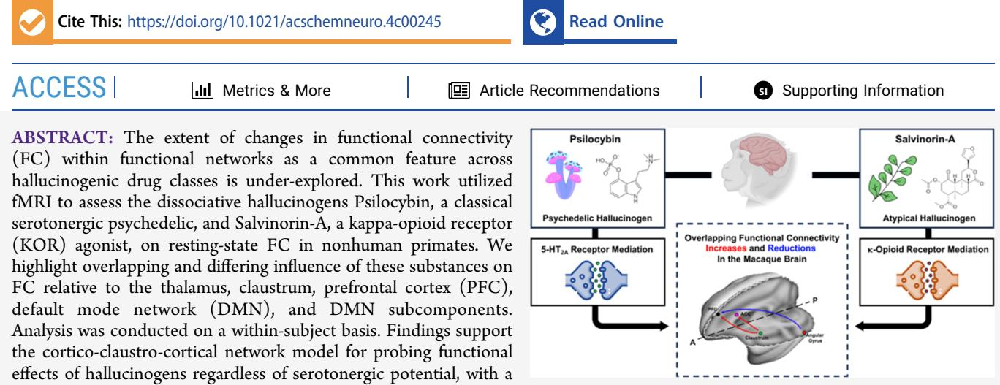
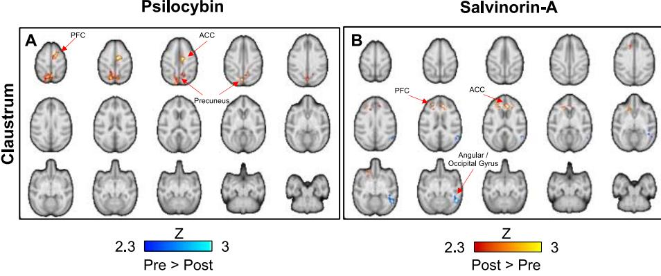
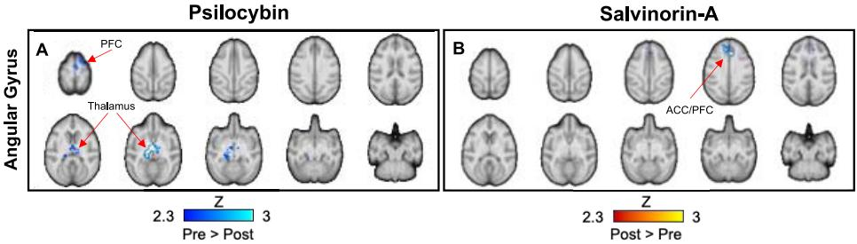
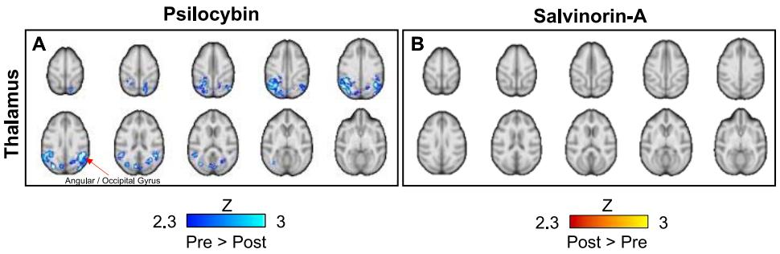
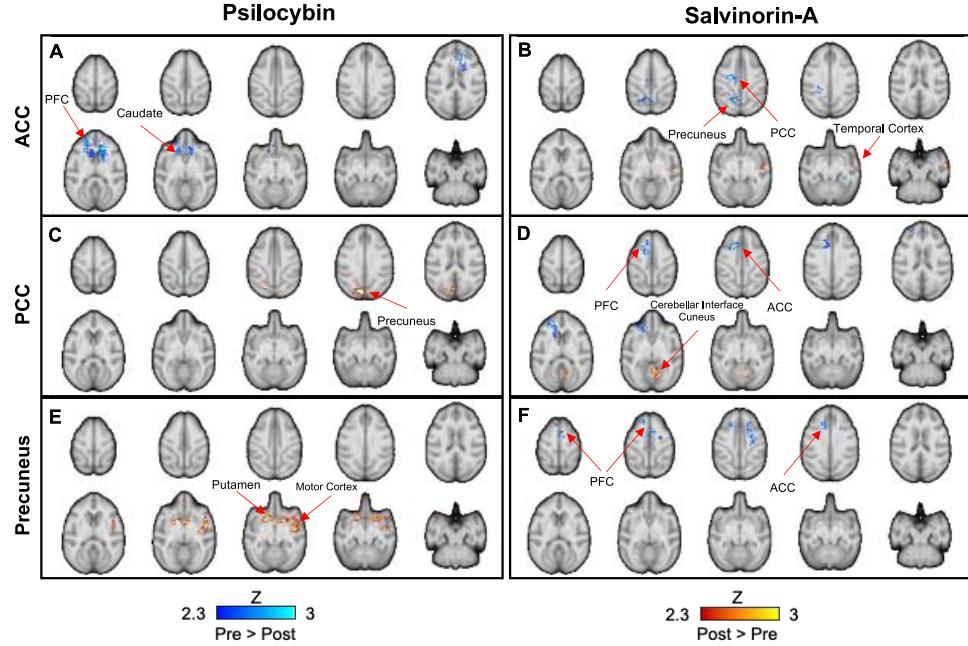
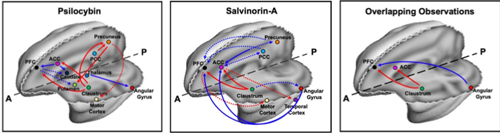

### **Acute Effects of Hallucinogens on Functional Connectivity: Psilocybin and Salvinorin‑A**

Frederick A. [Bagdasarian,](https://pubs.acs.org/action/doSearch?field1=Contrib&text1="Frederick+A.+Bagdasarian"&field2=AllField&text2=&publication=&accessType=allContent&Earliest=&ref=pdf) Hanne D. [Hansen,](https://pubs.acs.org/action/doSearch?field1=Contrib&text1="Hanne+D.+Hansen"&field2=AllField&text2=&publication=&accessType=allContent&Earliest=&ref=pdf) [Jingyuan](https://pubs.acs.org/action/doSearch?field1=Contrib&text1="Jingyuan+Chen"&field2=AllField&text2=&publication=&accessType=allContent&Earliest=&ref=pdf) Chen, [Chi-Hyeon](https://pubs.acs.org/action/doSearch?field1=Contrib&text1="Chi-Hyeon+Yoo"&field2=AllField&text2=&publication=&accessType=allContent&Earliest=&ref=pdf) Yoo, [Michael](https://pubs.acs.org/action/doSearch?field1=Contrib&text1="Michael+S.+Placzek"&field2=AllField&text2=&publication=&accessType=allContent&Earliest=&ref=pdf) S. Placzek, Jacob M. [Hooker,](https://pubs.acs.org/action/doSearch?field1=Contrib&text1="Jacob+M.+Hooker"&field2=AllField&text2=&publication=&accessType=allContent&Earliest=&ref=pdf) and [Hsiao-Ying](https://pubs.acs.org/action/doSearch?field1=Contrib&text1="Hsiao-Ying+Wey"&field2=AllField&text2=&publication=&accessType=allContent&Earliest=&ref=pdf) Wey[*](#page-5-0)

potential key paradigm centered around the claustrum, PFC, anterior cingulate cortices (ACC), and angular gyrus relationship. Thalamo-cortical networks are implicated but appear dependent on 5-HT2AR activation. Acute desynchronization relative to the DMN for both drugs was also shown. Our findings provide a framework to understand broader mechanisms at which hallucinogens in differing classes may impact subjects regardless of the target receptor.

KEYWORDS: *hallucinogens, functional connectivity, fMRI, psilocybin, salvinorin-A*

# ■ **INTRODUCTION**

Downloaded via UNIV OF GENEVA on July 4, 2024 at 14:41:14 (UTC).

See https://pubs.acs.org/sharingguidelines for options on how to legitimately share published articles.

Hallucinogens have been increasingly considered for mitigating psychiatric disorders, pain, and addiction, creating a renaissance of biomedical research involving these substances not seen since the 1960s. The majority of these substances investigated are "classical psychedelics" and have relatively high affinity to the serotonin 2A receptor (5-HT2AR). Psilocybin, a leading candidate in psychiatric disorders, metabolizes into the partial 5-HT2AR agonist psilocin. It is suggested to have benefits in depression[,1,2](#page-5-0) a potential alternative to substances like ketamine or common SSRIs, which may have heterogeneous results clinically.[3,](#page-5-0)[4](#page-6-0) A meta-analysis of lysergic acid diethylamide (LSD) showed potentially significant antiaddictive effects for alcohol abuse.[5](#page-6-0) As academic, legal, and societal attitudes toward psychedelic drugs are rapidly changing, so is the understanding of psychoactive hallucinogens outside of the "psychedelic" drug class. Examples include ketamine, which acts as an antidepressive agent that targets NMDA receptors,[6](#page-6-0) and 3,4-methyl enedioxy methamphetamine (MDMA), which is currently in a clinical trial for treating PTSD in combination with psychotherapy[7](#page-6-0) and primarily influences serotonin trafficking[.8](#page-6-0)

There are, however, other hallucinogenic drugs that are being investigated for therapeutic applications but otherwise are implicated with negative effects on users. Noribogaine, the extremely potent and hallucinogenic constituent of ibogaine, is a kappa opioid receptor (KOR) agonist that promotes structural neuroplasticity *in vitro*[9](#page-6-0) and is described to mitigate addiction in rodent[s10](#page-6-0) and drug cravings in humans.[11](#page-6-0) It is also prone to adverse cardiac events and potential cardiotoxicity.[12](#page-6-0) Salvinorin-A, another high-affinity KOR agonist, is also a potent dissociative hallucinoge[n13](#page-6-0) with similar characteristics to serotonergic psychedelics,[14](#page-6-0),[15](#page-6-0) but does not cause euphoria.[16](#page-6-0) Salvinorin-A has been reported to have positive outcomes preclinically for antinociception and addiction like LSD,[17](#page-6-0)−[19](#page-6-0) and has no reported adverse cardiac effects like Noribogaine.[12](#page-6-0) However, it does produce pro-depressive effects and dysphoria in users[.20,21](#page-6-0) As it has pro-hallucinatory but differential psychiatric effects of the antidepressive features of Psilocybin, this begs the question: are there functional commonalities between dissociative hallucinogens in general

| Received: | April 19, 2024 |
|-----------|----------------|
| Revised:  | June 11, 2024  |
| Accepted: | June 12, 2024  |

Figure 1. Connectivity changes from the claustrum for (A) Psilocybin and (B) Salvinorin-A. Significant increases in FC are red, significant decreases are blue. Red arrows and corresponding text label implicated regions.

regardless of pharmacological profiles? Such a commonality could inform our understanding of hallucinogenic states, which could aid in our understanding of cognitive disorders characterized by hallucinogenic symptoms.

Functional connectivity (FC) MRI is widely employed in healthy individuals and various brain disorders to measure the synchronization of neural activity across the brain. Correlated signal waveforms between regions indicate a level of connectivity, whereas noncorrelated signals reflect a lack of connectivity. Psilocybin, among other serotonergic hallucinogens, often reduces FC within networks such as the Default Mode Network (DMN), and elevates FC between cortical networks and subcortical regions such as the thalamus.[1](#page-5-0)[,22](#page-6-0)−[24](#page-6-0) To date, only a single FC-MRI study exists on Salvinorin-A, which reported reduced DMN FC when compared to a placebo group.[25](#page-6-0) Beyond the DMN, the claustrum regulates anxiety, stress, and depressive responses,[26,27](#page-6-0) and is suggested to support large-scale cognitive networks.[28](#page-6-0)−[30](#page-6-0) Recently, the claustrum was found to be a significant component of psilocybin-induced dissociations in an fMRI stud[y29](#page-6-0) and builds on previously identified changes in subcortical networks such as thalamic-cortical circuitry[.31](#page-6-0)

Within-subject comparisons of hallucinogens with dramatically variable pharmacological profiles in an imaging study have not been performed. In this study, we compared Psilocybin and Salvinorin-A in rhesus macaques (nonhuman primates; NHPs), a species in which pharmacology broadly translates to and reproduces in clinical populations[.32](#page-6-0) Regions investigated for hallucinogenic mechanisms were based on networks suggested from literature: claustral-cortical, thalamocortical, large-scale network circuitries of the prefrontal cortex (PFC) and DMN, and DMN subcomponents. We hypothesized that both Psilocybin and Salvinorin-A would dissociate FC within the DMN, while both substances would have unique modulatory effects pertaining to the claustral-cortical and thalamo-cortical circuitries due to their variable pharmacological profiles.

# ■ **RESULTS & DISCUSSION**

Novel findings reported here highlight overlapping and unique impacts of Psilocybin and Salvinorin-A on FC-MRI. Seedbased fMRI analysis is reported as significant changes in FC after drug challenges as either reductions or increases relative to predrug *Z*-scores. Seeds investigated were the claustrum, thalamus, DMN, PFC, and DMN subcomponents of the ACC, PCC, Precuneus, and Angular Gyrus. These results aim to inform future research on these, among other hallucinogenic substances, as well as provide broader insight into hallucinogenic phenomena outside of drug challenge studies. Heart rate, blood pressure and respiration rate were within stable ranges and under constant supervision of our veterinarian. Reversal drugs (i.e., an antagonist) were not needed at the completion of imaging, and all NHP recovered successfully after experiments.

**Cortico-Claustro-Cortico Network is Implicated Across Hallucinogens.** The claustrum has been suggested as a "conductor" of subjective consciousness[.33](#page-6-0) Its projections to many areas of the cortex[33,34](#page-6-0) and extremely high density of both 5-HT2AR[35](#page-6-0) and KOR[36](#page-6-0) have rendered the claustrum an ideal region of interest for investigating hallucinogenic action. Doss et al. proposed a cortico-claustro-cortical (CCC) circuit[37](#page-6-0) which posits that prefrontal, posterior parietal, and sensory cortical signaling is fed as an input to claustral neurons which then project signals back to the prefrontal cortex, forming a network mediating various cognitive functions. We observed that both Salvinorin-A and Psilocybin increased FC between the claustrum and areas of the frontal cortex, while only Psilocybin increased FC between the claustrum and precuneus and posterior parietal regions (Figure 1). Salvinorin-A also reduced FC between the claustrum and right angular/occipital gyrus. Barrett et al., 2020, is the only human fMRI study that has investigated FC relative to hallucinogens and the claustrum and partially supported the CCC-hallucinogenic desynchronization hypothesis.[29](#page-6-0) They also reported increased FC from the right claustrum to the fronto-parietal task control network, in line with our findings of increasing FC from the claustrum to cortical regions following Psilocybin. As our Salvinorin-A results indicated similar modulations, we suggest there are overlapping mechanisms at which hallucinogens generally influence the CCC circuit.

The angular gyrus, on the other hand, is reported to induce "out-of-body experiences" following electrical stimulation[.38](#page-6-0) Its activation or stimulus may influence subjects' ability to "selfidentify"[39](#page-6-0),[40](#page-6-0) and dissolve the conscious perception and separation of individuality from external entities,[41](#page-6-0) characteristics intrinsic to hallucinations and/or psychosis.[42](#page-6-0) Additionally, a report on LSD by Bedford et al. even found that changes in the angular gyrus may correlate with subjective effects of the drug.[43](#page-6-0) For Psilocybin and Salvinorin-A, when claustral FC increased to specific clusters in the frontal cortex (Figure 1), the angular gyrus tended to have reduced FC to those same regions [(Figure](#page-2-0) 2). Overlapping changes from the angular

Figure 2. DMN subregional cluster analysis of the Angular Gyrus for (A) Psilocybin and (B) Salvinorin-A. Significant increases in FC are red, significant decreases are blue. Red arrows and corresponding text label implicated regions.

Figure 3. Connectivity changes from the thalamus for (A) Psilocybin and (B) Salvinorin-A. Significant increases in FC are red, significant decreases are blue. Red arrows and corresponding text label implicated regions.

gyrus seed were characterized by reduced FC to PFC areas for psilocybin (Figure 2A) and Salvinorin-A (Figure 2B), pointing to CCC modulatory action. We also note that Psilocybin had strong dissociations from the angular gyrus to thalamus (Figure 2A), which was not observed in the Salvinorin-A group. Further supporting the angular gyrus' role of as a hub of hallucinogenic activity, Dai et al. found that LSD, ketamine, and nitrous oxide, commonly impact the temporoparietal junction−of which the angular gyrus is a key component[.6](#page-6-0)

Taken together, these results summarily suggest that functional dissociation from the angular gyrus to the frontal cortex, in addition to heightened claustral-cortical associations, may be a common mechanism underlying hallucinogenic modulations of functional activity in general, regardless of pharmacological profile. These regions specifically may be of key interest, then, for considerations of hallucinogenic mechanisms and dissolution of consciousness either by drugs or in psychiatric disorders in which such symptoms occur.

**Corticothalamic Connections May be Segregated between Hallucinogenic Drug Classes.** Thalamic nuclei transmit signals from sensory stimuli throughout the brain, namely to cortical regions and networks governing reward processing, cognitive and motor behavior.[44,45](#page-6-0) Previous reports on serotonergic hallucinogens like Psilocybin and LSD suggest increased FC between thalamic regions and sensorimotor, visual, and auditory cortical networks, the DMN and Task-Positive Network (TPN).[31](#page-6-0) Carhart-Harris et al., 2013, for example, reported increased FC from the thalamus to the TPN[.24](#page-6-0) Expanding our subcortical seed analysis to include the thalamus, we observed significantly reduced bilateral FC to the angular gyrus and/or posterior Task Positive Network following Psilocybin (Figure 3A), and vice versa (Figure 2A), while Salvinorin-A had no thalamic FC changes (Figure 3B). Though our results show Psilocybin induced clear reduction in FC from the thalamus to clusters largely constitutive of posterior regions of the angular gyrus/TPN (Figure 3A), posterior TPN recruitment appears substantial in both NHPs and human subjects for Psilocybin.

As we observed no changes in thalamic connectivity regarding Salvinorin-A, it is possible that thalamic connections to visual and angular cortical regions could be directly modulated through 5-HT2AR activation with serotonergic hallucinogens. In contrast, cortical, claustral and angular gyri cortical connections discussed previously may be more sensitive to effects elicited by hallucinogens broadly. Doss et al.'s lack of significant changes in static network FC relative to thalamic-included networks after Salvinorin-A inhalation in humans, and our lack of FC changes from the thalamus in the Salvinorin-A group, supports this notion.[25](#page-6-0) Preller et al. showed LSD increased FC between thalamic and (posterior) cortical regions while reducing it between striatal and thalamic regions.[46](#page-7-0) Inhibition of thalamic 5-HT2AR with the antagonist ketanserin showed that thalamic-cortical connectivity was indeed dependent on 5-HT2AR activation.[46](#page-7-0) These findings reported in human subjects, along with our results, suggest thalamic-cortical connectivity appears to be involved primarily for serotonergic hallucinogens and/or 5-HT2AR agonism. As such, corticothalamic circuit analysis may be best suited for serotonergic hallucinogens and/or the psychiatric disorders they may have utility, i.e., depression, but not for hallucinogens that may impair cognitive well-being like Salvinorin-A[20,21](#page-6-0) or hallucinations broadly. Future studies would benefit by investigating the impacts of enhancement or suppression effects of hallucinogens on thalamic neuronal signaling[.47](#page-7-0)

**DMN Specificity is Likely Dependent on Hallucinogenic Drug Classes.** For larger network domains, especially those frequently implicated in human studies, we also investigated FC from the DMN and PFC, followed by individual DMN subcomponents of the ACC, PCC, Precuneus and Angular Gyrus (discussed previously). Whole-network changes are shown in Supporting Information ([Figure](https://pubs.acs.org/doi/suppl/10.1021/acschemneuro.4c00245/suppl_file/cn4c00245_si_001.pdf) S2), as subcomponent analysis provided more informative FC

Figure 4. DMN subregional cluster analysis of the (A, B) ACC, (C, D) PCC, and (E, F) Precuneus. Significant clusters following Psilocybin and Salvinorin-A are highlighted with red arrows and corresponding text labeling implicated regions.

changes. From the subcomponent analysis (Figure 4), psilocybin reduced FC from the ACC to the frontal cortex and caudate, and increased PCC connectivity to the precuneus (Figure 4A,C), while both anterior and posterior cingulate cortices appear to be dissociated from one another after Salvinorin-A (Figure 4B,D). Psilocybin reduced FC from the ACC to the frontal cortex and caudate, and increased PCC connectivity to the precuneus. Psilocybin increased FC between the Precuneus seed to the caudate in both hemispheres, in addition to unilateral clusters in the motor cortex. Major dissociations were observed for both substances between the angular gyrus seed region [(Figure](#page-2-0) 2) and frontal cortical areas, or frontal cortical and ACC areas. Psilocybin additionally had a strong dissociation between angular gyrus and thalamic regions [(Figure](#page-2-0) 2A). These results support the notion that hallucinogens induce DMN dissociation, and such interpretations enhanced subregional decomposition. From the regional overlap identified between drugs, hallucinogenicinduced desynchronization of the DMN may be mediated by the ACC. Additionally, the slight increases in association observed between the DMN (or DMN subregions) and portions of the temporal (Figure 4B) and motor (Figure 4E) cortices observed for both drugs may reiterate greater networkintegration reported in other studies.[1,](#page-5-0)[23,43](#page-6-0)

Regional decomposition of the DMN has pointed to similar notions in other works. In the previously mentioned study by Carhart-Harris et al., anterior-to-posterior DMN FC was reduced in subjects after Psilocybin administration[,24](#page-6-0) and the only reported human fMRI study on Salvinorin-A showed likewise reductions of within-DMN static FC.[25](#page-6-0) More complicated paradigms are reported for hallucinogenic drugs such as Ayahuasca, a beverage consisting of DMT and monoamine oxidase inhibitors that prevent DMT degradation after ingestion. Though experienced users of powerful hallucinogens may have downregulated 5-HT2AR,[48](#page-7-0) Sampedro et al. found that such users of Ayahuasca had *increased* FC from the PCC to the ACC and visual cortex[.49](#page-7-0) Their dorsal ACC seed also had increased FC to clusters in the PCC, but reduced FC to the precuneus regions. Palhano-Fontes et al., 2015, on the other hand, reported only acute reductions in FC from the PCC to Precuneus in Ayahuasca-experienced subjects, which aligns with our Salvinorin-A findings[.50](#page-7-0) In any case, the cingulate cortices appear to be a major hub of within-DMN changes.

**Study Limitations.** A few limitations of the current work should be mentioned. Substances that impact autonomic processes may influence regions associated with such mechanisms, such as the ACC[.51](#page-7-0) The variable dosages of Psilocybin and Salvinorin-A are not used as covariates in our analysis due to sample size. However, overlapping results between those presented here and in awake fMRI studies in the broader literature support the validity of our findings. Ventilation was required in the Salvinorin-A group because Salvinorin-A is relatively unknown in the context of anesthetized NHPs, and safety concerns necessitated the precaution of controlling respiration on the chance of respiratory depression, given its additive sedation effects. Because there is no method for regressing ventilation effects on functional signals, this confound makes direct contrasts between Psilocybin and Salvinorin-A in predrug and postdrug states difficult, and such contrasts are described in Supporting Information [(Figures](https://pubs.acs.org/doi/suppl/10.1021/acschemneuro.4c00245/suppl_file/cn4c00245_si_001.pdf) S3, S4). Ketamine challenge is reported to reduce FC within the DMN.[52,53](#page-7-0) Ketamine induction followed by isoflurane maintenance in NHP, however, was reported by Li et al. to have no significant attenuation of DMN FC despite alterations to cerebral blood volumes[,54](#page-7-0) suggesting the impact of ketamine is likely minimal in the current experimental design. Despite the use of isoflurane anesthesia, similar functional networks can be identified in either awake or anesthetized monkeys[55](#page-7-0) and are often comparable to awake human functional networks.[56](#page-7-0) With a within-subject study design, timing between drug challenges could be of additional influence.[57](#page-7-0) We found no significant associations, however, due

Figure 5. Summary image of FC changes unique and overlapping between Psilocybin and Salvinorin-A. Red arrows indicate increases in FC, Blue arrows indicate decreases in FC. Dashed arrows indicate observed changes that were predominantly unilateral, the hemisphere of which can be found in the preceding figures. Color of ROI circles are only for distinguishment of implicated ROI.

to timing between hallucinogenic drug challenges and baseline FC (See Supporting [Information](https://pubs.acs.org/doi/suppl/10.1021/acschemneuro.4c00245/suppl_file/cn4c00245_si_001.pdf) for details).

**Concluding Remarks.** To our knowledge, this is the first study to compare the modulation effects of a serotonergic and a nonserotonergic hallucinogen in the acute phase of drug administration within the same animals. Outlined findings highlight overlapping and exclusive modulations to functional connectivity caused by Psilocybin and Salvinorin-A. We define an extension or interpretation of the CCC model of hallucinogenic pathways proposed by Doss et al. in line with known regionally specific functionality and previously described hallucinogen-induced alterations: (1) Increased association between subcortical-claustral neurons and the frontal cortex and anterior cingulate cortex; and (2) Dissociation between angular gyrus and the frontal cortex. Future studies will benefit from exploring the relationship(s) between the claustrum, angular gyrus and PFC. We also identify the thalamus, in addition to relative DMN dissociation, as a primary target for mechanistic differences between serotonergic and nonserotonergic hallucinogens in the acute phase. Summary FC diagrams illustrating unique and concurrent observations between substances are shown in Figure 5. Findings identified from these substances may help define their utility for applications to medical conditions concerning various cognitive networks involving the regions analyzed and hallucinatory activity.

# ■ **METHODS**

**Animal and Imaging Model.** Three male rhesus macaques (Weight: 10.6 ± 1.6 kg; Age: 7.6 ± 1.9 years) were included and imaged or underwent repeat imaging for each drug according to availability. NHPs were deprived of food for 12 h prior to imaging. Intramuscular injections of xylazine (0.5−2.0 mg/kg) and ketamine (10 mg/kg) were used for initial anesthetization. NHPs were then positioned into a 3T Siemens TIM-Trio with a BrainPET insert (Siemens, Munich, Germany) and maintained at ∼1−1.2% isoflurane. A custom 8-channel head coil was used for imaging. A high-resolution T1-weighted MPRAGE (TE1/TE2/TE3/TE4 = 1.64/3.5/5.36/7.22 ms, TR = 2530 ms, TI = 1200 ms, flip angle = 7° with 1 mm isotropic resolution) was first acquired. For fMRI acquisitions, NHPs were injected with Ferumoxytol (MION; 10 mg/kg) during an EPI sequence with TE/TR = 22/3000 ms, 1.3 mm isotropic resolution and 100 repetitions. A final fMRI experiment was then repeated for 100 min. After 10−15 min of baseline data were acquired, NHPs were injected with Psilocybin (30 *μ*g/kg, *N* = 2; 60 *μ*g/kg, *N* = 3; 90 *μ*g/kg, *N* = 2) or Salvinorin-A (2 *μ*g/kg, *N* = 2; 4 *μ*g/kg, *N* = 5). Psilocybin and Salvinorin-A had differing dose regimes because each drug was originally a component of two separate studies with independent aims from one another, but utilizing similar experimental designs and imaging paradigms. The differing methods and dose regime rationale can be found in more detail in Supporting [Information.](https://pubs.acs.org/doi/suppl/10.1021/acschemneuro.4c00245/suppl_file/cn4c00245_si_001.pdf) Animal physiology was monitored for heart rate, blood pressure, SpO2, respiration rate, and end-tidal CO2 and maintained within normal ranges by a qualified veterinarian technician. Resting times for NHP between scans varied depending on NHP use from previous studies and scanner availability. There were three instances of resting times less than 50 days: NHP1 received 4 *μ*g/kg of Salvinorin-A followed by 90 *μ*g/kg of Psilocybin 21 days later. NHP2 had two Salvinorin-A scans 14 days apart, and in a separate instance received 90 *μ*g/kg Psilocybin and 35 days later received 4 *μ*g/kg Salvinorin-A. As these data were pooled from two initially separate studies with relatively interspersed acquisition dates, drug application is best described as pseudorandom. Because ventilation was used for the Salvinorin-A injected animals, within-group and within-subject comparisons are the focus of this manuscript (discussed in the Results & [Discussion](#page-1-0)). All study procedures were reviewed and approved by the Institutional Animal Care and Use Committee (IACUC) of Massachusetts General Hospital in accordance with the guidelines and regulations to ensure animal welfare.

**fMRI Preprocessing and Functional Connectivity Pipeline.** Raw fMRI timeseries were converted from DICOM format to NIfTI files for data handling. Slice-timing correction was used to correct for EPI-inherent sampling offsets. Motion correction was performed with the FSL program MCFLIRT[.58](#page-7-0) The AFNI program 3dSkullStrip was used for brain extraction[.59](#page-7-0) The nonhuman primate (NHP) INIA19 brain template and NeuroMaps atla[s60](#page-7-0) was used for registration of data, performed with Advanced Normalization Tools (ANTs) programs ANTsRegistration and ANTsApplyTransforms,[61](#page-7-0) followed by bias-field correction. Data underwent 4 mm fwhm Gaussian kernel smoothing.

Ten to 15 min of fMRI time courses of pre- and post- drug injection data were extracted from the full data sets, followed by grand-mean scaling, band-pass filtering between 0.005 and 0.1 Hz, and removal of linear and quadratic trends. Nuisance regression was performed with FSL using regressors of motion correction parameters, the CSF and white matter. Masks to extract CSF and white-matter signals were generated from the INIA19 brain atlas. Residuals were demeaned and scaled to 100. Statistical processing was performed with AFNI programs to compute voxel-wise correlations with seed regions of interest (ROI). Selected seeds included the claustrum and thalamus to sample subcortical ROI, the PFC and DMN to probe larger implicated networks typically reported. DMN was defined by primary subcomponents of anterior and posterior cingulate cortices (ACC/PCC), precuneus, and angular gyrus, which are implicated in earlier fMRI literature on DMN-focused hallucinogen studies[.23,](#page-6-0)[50,62](#page-7-0) PFC was not included in the DMN as frontal-cortical connectivity to posterior DMN regions is considered significantly weaker in nonhominoids compared to hominoids,[63](#page-7-0) and because the ACC is currently included. Each of these ROIs were also probed independently to identify potentially more specific trends of DMN dissociations. Our separate PFC seed was composed of the inferior, middle, and superior frontal gyri. Visualization of the seeds overlaid on the brain template atlas can be found in Supporting Information ([Figure](https://pubs.acs.org/doi/suppl/10.1021/acschemneuro.4c00245/suppl_file/cn4c00245_si_001.pdf) S2). Pearson's correlation coefficients were calculated on a voxel-wise basis between the average timeseries within each seed region, and subsequently transformed to Fisher *Z* scores. NHP were grouped together based on the drug injected to achieve *N* = 7 per group and higher statistical power. Significance was assessed with a paired *t* test of pre- vs postdrug *Z*-scores with correction for multiple comparisons at *p* < 0.05 and cluster-forming correction at *Z* > 2.3.

# ■ **ASSOCIATED CONTENT**

### ***sı Supporting Information**

The Supporting Information is available free of charge at [https://pubs.acs.org/doi/10.1021/acschemneuro.4c00245](https://pubs.acs.org/doi/10.1021/acschemneuro.4c00245?goto=supporting-info).

> Experimental procedures outlining the differences between neuroimaging sessions for NHP receiving Psilocybin or Salvinorin-A drug challenges; representative seed regions used in the FC analysis are shown in Figure S1; additional results of the DMN and PFC seeds, which support the main text, are shown (Figure S2) and briefly described; the effects of ventilation, and how this impacts our ability to directly compare Psilocybin and Salvinorin-A groups in either pre- or postdrug states, are discussed in detail; additionally, we address the potential confounds of the timing between data acquisitions in the context of hallucinogenic drug challenges on within- and between-ROI FC; references are also included to provide further context and background ([PDF)](https://pubs.acs.org/doi/suppl/10.1021/acschemneuro.4c00245/suppl_file/cn4c00245_si_001.pdf)

# ■ **AUTHOR INFORMATION**

#### **Corresponding Author**

Hsiao-Ying Wey − *Department of Radiology, Massachusetts General Hospital, Harvard Medical School, Athinoula A. Martinos Center for Biomedical Imaging, Charlestown, Massachusetts 02129-2020, United States; Department of Psychiatry, Massachusetts General Hospital, Harvard Medical School, Center for the Neuroscience of Psychedelics, Charlestown, Massachusetts 02129, United States;* [orcid.org/0000-0002-1425-8489](https://orcid.org/0000-0002-1425-8489); Phone: 617-724-1384; Email: [hsiaoying.wey@mgh.harvard.edu](mailto:hsiaoying.wey@mgh.harvard.edu)

#### **Authors**

- Frederick A. Bagdasarian − *Department of Radiology, Massachusetts General Hospital, Harvard Medical School, Athinoula A. Martinos Center for Biomedical Imaging, Charlestown, Massachusetts 02129-2020, United States*
- Hanne D. Hansen − *Department of Radiology, Massachusetts General Hospital, Harvard Medical School, Athinoula A. Martinos Center for Biomedical Imaging, Charlestown, Massachusetts 02129-2020, United States; Neurobiology Research Unit, Copenhagen University Hospital, Copenhagen DK-2100, Denmark;* [orcid.org/0000-0001-5564-7627](https://orcid.org/0000-0001-5564-7627)
- Jingyuan Chen − *Department of Radiology, Massachusetts General Hospital, Harvard Medical School, Athinoula A. Martinos Center for Biomedical Imaging, Charlestown, Massachusetts 02129-2020, United States*
- Chi-Hyeon Yoo − *Department of Radiology, Massachusetts General Hospital, Harvard Medical School, Athinoula A. Martinos Center for Biomedical Imaging, Charlestown, Massachusetts 02129-2020, United States*
- Michael S. Placzek − *Department of Radiology, Massachusetts General Hospital, Harvard Medical School, Athinoula A. Martinos Center for Biomedical Imaging, Charlestown, Massachusetts 02129-2020, United States*
- Jacob M. Hooker − *Department of Radiology, Massachusetts General Hospital, Harvard Medical School, Athinoula A. Martinos Center for Biomedical Imaging, Charlestown, Massachusetts 02129-2020, United States; Department of Psychiatry, Massachusetts General Hospital, Harvard Medical School, Center for the Neuroscience of Psychedelics, Charlestown, Massachusetts 02129, United States;* [orcid.org/0000-0002-9394-7708](https://orcid.org/0000-0002-9394-7708)

Complete contact information is available at: [https://pubs.acs.org/10.1021/acschemneuro.4c00245](https://pubs.acs.org/doi/10.1021/acschemneuro.4c00245?ref=pdf)

#### **Author Contributions**

F.A.B. and C.H.Y. performed imaging experiments utilizing Salvinorin-A. H.D.H. performed imaging experiments with Psilocybin. F.A.B., C.H.Y., and H.Y.W. developed the image analysis pipeline for NHP data analysis. M.S.P. synthesized Salvinorin-A used in experiments. H.D.H., J.C., and J.M.H. provided consultations on methodology and data interpretations. F.A.B., H.D.H., and H.Y.W. conceptualized and designed experiments. F.A.B and H.Y.W. drafted the manuscript. All authors contributed to reviewing and editing the manuscript.

#### **Funding**

Salvinorin-A work is partially supported by Atai Life Sciences and Pilot Funding from the Athinoula A. Martinos Center for Biomedical Imaging, Department of Radiology, Massachusetts General Hospital. H.D.H. and the Psilocybin work is supported by the BBRF Young Investigator grant and Lundbeck Foundation (R293−2018−738). F.A.B. is supported by the NIH training grant 5T32AG66592−2. Additional funding was provided by NIH Shared Instrument Grants: S10RR017208, S10RR026666, S10RR022976, S10RR019933, and S10RR023401, S10OD023517.

#### **Notes**

The authors declare no competing financial interest.

# ■ **ACKNOWLEDGMENTS**

We thank Helen Deng for her veterinary care and assistance during NHP imaging and drug injections. We also thank Shirley Hsu and Oliver Ramsey for their technical assistance in the experimental setup with the utilized imaging system. Cartoon illustrations in the TOC/Abstract Graphic were sourced from Biorender.com and Flaticon.com. Please see the Supporting [Information](https://pubs.acs.org/doi/suppl/10.1021/acschemneuro.4c00245/suppl_file/cn4c00245_si_001.pdf) document for specific creator attributions.

# ■ **REFERENCES**

(1) Daws, R. E.; Timmermann, C.; Giribaldi, B.; Sexton, J. D.; Wall, M. B.; Erritzoe, D.; et al. Increased global [integration](https://doi.org/10.1038/s41591-022-01744-z) in the brain after psilocybin therapy for [depression.](https://doi.org/10.1038/s41591-022-01744-z) *Nat. Med.* 2022, *28*, 844−851.

(2) Griffiths, R. R.; Johnson, M. W.; Carducci, M. A.; Umbricht, A.; Richards, W. A.; Richards, B. D.; et al. Psilocybin produces [substantial](https://doi.org/10.1177/0269881116675513) and sustained decreases in [depression](https://doi.org/10.1177/0269881116675513) and anxiety in patients with lifethreatening cancer: A randomized [double-blind](https://doi.org/10.1177/0269881116675513) trial. *J. Psychopharmacol.* 2016, *30*, 1181−1197.

(3) Crisanti, C.; Enrico, P.; Fiorentini, A.; Delvecchio, G.; Brambilla, P. [Neurocognitive](https://doi.org/10.1016/j.jad.2020.07.119) impact of ketamine treatment in major depressive [disorder:](https://doi.org/10.1016/j.jad.2020.07.119) A review on human and animal studies. *J. Affective Disord.* 2020, *276*, 1109−1118.

(4) Shin, C.; Kim, Y. K. Ketamine in major [depressive](https://doi.org/10.30773/pi.2019.0236) disorder: Mechanisms and future [perspectives.](https://doi.org/10.30773/pi.2019.0236) *Psychiatry Invest.* 2020, *17*, 181− 192.

(5) Garcia-Romeu, A.; Davis, A. K.; Erowid, F.; Erowid, E.; Griffiths, R. R.; Johnson, M. W. [Cessation](https://doi.org/10.1177/0269881119845793) and reduction in alcohol [consumption](https://doi.org/10.1177/0269881119845793) and misuse after psychedelic use. *J. Psychopharmacol.* 2019, *33*, 1088−1101.

(6) Dai, R.; Larkin, T. E.; Huang, Z.; Tarnal, V.; Picton, P.; Vlisides, P. E.; et al. Classical and [non-classical](https://doi.org/10.1016/j.neuroimage.2023.120097) psychedelic drugs induce [common](https://doi.org/10.1016/j.neuroimage.2023.120097) network changes in human cortex. *NeuroImage* 2023, *273*, No. 120097.

(7) Mitchell, J. M.; Bogenschutz, M.; Lilienstein, A.; Harrison, C.; Kleiman, S.; Parker-Guilbert, K.; et al. [MDMA-assisted](https://doi.org/10.1038/s41591-021-01336-3) therapy for severe PTSD: a randomized, double-blind, [placebo-controlled](https://doi.org/10.1038/s41591-021-01336-3) phase 3 [study.](https://doi.org/10.1038/s41591-021-01336-3) *Nat. Med.* 2021, *27*, 1025−1033.

(8) Oeri, H. E. Beyond ecstasy: Alternative [entactogens](https://doi.org/10.1177/0269881120920420) to 3,4 [methylenedioxymethamphetamine](https://doi.org/10.1177/0269881120920420) with potential applications in [psychotherapy.](https://doi.org/10.1177/0269881120920420) *J. Psychopharmacol.* 2021, *35*, 512−536.

(9) Ly, C.; Greb, A. C.; Cameron, L. P.; Wong, J. M.; Barragan, E. V.; Wilson, P. C.; et al. [Psychedelics](https://doi.org/10.1016/j.celrep.2018.05.022) Promote Structural and [Functional](https://doi.org/10.1016/j.celrep.2018.05.022) Neural Plasticity. *Cell Rep.* 2018, *23*, 3170−3182.

(10) Chang, Q.; Hanania, T.; Mash, D. C.; Maillet, E. L. Noribogaine reduces nicotine [self-administration](https://doi.org/10.1177/0269881115584461) in rats. *J. Psychopharmacol.* 2015, *29*, 704−711.

(11) Brown, T. K. Ibogaine in the [treatment](https://doi.org/10.2174/15672050113109990001) of substance [dependence.](https://doi.org/10.2174/15672050113109990001) *Curr. Drug Abuse Rev.* 2013, *6*, 3−16.

(12) Koenig, X.; Hilber, K. The [Anti-Addiction](https://doi.org/10.3390/molecules20022208) Drug Ibogaine and the Heart: A Delicate [Relation.](https://doi.org/10.3390/molecules20022208) *Molecules* 2015, *20*, 2208−2228.

(13) Yan, F.; Roth, B. L. [Salvinorin](https://doi.org/10.1016/j.lfs.2004.07.008) A: A novel and highly selective *κ*opioid [receptor](https://doi.org/10.1016/j.lfs.2004.07.008) agonist. *Life Sci.* 2004, *75*, 2615−2619.

(14) Maqueda, A. E.; Valle, M.; Addy, P. H.; Antonijoan, R. M.; Puntes, M.; Coimbra, J.; et al. [Salvinorin-A](https://doi.org/10.1093/ijnp/pyv065) Induces Intense [Dissociative](https://doi.org/10.1093/ijnp/pyv065) Effects, Blocking External Sensory Perception and Modulating [Interoception](https://doi.org/10.1093/ijnp/pyv065) and Sense of Body Ownership in Humans. *Int. J. Neuropsychopharmacol.* 2015, *18*, pyv065.

(15) MacLean, K. A.; Johnson, M. W.; Reissig, C. J.; Prisinzano, T. E.; Griffiths, R. R. [Dose-related](https://doi.org/10.1007/s00213-012-2912-9) effects of salvinorin A in humans: Dissociative, [hallucinogenic,](https://doi.org/10.1007/s00213-012-2912-9) and memory effects. *Psychopharmacology* 2013; *226*381.

(16) Al-Hasani, R.; Bruchas, M. R. Molecular [Mechanisms](https://doi.org/10.1097/ALN.0b013e318238bba6) of Opioid [Receptor-Dependent](https://doi.org/10.1097/ALN.0b013e318238bba6) Signaling and Behavior. *Anesthesiology* 2011, *115*, 1363−1381.

(17) Cruz, A.; Domingos, S.; Gallardo, E.; Martinho, A. A [unique](https://doi.org/10.1016/j.phytochem.2017.02.001) natural selective [kappa-opioid](https://doi.org/10.1016/j.phytochem.2017.02.001) receptor agonist, salvinorin A, and its roles in human [therapeutics.](https://doi.org/10.1016/j.phytochem.2017.02.001) *Phytochemistry* 2017, *137*, 9−14.

(18) Chartoff, E. H.; Potter, D.; Damez-Werno, D.; Cohen, B. M.; Carlezon, W. A. [Exposure](https://doi.org/10.1038/sj.npp.1301659) to the Selective *κ*-Opioid Receptor Agonist Salvinorin A [Modulates](https://doi.org/10.1038/sj.npp.1301659) the Behavioral and Molecular Effects of [Cocaine](https://doi.org/10.1038/sj.npp.1301659) in Rats. *Neuropsychopharmacology* 2008, *33*, 2676−2687.

(19) Kivell, B. M.; Ewald, A. W. M.; Prisinzano, T. E. [Salvinorin](https://doi.org/10.1016/B978-0-12-420118-7.00012-3) A analogs and other kappa opioid receptor [compounds](https://doi.org/10.1016/B978-0-12-420118-7.00012-3) as treatments for [cocaine](https://doi.org/10.1016/B978-0-12-420118-7.00012-3) abuse. *Adv. Pharmacol.* 2014, *69*, 481−511.

(20) Ebner, S. R.; Roitman, M. F.; Potter, D. N.; Rachlin, A. B.; Chartoff, E. H. [Depressive-like](https://doi.org/10.1007/s00213-010-1836-5) effects of the kappa opioid receptor agonist salvinorin A are [associated](https://doi.org/10.1007/s00213-010-1836-5) with decreased phasic dopamine release in the nucleus [accumbens](https://doi.org/10.1007/s00213-010-1836-5). *Psychopharmacology* 2010; *210*241.

(21) Carlezon, W. A.; Béguin, C.; DiNieri, J. A.; Baumann, M. H.; Richards, M. R.; Todtenkopf, M. S. et al. [Depressive-like](https://doi.org/10.1124/jpet.105.092304) effects of the *κ*-opioid receptor agonist [salvinorin](https://doi.org/10.1124/jpet.105.092304) A on behavior and neuro[chemistry](https://doi.org/10.1124/jpet.105.092304) in rats. *J. Pharmacol. Exp. Ther.* 2006; *316*440.

(22) Madsen, M. K.; Stenbæk, D. S.; Arvidsson, A.; Armand, S.; Marstrand-Joergensen, M. R.; Johansen, S. S.; et al. [Psilocybin](https://doi.org/10.1016/j.euroneuro.2021.06.001)induced changes in brain network integrity and [segregation](https://doi.org/10.1016/j.euroneuro.2021.06.001) correlate with plasma psilocin level and [psychedelic](https://doi.org/10.1016/j.euroneuro.2021.06.001) experience. *Eur. Neuropsychopharmacol.* 2021, *50*, 121−132.

(23) Carhart-Harris, R. L.; Erritzoe, D.; Williams, T.; Stone, J. M.; Reed, L. J.; Colasanti, A.; et al. Neural correlates of the [psychedelic](https://doi.org/10.1073/pnas.1119598109) state as [determined](https://doi.org/10.1073/pnas.1119598109) by fMRI studies with psilocybin. *Proc. Natl. Acad. Sci. U.S.A.* 2012, *109*, 2138−2143.

(24) Carhart-Harris, R. L.; Leech, R.; Erritzoe, D.; Williams, T. M.; Stone, J. M.; Evans, J.; et al. Functional [connectivity](https://doi.org/10.1093/schbul/sbs117) measures after psilocybin inform a novel [hypothesis](https://doi.org/10.1093/schbul/sbs117) of early psychosis. *Schizophr. Bull.* 2013, *39*, 1343−1351.

(25) Doss, M. K.; May, D. G.; Johnson, M. W.; Clifton, J. M.; Hedrick, S. L.; Prisinzano, T. E.; et al. The Acute [Effects](https://doi.org/10.1038/s41598-020-73216-8) of the Atypical Dissociative [Hallucinogen](https://doi.org/10.1038/s41598-020-73216-8) Salvinorin A on Functional [Connectivity](https://doi.org/10.1038/s41598-020-73216-8) in the Human Brain. *Sci. Rep.* 2020, *10*, No. 16392.

(26) Nikolenko, V. N.; Rizaeva, N. A.; Beeraka, N. M.; Oganesyan, M. V.; Kudryashova, V. A.; Dubovets, A. A.; et al. The [mystery](https://doi.org/10.1186/s12993-021-00181-1) of [claustral](https://doi.org/10.1186/s12993-021-00181-1) neural circuits and recent updates on its role in neuro[degenerative](https://doi.org/10.1186/s12993-021-00181-1) pathology. *Behav. Brain Funct.* 2021, *17*, 8.

(27) Niu, M.; Kasai, A.; Tanuma, M.; Seiriki, K.; Igarashi, H.; Kuwaki, T.; et al. Claustrum mediates [bidirectional](https://doi.org/10.1126/sciadv.abi6375) and reversible control of [stress-induced](https://doi.org/10.1126/sciadv.abi6375) anxiety responses. *Sci. Adv.* 2022, *8*, 6375.

(28) Krimmel, S. R.; White, M. G.; Panicker, M. H.; Barrett, F. S.; Mathur, B. N.; Seminowicz, D. A. Resting state [functional](https://doi.org/10.1016/j.neuroimage.2019.03.075) [connectivity](https://doi.org/10.1016/j.neuroimage.2019.03.075) and cognitive task-related activation of the human [claustrum.](https://doi.org/10.1016/j.neuroimage.2019.03.075) *NeuroImage* 2019, *196*, 59−67.

(29) Barrett, F. S.; Krimmel, S. R.; Griffiths, R.; Seminowicz, D. A.; Mathur, B. N. Psilocybin acutely alters the functional [connectivity](https://doi.org/10.1016/j.neuroimage.2020.116980) of the claustrum with brain networks that support [perception,](https://doi.org/10.1016/j.neuroimage.2020.116980) memory, and [attention.](https://doi.org/10.1016/j.neuroimage.2020.116980) *NeuroImage* 2020, *218*, No. 116980.

(30) White, M. G.; Mathur, B. N. Claustrum circuit [components](https://doi.org/10.1007/s00429-018-1731-0) for top-down input [processing](https://doi.org/10.1007/s00429-018-1731-0) and cortical broadcast. *Brain Struct. Funct.* 2018, *223*, 3945−3958.

(31) Avram, M.; Rogg, H.; Korda, A.; Andreou, C.; Müller, F.; Borgwardt, S. Bridging the Gap? Altered [Thalamocortical](https://doi.org/10.3389/fpsyt.2021.706017) Connectivity in Psychotic and [Psychedelic](https://doi.org/10.3389/fpsyt.2021.706017) States. *Front. Psychiatry* 2021, *12*, 706017.

(32) Weerts, E. M.; Fantegrossi, W. E.; Goodwin, A. K. The [Value](https://doi.org/10.1037/1064-1297.15.4.309) of [Nonhuman](https://doi.org/10.1037/1064-1297.15.4.309) Primates in Drug Abuse Research. *Exp. Clin. Psychopharmacol.* 2007, *15*, 309−327.

(33) Crick, F. C.; Koch, C. What is the function of the [claustrum?](https://doi.org/10.1098/rstb.2005.1661) *Philos. Trans. R. Soc., B* 2005, *360*, 1271.

(34) Mathur, B. N. The [claustrum](https://doi.org/10.3389/fnsys.2014.00048) in review. *Front. Syst. Neurosci.* 2014, *8*, 48.

(35) Hannon, J.; Hoyer, D. [Molecular](https://doi.org/10.1016/j.bbr.2008.03.020) biology of 5-HT receptors. *Behav. Brain Res.* 2008, *195*, 198−213.

(36) Stiefel, K. M.; Merrifield, A.; Holcombe, A. O. The [claustrum's](https://doi.org/10.3389/fnint.2014.00020) proposed role in [consciousness](https://doi.org/10.3389/fnint.2014.00020) is supported by the effect and target [localization](https://doi.org/10.3389/fnint.2014.00020) of Salvia divinorum. *Front. Integr. Neurosci.* 2014, *8*, 20.

(37) Doss, M. K.; Madden, M. B.; Gaddis, A.; Nebel, M. B.; Griffiths, R. R.; Mathur, B. N.; Barrett, F. S. Models of [psychedelic](https://doi.org/10.1093/brain/awab406) drug action: Modulation of [cortical-subcortical](https://doi.org/10.1093/brain/awab406) circuits. *Brain* 2022, *145*, 441−456.

(38) Blanke, O.; Ortigue, S.; Landis, T.; Seeck, M. [Stimulating](https://doi.org/10.1038/419269a) illusory own-body [perceptions.](https://doi.org/10.1038/419269a) *Nature* 2002, *419*, 269−270.

(39) de Boer, D. M. L.; Johnston, P. J.; Kerr, G.; Meinzer, M.; Cleeremans, A. A causal role for the right [angular](https://doi.org/10.1038/s41598-020-76235-7) gyrus in selflocation mediated [perspective](https://doi.org/10.1038/s41598-020-76235-7) taking. *Sci. Rep.* 2020, *10*, No. 19229.

(40) Payne, S.; Tsakiris, M. Anodal [transcranial](https://doi.org/10.3758/s13415-016-0461-0) direct current stimulation of right temporoparietal area inhibits [self-recognition.](https://doi.org/10.3758/s13415-016-0461-0) *Cogn. Affective Behav. Neurosci.* 2017, *17*, 1.

(41) Ionta, S.; Heydrich, L.; Lenggenhager, B.; Mouthon, M.; Fornari, E.; Chapuis, D.; et al. [Multisensory](https://doi.org/10.1016/j.neuron.2011.03.009) mechanisms in temporoparietal cortex support [self-location](https://doi.org/10.1016/j.neuron.2011.03.009) and first-person perspective. *Neuron* 2011, *70*, 363−374.

(42) Frith, C. The self in action: lessons from [delusions](https://doi.org/10.1016/j.concog.2005.04.002) of control. *Conscious. Cogn.* 2005, *14*, 752−770.

(43) Bedford, P.; Hauke, D. J.; Wang, Z.; Roth, V.; Nagy-Huber, M.; Holze, F. et al. The effect of lysergic acid [diethylamide](https://doi.org/10.1038/s41386-023-01574-8) (LSD) on whole-brain functional and effective [connectivity](https://doi.org/10.1038/s41386-023-01574-8). *Neuropsychopharmacology* 2023*48*. DOI: [10.1038/s41386-023-01574-8.](https://doi.org/10.1038/s41386-023-01574-8?urlappend=%3Fref%3DPDF&jav=VoR&rel=cite-as)

(44) Sherman, S. M.; Guillery, R. W. The role of the [thalamus](https://doi.org/10.1098/rstb.2002.1161) in the flow of [information](https://doi.org/10.1098/rstb.2002.1161) to the cortex. *Phil. Trans. R. Soc., B* 2002, *357*, 1695.

(45) Haber, S. N. [Corticostriatal](https://doi.org/10.31887/DCNS.2016.18.1/shaber) circuitry. *Dialogues Clin. Neurosci.* 2016, *18*, 7.

(46) Preller, K. H.; Razi, A.; Zeidman, P.; Stämpfli, P.; Friston, K. J.; Vollenweider, F. X. Effective connectivity changes in [LSD-induced](https://doi.org/10.1073/pnas.1815129116) altered states of [consciousness](https://doi.org/10.1073/pnas.1815129116) in humans. *Proc. Natl. Acad. Sci. U.S.A.* 2019, *116*, 2743−2748.

(47) Inserra, A.; de Gregorio, D.; Rezai, T.; Lopez-Canul, M. G.; Comai, S.; Gobbi, G. Lysergic acid [diethylamide](https://doi.org/10.1177/0269881121991569) differentially modulates the reticular thalamus, [mediodorsal](https://doi.org/10.1177/0269881121991569) thalamus, and infralimbic prefrontal cortex: An in vivo [electrophysiology](https://doi.org/10.1177/0269881121991569) study in male [mice.](https://doi.org/10.1177/0269881121991569) *J. Psychopharmacol.* 2021, *35*, 469−482.

(48) Erritzoe, D.; Frokjaer, V. G.; Holst, K. K.; Christoffersen, M.; Johansen, S. S.; Svarer, C. et al. In vivo imaging of cerebral [serotonin](https://doi.org/10.1001/archgenpsychiatry.2011.56) transporter and serotonin 2A receptor binding in [3,4-methylenediox](https://doi.org/10.1001/archgenpsychiatry.2011.56)[ymethamphetamine](https://doi.org/10.1001/archgenpsychiatry.2011.56) (MDMA or 'Ecstasy') and hallucinogen users. *Arch. Gen. Psychiatry* 2011; *68*562.

(49) Sampedro, F.; De La, M.; Revenga, F.; Valle, M.; Roberto, N.; Domínguez-Clavé, E.; et al. Assessing the Psychedelic ['After-Glow'](https://doi.org/10.1093/ijnp/pyx036) in Ayahuasca Users: Post-Acute [Neurometabolic](https://doi.org/10.1093/ijnp/pyx036) and Functional [Connectivity](https://doi.org/10.1093/ijnp/pyx036) Changes Are Associated with Enhanced Mindfulness [Capacities.](https://doi.org/10.1093/ijnp/pyx036) *Int. J. Neuropsychopharmacol.* 2017, *20*, 698−711.

(50) Palhano-Fontes, F.; Andrade, K. C.; Tofoli, L. F.; Jose, A. C. S.; Crippa, A. S.; Hallak, J. E. C.; et al. The [psychedelic](https://doi.org/10.1371/journal.pone.0118143) state induced by Ayahuasca modulates the activity and [connectivity](https://doi.org/10.1371/journal.pone.0118143) of the Default Mode [Network.](https://doi.org/10.1371/journal.pone.0118143) *PLoS One* 2015, *10*, No. e0118143.

(51) Beissner, F.; Meissner, K.; Bär, K. J.; Napadow, V. [The](https://doi.org/10.1523/JNEUROSCI.1103-13.2013) autonomic brain: An activation likelihood estimation [meta-analysis](https://doi.org/10.1523/JNEUROSCI.1103-13.2013) for central processing of [autonomic](https://doi.org/10.1523/JNEUROSCI.1103-13.2013) function. *J. Neurosci.* 2013; *33*10503.

(52) Zacharias, N.; Musso, F.; Müller, F.; Lammers, F.; Saleh, A.; London, M. et al. [Ketamine](https://doi.org/10.1002/hbm.24791) effects on default mode network activity and vigilance: A randomized, [placebo-controlled](https://doi.org/10.1002/hbm.24791) crossover simultaneous [fMRI/EEG](https://doi.org/10.1002/hbm.24791) study. *Hum. Brain Mapp.* 2020; *41*107.

(53) Scheidegger, M.; Walter, M.; Lehmann, M.; Metzger, C.; Grimm, S.; Boeker, H.; et al. Ketamine [Decreases](https://doi.org/10.1371/journal.pone.0044799) Resting State Functional Network [Connectivity](https://doi.org/10.1371/journal.pone.0044799) in Healthy Subjects: Implications for [Antidepressant](https://doi.org/10.1371/journal.pone.0044799) Drug Action. *PLoS One* 2012, *7*, No. e44799, DOI: [10.1371/journal.pone.0044799.](https://doi.org/10.1371/journal.pone.0044799?urlappend=%3Fref%3DPDF&jav=VoR&rel=cite-as)

(54) Li, C. X.; Kempf, D.; Howell, L.; Zhang, X. Effects of [alfaxalone](https://doi.org/10.1016/j.mri.2020.10.011) on cerebral blood flow and intrinsic neural activity of rhesus [monkeys:](https://doi.org/10.1016/j.mri.2020.10.011) A [comparison](https://doi.org/10.1016/j.mri.2020.10.011) study with ketamine. *Magn. Reson. Imaging* 2021; *75*134.

(55) Hori, Y.; Schaeffer, D. J.; Gilbert, K. M.; Hayrynen, L. K.; Cléry, J. C.; Gati, J. S.; et al. Altered [Resting-State](https://doi.org/10.1093/cercor/bhaa168) Functional Connectivity between Awake and Isoflurane [Anesthetized](https://doi.org/10.1093/cercor/bhaa168) Marmosets. *Cereb. Cortex* 2020, *30*, 5943−5959.

(56) Wey, H. Y.; Phillips, K. A.; McKay, D. R.; Laird, A. R.; Kochunov, P.; Davis, M. D.; et al. [Multi-region](https://doi.org/10.1007/s00429-013-0620-9) hemispheric [specialization](https://doi.org/10.1007/s00429-013-0620-9) differentiates human from nonhuman primate brain [function.](https://doi.org/10.1007/s00429-013-0620-9) *Brain Struct. Funct.* 2014, *219*, 2187−2194.

(57) Knudsen, G. M. [Sustained](https://doi.org/10.1038/s41386-022-01361-x) effects of single doses of classical [psychedelics](https://doi.org/10.1038/s41386-022-01361-x) in humans. *Neuropsychopharmacology* 2023, *48*, 145− 150.

(58) Jenkinson, M.; Bannister, P.; Brady, M.; Smith, S. [Improved](https://doi.org/10.1006/nimg.2002.1132) [optimization](https://doi.org/10.1006/nimg.2002.1132) for the robust and accurate linear registration and motion [correction](https://doi.org/10.1006/nimg.2002.1132) of brain images. *NeuroImage* 2002, *17*, 825−841.

(59) Cox, R. W. AFNI: Software for analysis and [visualization](https://doi.org/10.1006/cbmr.1996.0014) of functional magnetic resonance [neuroimages.](https://doi.org/10.1006/cbmr.1996.0014) *Comput. Biomed. Res.* 1996, *29*, 162−173.

(60) Rohlfing, T.; Kroenke, C. D.; Sullivan, E. V.; Dubach, M. F.; Bowden, D. M.; Grant, K. A.; Pfefferbaum, A. The INIA19 [template](https://doi.org/10.3389/fninf.2012.00027) and [NeuroMaps](https://doi.org/10.3389/fninf.2012.00027) atlas for primate brain image parcellation and spatial [normalization.](https://doi.org/10.3389/fninf.2012.00027) *Front. Neuroinf.* 2012, *6*, 27.

(61) Avants, B. B.; Tustison, N.; Johnson, H. Advanced Normalization Tools (ANTS) Release 2.x. 2014, [https://brianavants.](https://brianavants.wordpress.com/2012/04/13/updated-ants-compile-instructions-april-12-2012/) [wordpress.com/2012/04/13/updated-ants-compile-instructions-april-](https://brianavants.wordpress.com/2012/04/13/updated-ants-compile-instructions-april-12-2012/)[12-2012/](https://brianavants.wordpress.com/2012/04/13/updated-ants-compile-instructions-april-12-2012/).

(62) Tagliazucchi, E.; Carhart-Harris, R.; Leech, R.; Nutt, D.; Chialvo, D. R. Enhanced repertoire of brain [dynamical](https://doi.org/10.1002/hbm.22562) states during the [psychedelic](https://doi.org/10.1002/hbm.22562) experience. *Hum. Brain Mapp.* 2014, *35*, 5442−5456.

(63) Garin, C. M.; Hori, Y.; Everling, S.; Whitlow, C. T.; Calabro, F. J.; Luna, B. et al. An [evolutionary](https://doi.org/10.1016/j.celrep.2022.110669) gap in primate default mode network [organization.](https://doi.org/10.1016/j.celrep.2022.110669) *Cell Rep.* 2022; *39*110669.