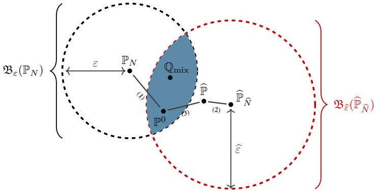
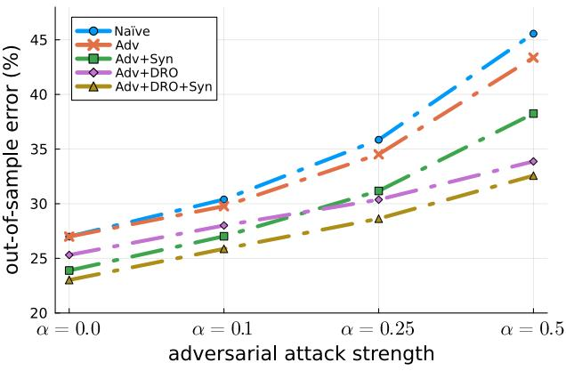
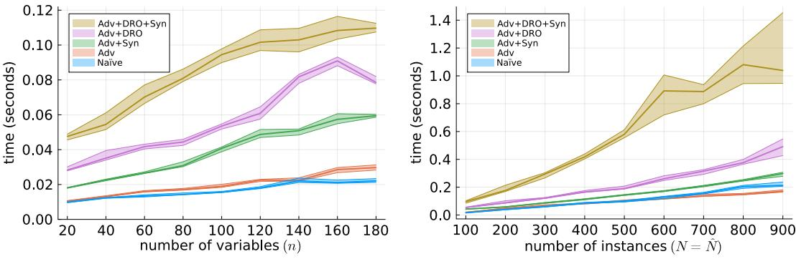

# CAN SYNTHETIC DATA REDUCE CONSERVATISM OF DISTRIBUTIONALLY ROBUST ADVERSARIAL TRAINING?

## Anonymous authors

Paper under double-blind review

## ABSTRACT

When the inputs of a machine learning model are subject to adversarial attacks, standard stationarity assumptions on the training and test sets are violated, typically making empirical risk minimization (ERM) ineffective. Adversarial training, which imitates the adversary during the training stage, has thus emerged as the *de facto* standard for hedging against adversarial attacks. Although adversarial training provides some robustness over ERM, it can still be subject to overfitting, which explains why recent work mixing the training set with synthetic data obtains improved out-of-sample performances. Inspired by these observations, we develop a Wasserstein distributionally robust (DR) counterpart of adversarial training for improved generalization and provide a recipe for further reducing the conservatism of this approach by adjusting its ambiguity set with respect to synthetic data. The underlying optimization problem, DR adversarial training with synthetic data, is nonconvex and comprises infinitely many constraints. To this end, by using results from robust optimization and convex analysis, we develop tractable relaxations. We focus our analyses on the logistic loss function and provide discussions for adapting this framework to several other loss functions. We demonstrate the superiority of this approach on artificial as well as standard benchmark problems.

## 1 INTRODUCTION

In recent years, there has been a surge of interest in utilizing synthetic data in order to improve adversarial robustness of ML models. [Carmon et al.](#page-9-0) [\(2019\)](#page-9-0) demonstrate that training a classifier with additional unlabelled data from the same distribution helps adversarial robustness. [Deng et al.](#page-9-1) [\(2021\)](#page-9-1) show how unlabelled data from a different domain/distribution improves adversarial robustness in the original domain. [Sehwag et al.](#page-11-0) [\(2022\)](#page-11-0) investigate how adversarial robustness of a classifier trained on synthetic data from a proxy distribution translates to the robustness on the real data, and highlight the importance of quantifying the distance between real and proxy data distribution. In comparison to data arising from a related domain/proxy distribution, the advantage of relying on a synthetic data generator trained on real data is that control over the distance between real and synthetic distribution often comes for free as a consequence of theoretical guarantees on the fidelity of the chosen generator [\(Goodfellow et al., 2014a;](#page-10-0) [Arjovsky](#page-9-2) [et al., 2017;](#page-9-2) [Li et al., 2017\)](#page-10-1). In particular, Wasserstein GAN [\(Arjovsky et al., 2017\)](#page-9-2) for example achieves the closeness between the training data and the generator in terms of Wasserstein-1 distance and so the generator is guaranteed to live within a small ball around the training distribution.

The concept of adversarial robustness is designed to protect against adversarial attacks, however, it is typically still prone to overfitting [Wong et al.](#page-12-0) [\(2020\)](#page-12-0). On the other hand, for non-adversarial settings, distributionally robust optimization hedges against overfitting by learning over the worst-case data distribution realization from an ambiguity set (ball) built around the empirical (real data) distribution. In this paper, we explore how synthetic data helps us achieve both adversarial and distributional robustness. We find that synthetic data provides us a 'direction' along which to travel from the center of the ball in our search for the true distribution. That is, we rely on synthetic data in order to identify appropriate *fraction* of the ball and so *reduce the conservatism* of distributionally robust optimization. Thus, we aim to utilize synthetic data for model generalization.

Figure 1: *Adversarial training [Adv](#page-3-0) optimizes the expected adversarial loss over the empirical distribution* PN *. Replacing* PN *with the worst-case distribution in an ambiguity set* Bε(PN ) *built around it gives us the DR adversarial training problem [AdvDRO.](#page-3-1) To reduce conservatism of* Bε(PN )*, we intersect it with another ball around synthetic empirical distribution* Bεb(Pb Nb ) *(Section [4\)](#page-4-0). This intersection includes* P 0 *if* εb*overestimates* (2) + (3) *for which confidence bounds can be provided (*e.g.*, fidelity guarantees on the synthetic generator along with finite-sample statistics; see Appendix [D.2\)](#page-31-0). The recent literature on synthetic data for adversarial training [\(Gowal et al., 2021;](#page-10-2) [Xing et al., 2022\)](#page-12-1), instead of solving an ERM over* PN *, solves an ERM over* Qmix *which is also included in the intersection* Bε(PN ) ∩ Bεb(Pb Nb ) *under some conditions on* ε *and* εb*(*cf. *Lemma [3\)](#page-5-0).*

The overarching question we address in this paper is: *What is the value of synthetic data in the context of model robustness?* See Figure [1](#page-1-0) for an illustration of our problem setting and Appendix [A](#page-13-0) for notation. Our contributions are:

- We show that logistic loss adversarial training is equivalent to empirical risk minimization (for a new loss function) and is consequently prone to overfitting.
- We provide a tractable convex optimization reformulation for both adversarially *and* Wasserstein distributionally robust optimization with logistic loss (*cf.* Section [3\)](#page-3-2).
- To reduce the conservatism of adversarially and distributionally robust optimization, in Section [4,](#page-4-0) we derive a variant of it where the distributional ambiguity is replaced with the intersection of Wasserstein balls built around the real and synthetic data (*cf.* Figure [1\)](#page-1-0). We provide discussions on when this approach is meaningful and provide a rigorous theoretical analysis to derive tractable approximation schemes by unifying the robust optimization, adversarial training, and synthetic data fields.
- We provide extensive experimentation to showcase the benefits of our approach and in particular on all the UCI datasets we considered, we beat all the competing state-of-the-art results.

## 2 PROBLEM SETTING AND PRELIMINARIES

In this work, we consider a binary classification problem where an instance is modeled as (x, y) ∈ Ξ := R n × {−1, +1}. We focus specifically on logistic regression as it provides a particularly favourable ground to explore the relationship between adversarial robustness and ERM. More precisely, the labels depend on the features probabilistically with

$$\text{Prob}[y \mid \boldsymbol{x}] \;= [1 + \exp(-y \cdot \boldsymbol{\beta}^\top \boldsymbol{x})]^{-1},$$

for some β ∈ R n; its associated loss is the *logloss* function ℓβ(x, y) := log(1 + exp (−y · β ⊤x)). We review and discuss several training paradigms (*cf.* Table [1](#page-2-0) for a summary).

|               | ERM                | DRO                                 | Adv                                                    |  |  |
|---------------|--------------------|-------------------------------------|--------------------------------------------------------|--|--|
| Training risk | EP N [ℓβ(x, y)] | EQ[ℓβ(x, y)] sup Q∈Bε(PN ) | " # EP sup {ℓβ(x + z, y)} N z:∥z∥p≤α |  |  |
| True risk     | EP0 [ℓβ(x, y)]  | EP0 [ℓβ(x, y)]                   | " # EP0 {ℓβ(x + z, y)} sup z:∥z∥p≤α     |  |  |

Table 1: *Comparison of the risks taken under various training paradigms.*

Distributional ambiguity measures and sets Let P(Ξ) denote the set of probability distributions supported on Ξ. In this work, we employ the *Wasserstein distance* to model distributional ambiguity. Before defining the Wasserstein distance on P(Ξ), we introduce the following feature-label metric on Ξ.

Definition 1. *The distance* d(ξ, ξ ′ ) *between* ξ = (x, y) ∈ Ξ *and* ξ ′ = (x ′ , y′ ) ∈ Ξ *is the standard feature-label metric*

$$d(\xi, \xi') = \|x - x'\|\_q + \kappa \cdot \mathbf{1}[y \neq y']$$

*for* κ > 0 *controlling the label weight and* q > 0 *specifying a rational norm on* R n*.*

Using Definition [1,](#page-1-1) we next define the Wasserstein distance.

Definition 2. *The type-1 Wasserstein distance between distributions* Q ∈ P(Ξ) *and* Q′ ∈ P(Ξ)*, for the feature-label metric* d(ξ, ξ ′ ) *on* Ξ*, is defined as*

$$\mathrm{W}(\mathbb{Q}, \mathbb{Q}') = \inf\_{\Pi \in \mathcal{P}(\Xi \times \Xi)} \left\{ \int\_{\Xi \times \Xi} d(\xi, \xi') \Pi(d\xi, d\xi') \, : \, \Pi(d\xi, \Xi) = \mathbb{Q}(d\xi), \, \Pi(\Xi, d\xi') = \mathbb{Q}'(d\xi') \right\}.$$

For a fixed ε > 0, we define the Wasserstein ambiguity set of P ∈ P(Ξ) as Bε(P) := {Q ∈ P(Ξ) : W(Q, P) ≤ ε}.

Empirical Risk Minimization Let us denote by P 0 the true data generating distribution, then one ideally wants to minimize the expected loss over P 0 , represented as the following problem

$$\underset{\beta \in \mathbb{R}^n}{\text{minimize}} \quad \mathbb{E}\_{\mathbb{P}^0} [\ell\_\beta(x, y)]. \tag{RM}$$

In practice, P 0 is hardly ever known, and one thus resorts to the empirical distribution PN = 1 N P i∈[N] δξi where {ξ i = (x i , yi )}i∈[N] are i.i.d. samples from P 0 and δξ denotes the Dirac distribution supported on ξ. Thus, the empirical risk minimization (ERM) problem is

$$\underset{\mathcal{B}\in\mathbb{R}^n}{\text{minimize}}\quad\mathbb{E}\_{\mathbb{P}\_N}[\ell\_\beta(\mathbf{z},y)] = \frac{1}{N}\sum\_{i\in\{N\}}\ell\_\beta(\mathbf{z}^i,y^i).\tag{\text{ERM}}$$

Distributionally Robust Optimization It is well understood that in non-asymptotic settings, [ERM](#page-2-1) may suffer from *overfitting* or *optimism bias* [\(Bishop, 2006;](#page-9-3) [Hastie et al., 2009;](#page-10-3) [Murphy, 2022;](#page-11-1) [DeMiguel & Nogales, 2009;](#page-9-4) [Michaud,](#page-10-4) [1989;](#page-10-4) [Smith & Winkler, 2006\)](#page-11-2). *Distributionally robust optimization* (DRO, [Delage & Ye 2010\)](#page-9-5) is an optimization approach attempting at addressing this issue. DRO is is motivated by the fact that in the finite-data setting, the ambiguity between the true and empirical distributions is positive but upper-bounded by some ϵ > 0. When the ambiguity is measured by Wasserstein distance [2,](#page-2-3) this means that P 0 ∈ Bε(PN ). The goal in DRO is to optimize the expected loss over the worst possible realization of the true distribution in Bε(PN ). That is,

$$\underset{\mathcal{B}\in\mathbb{R}^n}{\text{minimize}}\quad\sup\_{\mathbb{Q}\in\mathfrak{B}\_{\varepsilon}(\mathbb{P}\_N)}\mathbb{E}\_{\mathbb{Q}}[\ell\_{\mathcal{B}}(\mathfrak{x},y)].\tag{DRO}$$

We refer the readers to [Mohajerin Esfahani & Kuhn](#page-10-5) [\(2018\)](#page-10-5) and [Kuhn et al.](#page-10-6) [\(2019a\)](#page-10-6) for the generalization guarantees and finite sample statistics for [DRO.](#page-2-2)

Adversarial Robustness Another popular approach to improve over the generalization performance of [ERM](#page-2-1) is *adversarial robustness* where the goal is to provide robustness against *adversarial attacks* [\(Goodfellow et al., 2014b\)](#page-10-7). An adversarial attack, in the widely studied lp-noise setting (see e.g. [Croce et al.](#page-9-6) [\(2020\)](#page-9-6)), perturbs the features of the test instances (x, y) by adding additive noise z to x. The adversary chooses the noise vector z, subject to ∥z∥p ≤ α, so as to maximize the loss ℓβ(x + z, y) associated with this perturbed test instance. Therefore, in adversarial training one can solve the following optimization problem in the training stage to hedge against adversarial perturbations at test time

$$\underset{\mathcal{B}\in\mathbb{R}^{n}}{\text{minimize}}\quad\mathbb{E}\_{\mathbb{P}\_{N}}\left[\sup\_{\mathbf{z}\colon\|\mathbf{z}\|\_{p}\leq\alpha}\left\{\ell\_{\mathcal{B}}(\mathbf{z}+\mathbf{z},y)\right\}\right].\tag{A\text{dv}}$$

Note that [Adv](#page-3-0) reduces to [ERM](#page-2-1) when α = 0. It is worth noting that [Adv](#page-3-0) is identical to feature robust training [\(Bertsimas](#page-9-7) [et al., 2019\)](#page-9-7) which does not have adversarial attacks but the training set comprises noisy observations of the features hence one employs robust optimization [\(Ben-Tal et al., 2009;](#page-9-8) [Gorissen et al., 2015\)](#page-10-8).

## 3 DISTRIBUTIONALLY ROBUST ADVERSARIAL TRAINING

Problems [Adv](#page-3-0) and [ERM](#page-2-1) of logistic regression differ from one another in their objective functions. However, the following lemma shows that Problem [Adv](#page-3-0) is nothing but an [ERM](#page-2-1) problem for a different loss function.

Lemma 1. *Problem [Adv](#page-3-0) is identical to*

$$\underset{\beta \in \mathbb{R}^n}{\text{minimize}} \quad \mathbb{E}\_{\mathbb{P}\_N} [\ell\_\beta^\alpha(x, y)],$$

*where* ℓ α β (x, y) := log(1 + exp(−y · β ⊤x + α · ∥β∥p⋆ )) *is the* adversarial loss *associated with the logloss. Moreover, the corresponding univariate loss* L α(z) := log(1 + exp(−z + α · ∥β∥p⋆ )) *satisfies* Lip(L α) = 1 *for any* α > 0*.*

Reducing the [Adv](#page-3-0) to problem [ERM](#page-2-1) with loss function ℓ α β (x, y) highlights that adversarial training is prone to overfitting. In order to circumvent this obstacle, we devote the remainder of this section to derive a distributionally robust counterpart of adversarial training. We introduce the following *distributionally and adversarially robust* optimization problem:

$$\underset{\mathcal{B}\in\mathbb{R}^{n}}{\text{minimize}}\quad\sup\_{\mathbb{Q}\in\mathfrak{B}\_{\sigma}(\mathbb{P}\_{N})}\mathbb{E}\_{\mathbb{Q}}\left[\sup\_{\mathbf{z}:\|\mathbf{z}\|\_{p}\leq\alpha}\{\ell\_{\mathcal{B}}(\mathbf{z}+\mathbf{z},y)\}\right].\tag{\text{AdvDRO}}$$

Solving Problem [AdvDRO](#page-3-1) requires the following assumption.

Assumption 1. *There exists* ε > 0 *known to the decision maker so that* P 0 ∈ Bε(PN )*.*

We discuss relaxing Assumption [1](#page-3-3) in Appendix[§D.1.](#page-29-0) As a corollary of Lemma [1,](#page-3-4) [AdvDRO](#page-3-1) has a tractable reformulation. Corollary 1. *Problem [AdvDRO](#page-3-1) admits the following tractable convex optimization reformulation:*

$$\begin{array}{ll}\underset{\beta,\lambda,\ \mathbf{s}}{\text{minimize}} & \lambda\cdot\boldsymbol{\varepsilon} + \frac{1}{N} \sum\_{i\in[N]} s\_{i} \\\text{subject to} & \log(1 + \exp(-y^{i}\cdot\boldsymbol{\beta}^{\top}\boldsymbol{x}^{i} + \boldsymbol{\alpha}\cdot\|\boldsymbol{\beta}\|\_{p^{\*}})) \leq s\_{i} & \forall i \in [N] \\ & \log(1 + \exp(y^{i}\cdot\boldsymbol{\beta}^{\top}\boldsymbol{x}^{i} + \boldsymbol{\alpha}\cdot\|\boldsymbol{\beta}\|\_{p^{\*}})) - \lambda\cdot\boldsymbol{\kappa} \leq s\_{i} & \forall i \in [N] \\ & \|\beta\|\_{q^{\*}} \leq \lambda \\ & \beta \in \mathbb{R}^{n}, \ \lambda \geq 0, \ \mathbf{s} \in \mathbb{R}^{N}, \end{array}$$

In Appendix [C.3,](#page-16-0) we show how one can further rewrite [AdvDRO](#page-3-1) as a conic optimization problem with the exponential cone and the cone associated with the q ⋆ -norm. For q, q⋆ ∈ {1, 2, ∞}, the yielding problem can be solved with the exponential cone solver of MOSEK [\(MOSEK ApS, 2023a\)](#page-11-3), in polynomial time (with respect to their input size, [Nesterov](#page-11-4) [2018\)](#page-11-4). We derive the regularized counterparts of these problems, and discuss that their complexity remain the same.

## 4 REDUCING CONSERVATISM WITH SYNTHETIC DATA

So far we have discussed the setting where we have access to the empirical distribution PN that is constructed from N i.i.d. samples of P 0 . Suppose that we have an additional empirical distribution Pb Nb which is constructed from Nb i.i.d. samples {ξbj = (xb j , yb j )}j∈[Nb] of another related but non-identical distribution Pb. We first start with a strong and unrealistic assumption, that additional data is close enough to P 0 :

Assumption 2. *There exists* ε >b 0 *known to the decision maker so that* W(P 0 , Pb Nb ) ≤ εb*.*

As mentioned earlier, [DRO](#page-2-2) assumes P 0 ∈ Bε(PN ). Under Assumption [2,](#page-4-1) it also follows that P 0 ∈ Bεb(Pb Nb ), meaning that P 0 ∈ Bε(PN ) ∩ Bεb(Pb Nb ). We thus want to solve the following variant of [AdvDRO](#page-3-1) where the ambiguity set is modeled as the intersection of two balls, hence providing us a weakly less conservative ambiguity set than of [AdvDRO:](#page-3-1)

$$\underset{\mathcal{B}\in\mathbb{R}^n}{\text{minimize}}\quad\sup\_{\mathbb{Q}\in\mathfrak{B}\_{\varepsilon}(\mathbb{P}\_N)\cap\mathfrak{B}\_{\delta}(\mathbb{P}\_N)}\mathbb{E}\_{\mathbb{Q}}[\ell\_{\mathcal{B}}^{\alpha}(\mathbf{z},y)],\tag{\text{Synth}}$$

which reduces to [AdvDRO](#page-3-1) when εbis sufficiently large so that Bε(PN ) ∩ Bεb(Pb Nb ) = Bε(PN ). Note that for [Synth](#page-4-2) to be well-defined, Bε(PN ) ∩ Bεb(Pb Nb ) needs to be non-empty (to be characterized in Section [§4](#page-4-0) ).

The inner problem in [Synth](#page-4-2) involves optimizing the worst-case realization Q from an unusual constraint set in the distribution space. To avoid the difficulty of solving such a problem, we borrow techniques from the *adjustable robust optimization* literature to find a tractable convex relaxation of Problem [Synth.](#page-4-2) Discussion on the difficulty of directly solving [Synth](#page-4-2) and the need for our relaxation is in Appendix [§B.](#page-13-1) The next theorem is our main theoretical contribution, which presents a conservative relaxation to Problem [Synth.](#page-4-2)

Theorem 1. *Problem [Synth](#page-4-2) admits the following tractable convex conservative relaxation:*

minimize β,λ,λ, b s,sb,z+,z− ε · λ + εb· λb + 1 N X N i=1 si + 1 Nb X Nb j=1 sbj subject to L α(β ⊤x i + z +⊤ ij (xb j − x i )) ≤ si + κ · 1 − y i 2 · λ + sbj + κ · 1 − yb j 2 · λb ∀i ∈ [N], ∀j ∈ [Nb] ∥β − z + ij∥q ⋆ ≤ λ, ∥−β − z − ij∥q ⋆ ≤ λ, ∥z + ij∥q ⋆ ≤ λ, b ∥z − ij∥q ⋆ ≤ λ ∀i ∈ [N], ∀j ∈ [Nb] α −⊤ i 1 + y i 1 + yb j

$$L^{\alpha}(-\boldsymbol{\beta}^{\top}\boldsymbol{x}^{i}+\mathbf{z}\_{ij}^{-\top}(\hat{\boldsymbol{x}}^{j}-\boldsymbol{x}^{i})) \leq s\_{i}+\kappa \cdot \frac{\mathbf{1}\top\mathbf{y}}{2}\cdot\lambda+\hat{s}\_{j}+\kappa \cdot \frac{\mathbf{1}\top\mathbf{y}}{2}\cdot\hat{\lambda} \qquad \forall i\in[N],\ \forall j\in[\widehat{N}]$$

$$\beta \in \mathbb{R}^n, \ \lambda \ge 0, \ \widehat{\lambda} \ge 0, \ s \in \mathbb{R}\_+^N, \ \widehat{s} \in \mathbb{R}\_+^{\widehat{N}}, \ z\_{ij}^+, z\_{ij}^- \in \mathbb{R}^n, \ i \in [N], \ j \in [\widehat{N}]. \tag{\text{ProxSym}}$$

This formulation admits an exponential cone reformulation, with the same techniques applied to [AdvDRO](#page-3-1) which is summarized in Appendix [§C.3.](#page-16-0) Moreover, in Appendix [§C.9,](#page-25-0) we review tailored methods for norms with q ∈ {1, 2, ∞} as well as present alternative relaxations using techniques from robust optimization.

The case of uninformative synthetic data When the synthetic data does not provide any useful information, we can select bϵ large enough to have Bε(PN ) ∩ Bεb(Pb Nb ) = Bε(PN ). In this case, problem [Synth](#page-4-2) simply reduces to Problem [AdvDRO.](#page-3-1) The next lemma discusses the same behavior for the relaxed problem [ProxSynth,](#page-4-3) meaning that the presented relaxation will not force learning from the synthetic data, and recovering [AdvDRO](#page-3-1) remains a feasible solution.

Lemma 2. *As* εb→ ∞*, the optimal value of [ProxSynth](#page-4-3) converges to the optimal value of [AdvDRO.](#page-3-1)*

The case of unknown ϵ and bϵ Let us discuss how to tune the parameters ε and εb when they are unknown. This discussion requires understanding the statistical properties of [AdvDRO](#page-3-1) and [Synth,](#page-4-2) which we provide in Appendix [§D.](#page-29-1) First, recall that we need Bε(PN ) ∩ Bεb(Pb Nb ) ̸= ∅ for [Synth](#page-4-2) to be well-defined. To ensure this, a sufficient condition follows from the triangle inequality: ε + εb≥ W(PN , Pb Nb ).

Let us now discuss tuning ε. We aim to find a tight ε value so that P 0 ∈ Bε(PN ) with high confidence. To this end, we use the rich arsenal of finite-sample statistics from the Wasserstein DRO literature. In Appendix [D.1,](#page-29-0) we review existing results applicable to [AdvDRO,](#page-3-1) including the optimal value of ε given a confidence level for including P 0 in Bε(PN ), asymptotic consistency of [AdvDRO,](#page-3-1) and the existence of sparse worst-case distributions in the nature's problem.

On the other hand, deciding εb is a much more challenging task since we want to have P 0 ∈ Bεb(Pb Nb ), but Pb Nb is constructed of i.i.d. samples of another distribution Pb. Thus, one needs to estimate both εb1 := W(Pb Nb , Pb) and εb2 := W(Pb, P 0 ). We then would choose εb≥ εb1+εb2 to include P 0 in Bεb(Pb Nb ). In Appendix [D.2,](#page-31-0) we first assume that εb2 is known, and show that [Synth](#page-4-2) enjoys an optimal characterization of ε and εbvalues that guarantee P 0 ∈ Bε(PN )∩Bεb(Pb Nb ) with arbitrarily high confidence. Note that when no knowledge of εb2 exists, we use cross-validation to tune this parameter.

Connection to literature on synthetic data for adversarial training Here, we investigate the literature on using synthetic data {(xb j , yb j )}j∈[Nb] for adversarial training and relate it to the problem [Synth](#page-4-2) we propose. The works in this literature [\(Gowal et al., 2021;](#page-10-2) [Xing et al., 2022\)](#page-12-1) propose solving the following problem, for some w > 0.

$$\underset{\boldsymbol{\theta}\in\mathbb{R}^{n}}{\text{minimize}}\quad\frac{1}{N+w\cdot\hat{N}}\left[\sum\_{i\in[N]}\sup\_{\mathbf{z}^{i}:\|\mathbf{z}^{i}\|\_{p}\leq\alpha}\{\ell\_{\mathcal{B}}(\mathbf{z}^{i}+\mathbf{z}^{i},y^{i})\}+w\cdot\sum\_{j\in[\hat{N}]}\sup\_{\mathbf{z}^{j}:\|\mathbf{z}^{j}\|\_{p}\leq\alpha}\{\ell\_{\mathcal{B}}(\hat{\mathbf{z}}^{j}+\mathbf{z}^{j},\hat{y}^{i})\}\right],\tag{1}$$

Proposition 1. *Problem* [\(1\)](#page-5-1) *is equivalent to* min β∈Rn EQmix [ℓ α β (x, y)] *where* Qmix := λPN + (1 − λ)Pb Nb *for* λ = N N+w·Nb *.*

The following lemma shows that under reasonable conditions for ε and εb, the mixture distribution introduced in Proposition [1](#page-5-2) is included in Bε(PN )∩Bεb(Pb Nb ). This means that the distribution Qmix used in the literature on synthetic data for adversarial training, belongs to the set of distributions considered in Problem [Synth.](#page-4-2)

Lemma 3. *For any* λ ∈ (0, 1) *and distribution* Qmix := λ · PN + (1 − λ) · Pb Nb *, we have:*

$$
\varepsilon + \widehat{\varepsilon} \ge \mathrm{W}(\mathbb{P}\_N, \widehat{\mathbb{P}}\_{\widehat{N}}) \quad \text{and} \quad \frac{\lambda}{1 - \lambda} = \frac{\widehat{\varepsilon}}{\varepsilon} \implies \mathbb{Q}\_{\mathrm{mix}} \in \mathfrak{B}\_{\varepsilon}(\mathbb{P}\_N) \cap \mathfrak{B}\_{\widehat{\varepsilon}}(\widehat{\mathbb{P}}\_{\widehat{N}}).
$$

For λ = N N+Nb , provided that Bε(PN ) ∩ Bεb(Pb Nb ) is nonempty, Lemma [3](#page-5-0) shows that a sufficient condition for this intersection to include the mixture Qmix is ε/ε b = N/Nb, which is intuitive since the radii of the Wasserstein ambiguity sets are typically chosen inversely proportional to the number of samples [\(Kuhn et al., 2019b,](#page-10-9) Theorem 18).

## 5 EXPERIMENTS

We compare the proposed DRO problem over the intersection of empirical and synthetic Wasserstein balls with several benchmark methods. Code and more experiments are on an anonymous repo (we will share the URL with reviewers when discussion opens). The following abbreviations will be used throughout the experiments:

- Naïve: Solving [ERM](#page-2-1) with the logloss function;

| Case     | CV'ed w | CV'ed ε/εb |
|----------|---------|------------|
| α = 0    | 0.002   | 0.0120     |
| α = 0.1  | 0.046   | 0.172      |
| α = 0.25 | 0.086   | 0.232      |
| α = 0.5  | 0.290   | 0.241      |

Figure 2: *Left: mean out-of-sample error rates of each method over different attack strengths. Right: average importance of synthetic data for empirical and robust risk minimization.*

- Adv: Adversarial training [Adv](#page-3-0) on the empirical distribution (*e.g.*, [Madry et al. 2017\)](#page-10-10);
- Adv+Syn: Solving [\(1\)](#page-5-1) for adversarial training on mixtures of real and synthetic data (*e.g.*, [Gowal et al. 2021\)](#page-10-2);
- Adv+DRO: Distributionally robust (DR) counterpart [AdvDRO](#page-3-1) of [Adv](#page-3-0) with the ambiguity set centered at PN ;
- Adv+DRO+Syn: DR counterpart [Synth](#page-4-2) of [Adv](#page-3-0) over intersection of ambiguity sets built around PN and Pb Nb .

Artificial Data We sample instances i.i.d. from a generated artificial ground truth distribution to form training and test sets. Similarly, we sample instances i.i.d. from another related but different ground truth distribution to form synthetic sets. The details are in Appendix [§E.](#page-33-0) We simulate 25 cases, each with N = 100 training instances, Nb = 200 synthetic instances, and Nte = 10, 000 test instances. For each case, we further simulate different adversarial attack strengths α ∈ {0, 0.1, 0.25, 0.5} using ℓ2 attacks (ℓ1 and ℓ∞ are also available in our repository with similar implementation and results). In each problem, we apply 5-fold cross-validation to select the best parameter combinations for both our and the benchmark methods (the specific parameters and grids for validation are shared in our repository). The performance in terms of the out-of-sample misclassification (error) rates is available on the left-hand side of Figure [2.](#page-6-0) As expected, Naïve training provides the worst out-of-sample errors. While Adv improves these errors, Adv+Syn and Adv+DRO enhance its performance further by mixing the empirical distribution with synthetic data and by applying DRO, respectively. Notice also that in low attack regimes using synthetic data is more important than adding distributional robustness, where a higher attack regime makes distributional robustness more important. Finally, Adv+DRO+Syn always provides the lowest errors by applying both these techniques simultaneously (that is, by solving [Synth\)](#page-4-2). On the right-hand side of Figure [2,](#page-6-0) we display the average CV'ed w values for problem [\(1\)](#page-5-1) which shows that the greater the attack strength is the more we should use the synthetic data; same relationship holds for ε/εbin [Synth,](#page-4-2) which means that the relative size of the Wasserstein ball built around the empirical distribution gets larger compared to the same ball around the synthetic data. We remark this as a possible future research direction exploring whether a larger attack *per se* implies the intersection of the Wasserstein ball will move towards the synthetic data distribution.

Since the relaxation problems we solve for [Synth](#page-4-2) comprise O(n · N · Nb) variables and exponential cone constraints, it is natural to ask whether the method scales to practical settings. Indeed, we find that in practice our methods scale better than that. To this end, we simulate problems with the same procedure as explained in the performance experiments above and report the mean runtimes in Figure [3.](#page-7-0) On the left-hand side of this figure, we simulate 25 cases that fix α = 0.2, N = 200, Nb = 200 and vary n ∈ {20, 40, . . . , 180}. On the right-hand side, we similarly simulate 25 cases that instead fix n = 100 and vary N = Nb ∈ {100, 200, . . . , 1000}. We observe that the fastest methods are Naïve and Adv among which the faster one depends on n (as the adversarial loss includes a regularizer of β), followed by Adv+Syn, Adv+DRO, and Adv+DRO+Syn, respectively. The slowest method is Adv+DRO+Syn, which is expected

Figure 3: *Runtimes over varying problem dimensions. Left:* N = Nb = 200 *is fixed. Right:* n = 100 *is fixed.*

| Data Set                | N   | N     | N b te       | n       | Attack               | Naïve                              | Adv                                | Adv+Syn                            | Adv+DRO                            | Adv+DRO+Syn                        |
|-------------------------|-----|-------|--------------|---------|----------------------|------------------------------------|------------------------------------|------------------------------------|------------------------------------|------------------------------------|
| absent                  | 111 | 333   | 296          | 74      | α = 0.05             | 44.02% (± 2.89)                    | 38.82% (± 2.86)                    | 35.95% (± 3.78)                    | 34.22% (± 2.70)                    | 32.64% (± 2.54)                    |
| annealing               |     | 404   | 360          | 41      | α = 0.20 α = 0.05 | 73.65% (± 4.14) 18.08% (± 1.89) | 51.49% (± 3.39) 16.61% (± 2.16) | 49.56% (± 3.80) 14.97% (± 1.39) | 45.61% (± 2.32) 13.50% (± 2.98) | 44.90% (± 2.30) 12.78% (± 2.78) |
|                         | 134 |       |              |         | α = 0.20             | 37.31% (± 3.92)                    | 23.08% (± 2.82)                    | 21.30% (± 1.93)                    | 20.70% (± 1.32)                    | 19.53% (± 1.42)                    |
| audiology               | 33  | 102   | 91           | 102     | α = 0.05 α = 0.20 | 21.43% (± 3.64) 37.91% (± 6.78) | 21.54% (± 3.92) 29.34% (± 5.89) | 17.03% (± 2.90) 20.44% (± 2.75) | 11.76% (± 3.28) 20.00% (± 3.01) | 9.01% (± 3.54) 17.91% (± 3.28)  |
| breast-cancer           | 102 | 307   | 274          | 90      | α = 0.05             | 4.74% (± 1.26)                     | 4.93% (± 1.75)                     | 3.87% (± 1.17)                     | 3.06% (± 0.79)                     | 2.52% (± 0.50)                     |
| contraceptive           |     | 663   | 590          | 23      | α = 0.20 α = 0.05 | 9.93% (± 1.73) 44.14% (± 2.80)  | 8.14% (± 2.01) 42.86% (± 2.59)  | 6.09% (± 1.79) 40.98% (± 0.95)  | 5.04% (± 1.11) 40.00% (± 1.33)  | 4.67% (± 0.99) 39.65% (± 1.15)  |
|                         | 220 |       |              |         | α = 0.20             | 66.19% (± 5.97)                    | 43.49% (± 2.24)                    | 42.71% (± 1.47)                    | 42.71% (± 1.47)                    | 42.71% (± 1.47)                    |
| dermatology             | 53  | 161   | 144          | 99      | α = 0.05 α = 0.20 | 15.97% (± 2.64) 30.07% (± 4.24) | 16.46% (± 1.67) 28.54% (± 3.25) | 13.47% (± 1.97) 21.53% (± 2.17) | 12.78% (± 1.61) 22.64% (± 2.15) | 10.84% (± 1.24) 20.21% (± 1.58) |
| ecoli 50 spambase |     | 151   | 135 1,841 | 9 58 | α = 0.05             | 16.30% (± 4.42)                    | 14.67% (± 5.13)                    | 13.26% (± 3.07)                    | 11.11% (± 5.52)                    | 9.78% (± 2.61)                     |
|                         |     |       |              |         | α = 0.20 α = 0.05 | 51.41% (± 3.37)                    | 42.67% (± 2.91)                    | 41.85% (± 2.95)                    | 39.70% (± 2.68)                    | 38.89% (± 2.57)                    |
|                         | 690 | 2,070 |              |         | α = 0.20             | 11.35% (± 0.77) 27.32% (± 2.11) | 10.23% (± 0.54) 15.83% (± 0.77) | 10.16% (± 0.56) 15.70% (± 0.76) | 9.83% (± 0.37) 15.67% (± 0.72)  | 9.81% (± 0.38) 15.50% (± 0.68)  |
| spect                   | 24  | 72    | 64           | 23      | α = 0.05             | 33.75% (± 5.17)                    | 29.69% (± 5.46)                    | 25.78% (± 3.06)                    | 25.47% (± 3.38)                    | 21.56% (± 2.74)                    |
|                         |     | 153   | 136          | 32      | α = 0.20 α = 0.05 | 54.22% (± 9.88) 21.84% (± 4.55) | 37.5% (± 3.53) 20.81% (± 3.97)  | 35.16% (± 2.47) 17.35% (± 3.59) | 33.75% (± 2.68) 16.18% (± 3.83) | 30.16% (± 3.61) 14.78% (± 2.89) |
| primacy-tumor           | 50  |       |              |         | α = 0.20             | 34.19% (± 6.17)                    | 25.37% (± 4.58)                    | 21.62% (± 3.45)                    | 21.84% (± 3.34)                    | 19.63% (± 2.71)                    |

Table 2: *Mean out-of-sample errors (*± *standard deviation) over* 10 *UCI datasets.*

given that Adv+DRO is a special case with large εb; however, the runtime is observed to scale graciously. To further concentrate on the runtime of Adv+DRO, we simulated cases with n = 1, 000 and N = Nb = 10, 000, and recorded that the runtimes vary between 134 to 232 seconds.

Real Data We compare the out-of-sample error rates of each method on 10 of the most popular UCI datasets for classification [\(Dua & Graff, 1998\)](#page-10-11). Classification problems with more than two classes are converted to binary classification problems (most frequent class/others). The numerical features are standardized, the ordinal categorical features are left as they are, and the nominal categorical features are processed via one-hot encoding. Further details about preprocessing are documented in our repository. For each dataset, we applied 10 simulations of the following procedure: *(i)* Select 40% of the dataset as a test set (Nte ∝ 0.4); *(ii)* Sample 25% of the remaining instances to form a training set (N ∝ 0.6 · 0.25); *(iii)* The rest (Nb ∝ 0.6 · 0.75) is used to fit a synthetic distribution by using the Gaussian Copula from the SDV [Patki et al.](#page-11-5) [\(2016\)](#page-11-5). We sample Nb synthetic instances and then 5-fold cross-validate the parameters of each method (to have equal comparison, we used the same grids with the benchmark methods) similarly to the previous experiments. The mean errors on the test set are reported in Table [2](#page-7-1) for attacks α = 0.05 and α = 0.20. The best error is always achieved by Adv+DRO+Syn, followed by Adv+DRO, Adv+Syn, Adv, Naïve, respectively. Adv+DRO achieves better errors than Adv+Syn (as observed from the mean errors) but there are cases where this is reversed. On the other hand, we verify that there is no case where any method is better than Adv+DRO+Syn.

## 6 RELATED WORK

Interactions between adversarial and distributional robustness are not new. [Sinha et al.](#page-11-6) [\(2017\)](#page-11-6), for example, show that distributional robust optimization over Wasserstein balls is intractable for generic functions (*e.g.*, neural networks) but its Lagrange relaxation resembles adversarial training hence applying adversarial training still gives some distributional robustness guarantees. Similarly, there have been works showing how one can obtain adversarial robustness via distributionally robust optimization [\(Regniez et al., 2022\)](#page-11-7). However, to our knowledge, there has not been any work addressing Wasserstein distributional robustness (that hedges against overfitting, [Kuhn et al. 2019b\)](#page-10-9) and adversarial robustness (that hedges against adversarial attacks, [Goodfellow et al. 2014b\)](#page-10-7) simultaneously. To our knowledge, the only existing work that considers generalization and adversarial robustness together is the work of [Bennouna et al.](#page-9-9) [\(2023\)](#page-9-9) where the distributional ambiguity is modeled with φ-divergences and the prediction model is a neural network.

The idea of intersecting Wasserstein balls is inspired by the "Surround, then Intersect" (SI) strategy [\(Taskesen et al., 2021,](#page-11-8) §5.2) to learn linear regression coefficients under sequential domain adaptation (see [Shafahi et al. 2020](#page-11-9) and [Song et al.](#page-11-10) [2018](#page-11-10) for a deeper understanding of robustness in domain adaptation/transfer learning). The authors use a Wasserstein metric constructed around the first and second moments and show that problem [Synth](#page-4-2) admits a tractable convex optimization reformulation under this metric. Their proof uses minimax equality which exploits the squared loss function. Indeed, we showed that in the logistic classification setting, the distributionally robust adversarial training (classification) problem becomes substantially harder, and we thus developed different duality techniques (*e.g.*, Toland's duality) and relaxations (*e.g.*, adjustable robust optimization). Recent work started to explore the intersection of ambiguity sets in different contexts [\(Awasthi et al., 2022\)](#page-9-10) or different setups [\(Zhang et al., 2023\)](#page-12-2). Given the increasing interest in this stream of research, we hope our work and analysis will be complementary to the theory. For a deeper understanding of domain adaptation (and transfer learning in general), we refer the interested reader to some works from transfer learning and domain adaptation literature.

## 7 CONCLUSION

One of the two motivations of this study was that adversarial training is subject to overfitting, which led us to formulate and experiment with the adversarially and distributionally robust training models. In the numerical results, we observed that adversarial training is improved by taking its Wasserstein DR counterpart. This is due to the same reason behind the success of recent studies that mix empirical data with synthetic data, as using synthetic data, to some extent, regularizes decisions. Motivated by these observations, our main contribution was to unify the practices of adversarial training, DRO, and using synthetic data: instead of achieving adversarial robustness with synthetic data, we achieve it by distributional robustness and use the synthetic data to manipulate the underlying ambiguity sets. The experiments show a drastic improvement over the benchmark methods.

Despite the appealing performance, one must also be mindful that the proposed model needs to tune an additional parameter (εb) that can recover as special cases the DRO problem (εb≫ ε) and the adversarial training problem (ε = 0 with large εb), and can even resemble non-robust adversarial training with synthetic data when the boundaries of the Wasserstein balls intersect. Regardless, we observe that in most cases this model achieves much better error rates than any of these special cases. Moreover, we focused on the logloss function to show the theoretical challenges and present tractable reformulation/approximation techniques; it could be fruitful to extend these results to neural network classifiers as is typical for theoretical studies stemming from logistic regression [\(Dreiseitl & Ohno-Machado, 2002\)](#page-9-11). The extension of our findings to different loss functions is sketched in the appendices.

## REFERENCES

- Martin Arjovsky, Soumith Chintala, and Léon Bottou. Wasserstein generative adversarial networks. In Doina Precup and Yee Whye Teh (eds.), *Proceedings of the 34th International Conference on Machine Learning*, volume 70 of *Proceedings of Machine Learning Research*, pp. 214–223. PMLR, 06–11 Aug 2017. URL <https://proceedings.mlr.press/v70/arjovsky17a.html>.
- Pranjal Awasthi, Christopher Jung, and Jamie Morgenstern. Distributionally robust data join. *arXiv preprint arXiv:2202.05797*, 2022.
- A. Ben-Tal, L. El Ghaoui, and A. Nemirovski. *Robust Optimization*. Princeton University Press, 2009.
- Aharon Ben-Tal, Alexander Goryashko, Elana Guslitzer, and Arkadi Nemirovski. Adjustable robust solutions of uncertain linear programs. *Mathematical programming*, 99(2):351–376, 2004.
- Amine Bennouna, Ryan Lucas, and Bart Van Parys. Certified robust neural networks: Generalization and corruption resistance. *arXiv preprint arXiv:2303.02251*, 2023.
- D. Bertsimas and D. Den Hertog. *Robust and Adaptive Optimization*. Dynamic Ideas, 2022.
- Dimitris Bertsimas, Vineet Goyal, and Brian Y Lu. A tight characterization of the performance of static solutions in two-stage adjustable robust linear optimization. *Mathematical Programming*, 150(2):281–319, 2015.
- Dimitris Bertsimas, Jack Dunn, Colin Pawlowski, and Ying Daisy Zhuo. Robust classification. *INFORMS Journal on Optimization*, 1(1):2–34, 2019.
- J. Bezanson, A. Edelman, S. Karpinski, and V. B. Shah. Julia: A fresh approach to numerical computing. [https:]( https://doi.org/10.1137/141000671) [//doi.org/10.1137/141000671]( https://doi.org/10.1137/141000671).
- C. Bishop. *Pattern Recognition and Machine Learning*. Springer, 2006.
- Yair Carmon, Aditi Raghunathan, Ludwig Schmidt, John C Duchi, and Percy S Liang. Unlabeled data improves adversarial robustness. In H. Wallach, H. Larochelle, A. Beygelzimer, F. d'Alché-Buc, E. Fox, and R. Garnett (eds.), *Advances in Neural Information Processing Systems*, volume 32. Curran Associates, Inc., 2019. URL [https://proceedings.neurips.cc/paper\\_files/paper/2019/file/](https://proceedings.neurips.cc/paper_files/paper/2019/file/32e0bd1497aa43e02a42f47d9d6515ad-Paper.pdf) [32e0bd1497aa43e02a42f47d9d6515ad-Paper.pdf](https://proceedings.neurips.cc/paper_files/paper/2019/file/32e0bd1497aa43e02a42f47d9d6515ad-Paper.pdf).
- Francesco Croce, Maksym Andriushchenko, Vikash Sehwag, Edoardo Debenedetti, Nicolas Flammarion, Mung Chiang, Prateek Mittal, and Matthias Hein. Robustbench: a standardized adversarial robustness benchmark. *arXiv preprint arXiv:2010.09670*, 2020.
- E. Delage and Y. Ye. Distributionally robust optimization under moment uncertainty with application to data-driven problems. *Operations Research*, 58(3):596–612, 2010.
- V. DeMiguel and F. J. Nogales. Portfolio selection with robust estimation. *Operations Research*, 57(3):560–577, 2009.
- Zhun Deng, Linjun Zhang, Amirata Ghorbani, and James Zou. Improving adversarial robustness via unlabeled out-ofdomain data. In Arindam Banerjee and Kenji Fukumizu (eds.), *Proceedings of The 24th International Conference on Artificial Intelligence and Statistics*, volume 130 of *Proceedings of Machine Learning Research*, pp. 2845–2853. PMLR, 13–15 Apr 2021. URL <https://proceedings.mlr.press/v130/deng21b.html>.
- Stephan Dreiseitl and Lucila Ohno-Machado. Logistic regression and artificial neural network classification models: a methodology review. *Journal of biomedical informatics*, 35(5-6):352–359, 2002.
- D. Dua and C. Graff. UCI machine learning repository. <http://archive.ics.uci.edu/ml>, 1998.
- I. Dunning, J. Huchette, and M. Lubin. JuMP: A modeling language for mathematical optimization. *SIAM Review*, 59 (2):295–320, 2017.
- Nicolas Fournier and Arnaud Guillin. On the rate of convergence in wasserstein distance of the empirical measure. *Probability theory and related fields*, 162(3-4):707–738, 2015.
- Ian Goodfellow, Jean Pouget-Abadie, Mehdi Mirza, Bing Xu, David Warde-Farley, Sherjil Ozair, Aaron Courville, and Yoshua Bengio. Generative adversarial nets. In Z. Ghahramani, M. Welling, C. Cortes, N. Lawrence, and K.Q. Weinberger (eds.), *Advances in Neural Information Processing Systems*, volume 27. Curran Associates, Inc., 2014a. URL [https://proceedings.neurips.cc/paper\\_files/paper/2014/file/](https://proceedings.neurips.cc/paper_files/paper/2014/file/5ca3e9b122f61f8f06494c97b1afccf3-Paper.pdf) [5ca3e9b122f61f8f06494c97b1afccf3-Paper.pdf](https://proceedings.neurips.cc/paper_files/paper/2014/file/5ca3e9b122f61f8f06494c97b1afccf3-Paper.pdf).
- Ian J Goodfellow, Jonathon Shlens, and Christian Szegedy. Explaining and harnessing adversarial examples. *arXiv preprint arXiv:1412.6572*, 2014b.
- Bram L Gorissen, ˙Ihsan Yanıkoglu, and Dick Den Hertog. A practical guide to robust optimization. ˘ *Omega*, 53:124–137, 2015.
- Sven Gowal, Sylvestre-Alvise Rebuffi, Olivia Wiles, Florian Stimberg, Dan Andrei Calian, and Timothy A Mann. Improving robustness using generated data. *Advances in Neural Information Processing Systems*, 34:4218–4233, 2021.
- T. Hastie, R. Tibshirani, and J. Friedman. *The Elements of Statistical learning: Data mining, Inference, and Prediction*. Springer, 2009.
- Chih-Wei Hsu, Chih-Chung Chang, Chih-Jen Lin, et al. A practical guide to support vector classification, 2003.
- D. Kuhn, P. Mohajerin Esfahani, V.A. Nguyen, and S. Shafieezadeh-Abadeh. Wasserstein distributionally robust optimization: Theory and applications in machine learning. *INFORMS TutORials in Operations Research*, pp. 130–169, 2019a.
- Daniel Kuhn, Peyman Mohajerin Esfahani, Viet Anh Nguyen, and Soroosh Shafieezadeh-Abadeh. Wasserstein distributionally robust optimization: Theory and applications in machine learning. In *Operations research & management science in the age of analytics*, pp. 130–166. Informs, 2019b.
- Chun-Liang Li, Wei-Cheng Chang, Yu Cheng, Yiming Yang, and Barnabás Póczos. MMD GAN: towards deeper understanding of moment matching network. In Isabelle Guyon, Ulrike von Luxburg, Samy Bengio, Hanna M. Wallach, Rob Fergus, S. V. N. Vishwanathan, and Roman Garnett (eds.), *Advances in Neural Information Processing Systems 30: Annual Conference on Neural Information Processing Systems 2017, December 4-9, 2017, Long Beach, CA, USA*, pp. 2203–2213, 2017. URL [https://proceedings.neurips.cc/paper/2017/hash/](https://proceedings.neurips.cc/paper/2017/hash/dfd7468ac613286cdbb40872c8ef3b06-Abstract.html) [dfd7468ac613286cdbb40872c8ef3b06-Abstract.html](https://proceedings.neurips.cc/paper/2017/hash/dfd7468ac613286cdbb40872c8ef3b06-Abstract.html).
- Aleksander Madry, Aleksandar Makelov, Ludwig Schmidt, Dimitris Tsipras, and Adrian Vladu. Towards deep learning models resistant to adversarial attacks. *arXiv preprint arXiv:1706.06083*, 2017.
- R. O. Michaud. The Markowitz optimization enigma: Is 'optimized' optimal? *Financial Analysts Journal*, 45(1):31–42, 1989.
- P. Mohajerin Esfahani and D. Kuhn. Data-driven distributionally robust optimization using the Wasserstein metric: performance guarantees and tractable reformulations. *Mathematical Programming*, 171(1–2):1–52, 2018.
- MOSEK ApS. MOSEK Optimizer API for Julia 10.1.12. [https://docs.mosek.com/latest/juliaapi/](https://docs.mosek.com/latest/juliaapi/index.html) [index.html](https://docs.mosek.com/latest/juliaapi/index.html), 2023a.
- MOSEK ApS. Modeling cookbook. [https://docs.mosek.com/MOSEKModelingCookbook-letter.](https://docs.mosek.com/MOSEKModelingCookbook-letter.pdf) [pdf](https://docs.mosek.com/MOSEKModelingCookbook-letter.pdf), 2023b.
- K. P. Murphy. *Probabilistic Machine Learning: An Introduction*. MIT Press, 2022.
- Y. Nesterov. *Lectures on Convex Optimization*. Springer, 2nd edition, 2018.
- Neha Patki, Roy Wedge, and Kalyan Veeramachaneni. The synthetic data vault. In *2016 IEEE International Conference on Data Science and Advanced Analytics (DSAA)*, pp. 399–410, 2016. doi: 10.1109/DSAA.2016.49.
- Chiara Regniez, Gauthier Gidel, and Hugo Berard. A distributional robustness perspective on adversarial training with the ∞-wasserstein distance, 2022. URL <https://openreview.net/forum?id=z7DAilcTx7>.
- R. T. Rockafellar. *Convex Analysis*. Princeton University Press, 1997.
- Ernst Roos, Dick den Hertog, Aharon Ben-Tal, FJCT de Ruiter, and Jianzhe Zhen. Tractable approximation of hard uncertain optimization problems. *Available on Optimization Online*, 2018.
- Vikash Sehwag, Saeed Mahloujifar, Tinashe Handina, Sihui Dai, Chong Xiang, Mung Chiang, and Prateek Mittal. Robust learning meets generative models: Can proxy distributions improve adversarial robustness? In *International Conference on Learning Representations*, 2022. URL <https://openreview.net/forum?id=WVX0NNVBBkV>.
- Aras Selvi, Mohammad Reza Belbasi, Martin Haugh, and Wolfram Wiesemann. Wasserstein logistic regression with mixed features. *Advances in Neural Information Processing Systems*, 35:16691–16704, 2022.
- Ali Shafahi, Parsa Saadatpanah, Chen Zhu, Amin Ghiasi, Christoph Studer, David Jacobs, and Tom Goldstein. Adversarially robust transfer learning, 2020.
- S. Shafieezadeh-Abadeh, D. Kuhn, and P. Mohajerin Esfahani. Regularization via mass transportation. *Journal of Machine Learning Research*, 20(103):1–68, 2019.
- Soroosh Shafieezadeh-Abadeh, Liviu Aolaritei, Florian Dörfler, and Daniel Kuhn. New perspectives on regularization and computation in optimal transport-based distributionally robust optimization. *arXiv preprint arXiv:2303.03900*, 2023.
- Alexander Shapiro. On duality theory of conic linear problems. *Nonconvex Optimization and its Applications*, 57: 135–155, 2001.
- Aman Sinha, Hongseok Namkoong, Riccardo Volpi, and John Duchi. Certifying some distributional robustness with principled adversarial training. *arXiv preprint arXiv:1710.10571*, 2017.
- J. E. Smith and R. L. Winkler. The optimizer's curse: Skepticism and postdecision surprise in decision analysis. *Management Science*, 52(3):311–322, 2006.
- Chuanbiao Song, Kun He, Liwei Wang, and John E Hopcroft. Improving the generalization of adversarial training with domain adaptation. *arXiv preprint arXiv:1810.00740*, 2018.
- Bahar Taskesen, Man-Chung Yue, Jose Blanchet, Daniel Kuhn, and Viet Anh Nguyen. Sequential domain adaptation by synthesizing distributionally robust experts. In *International Conference on Machine Learning*, pp. 10162–10172. PMLR, 2021.
- John F Toland. Duality in nonconvex optimization. *Journal of Mathematical Analysis and Applications*, 66(2):399–415, 1978.
- Ioannis Tsaknakis, Mingyi Hong, and Shuzhong Zhang. Minimax problems with coupled linear constraints: computational complexity, duality and solution methods. *arXiv preprint arXiv:2110.11210*, 2021.
- Cédric Villani et al. *Optimal transport: old and new*, volume 338. Springer, 2009.
- Alex L Wang and Fatma Kilinc-Karzan. A geometric view of sdp exactness in qcqps and its applications. *arXiv preprint arXiv:2011.07155*, 2020.
- Eric Wong, Leslie Rice, and Zico Kolter. Overfitting in adversarially robust deep learning. In *International Conference on Machine Learning*, 2020. URL <https://api.semanticscholar.org/CorpusID:211505864>.
- Yue Xing, Qifan Song, and Guang Cheng. Why do artificially generated data help adversarial robustness. *Advances in Neural Information Processing Systems*, 35:954–966, 2022.
- ˙Ihsan Yanıkoglu, Bram L Gorissen, and Dick den Hertog. A survey of adjustable robust optimization. ˘ *European Journal of Operational Research*, 277(3):799–813, 2019.
- Man-Chung Yue, Daniel Kuhn, and Wolfram Wiesemann. On linear optimization over wasserstein balls. *Mathematical Programming*, 195(1-2):1107–1122, 2022.
- Y. Zhang, L. N. Steimle, and B. T. Denton. Data-driven distributionally robust optimization: Intersecting ambiguity sets, performance analysis and tractability. Available on Optimization Online, 2023.
- Erheng Zhong, Wei Fan, Qiang Yang, Olivier Verscheure, and Jiangtao Ren. Cross validation framework to choose amongst models and datasets for transfer learning. In *Machine Learning and Knowledge Discovery in Databases: European Conference, ECML PKDD 2010, Barcelona, Spain, September 20-24, 2010, Proceedings, Part III 21*, pp. 547–562. Springer, 2010.

# Can Synthetic Data Reduce Conservatism of Distributionally Robust Adversarial Training?

## Supplementary Materials

## A NOTATION

Throughout the paper, bold lower case letters denote vectors, while standard lower case letters are reserved for scalars. A generic data instance is modeled as (x, y) ∈ Ξ := R n × {−1, +1}. For any p > 0, ∥x∥p denotes the rational norm ( Pn i=1|xi | p ) 1/p and ∥x∥p⋆ is its dual norm where 1 p + 1 p⋆ = 1 with the convention of 1/1 + 1/∞ = 1. The set of probability distributions supported on Ξ is denoted by P(Ξ). The Dirac measure supported on ξ is denoted by δξ. The logloss is defined as ℓβ(x, y) = log(1+exp(−y·β ⊤x)) and its associated univariate loss is L(z) = log(1+exp(−z)) so that L(y · β ⊤x) = ℓβ(x, y). The exponential cone is denoted by Kexp = cl({ω ∈ R 3 : ω1 ≥ ω2 · exp(ω3/ω2), ω1 > 0, ω2 > 0}) where cl is the closure operator. The Lipschitz modulus of a univariate function f is defined as Lip(f) := supz,z′∈R n |f(z)−f(z ′ )| |z−z ′ | : z ̸= z o whereas its effective domain is dom(f) = {z : f(z) < +∞}. For a function f : R n 7→ R, its convex conjugate is f ∗ (z) = supx∈Rn z ⊤x − f(x). We reserve α ≥ 0 for the radii of the norms of adversarial attacks on the features and ε ≥ 0 for the radii of distributional ambiguity sets. All proofs are relegated to supplementary materials.

## B DISCUSSION ON SOLVING PROBLEM S[YNTH](#page-4-2)

The following lemma transforms problem [Synth](#page-4-2) into a minimization problem with vector variables instead of Q. To this end, assume that [Synth](#page-4-2) is well-defined, that is, Bε(PN ) ∩ Bεb(Pb Nb ) is non-empty (to be characterized in [§D\)](#page-29-1).

Lemma 4. *For* ε, ε >b 0 *satisfying* Bε(PN ) ∩ Bεb(Pb Nb ) ̸= ∅*, the inner* sup *problem (nature's problem) of [Synth](#page-4-2) admits the following reformulation:*

$$\begin{split} \underset{\hat{\lambda},\hat{\lambda},\hat{\sigma},\hat{\tilde{\sigma}}}{\text{minimize}} \quad & \varepsilon \cdot \lambda + \hat{\varepsilon} \cdot \hat{\lambda} + \frac{1}{N} \sum\_{i=1}^{N} s\_{i} + \frac{1}{\hat{N}} \sum\_{i=1}^{\hat{N}} \hat{s}\_{i} \\ \text{subject to} \quad & \sup\_{\mathbf{x} \in \mathbb{R}^{n}} \{\ell^{o}\_{\hat{\beta}}(\mathbf{x}, +1) - \lambda \cdot \|\mathbf{x}^{i} - \mathbf{x}\|\_{q} - \hat{\lambda} \cdot \|\hat{\mathbf{x}}^{j} - \mathbf{x}\|\_{q}\} \leq \\ & s\_{i} + \kappa \cdot \frac{1 - y^{i}}{2} \cdot \lambda + \hat{s}\_{j} + \kappa \cdot \frac{1 - \hat{y}^{j}}{2} \cdot \hat{\lambda} \,\forall i \in [N], \,\forall j \in [\hat{N}] \end{split}$$
 
$$\sup\_{\mathbf{x} \in \mathbb{R}^{n}} \{\ell^{o}\_{\hat{\beta}}(\mathbf{x}, -1) - \lambda \cdot \|\mathbf{x}^{i} - \mathbf{x}\|\_{q} - \hat{\lambda} \cdot \|\hat{\mathbf{x}}^{j} - \mathbf{x}\|\_{q}\} \leq$$
 
$$s\_{i} + \kappa \cdot \frac{1 + y^{i}}{2} \cdot \lambda + \hat{s}\_{j} + \kappa \cdot \frac{1 + \hat{y}^{j}}{2} \cdot \hat{\lambda} \,\forall i \in [N], \,\forall j \in [\hat{N}]$$
 
$$\lambda \geq 0, \ \hat{\lambda} \geq 0, \ s \in \mathbb{R}^{N}\_{+}, \ \hat{s} \in \mathbb{R}^{\hat{N}}\_{+}.$$

Although the equivalent problem presented in Lemma [4](#page-13-2) optimizes a linear objective function over O(N · Nb) many constraints, the sup terms on the left-hand side of these constraints are maximization of difference of convex (DC) functions. We first reformulate these constraints by using techniques from adjustable robust optimization [\(Ben-Tal et al.,](#page-9-12) [2004;](#page-9-12) [Yanıkoglu et al., 2019\)](#page-12-3). To this end, by using the univariate-loss formulation ˘ ℓ α β (x, y) = L α(y · β ⊤x), and by

representing t(λ, λ, b s, sb) as a linear function, we can model any of the above constraints as

$$\sup\_{\boldsymbol{x},\boldsymbol{a}\in\mathbb{R}^{n}}\{L^{\alpha}(\boldsymbol{\omega}^{\top}\boldsymbol{x})-\lambda\cdot\|\boldsymbol{a}-\boldsymbol{x}\|\_{q}-\widehat{\lambda}\cdot\|\widehat{\boldsymbol{a}}-\boldsymbol{x}\|\_{q}\}\leq t(\lambda,\widehat{\lambda},\boldsymbol{s},\widehat{\boldsymbol{s}})\tag{2}$$

for ω = ±β, a = x i and ab = xb j for some i ∈ [N] and j ∈ [Nb]. The next lemma shows how to write this constraint as an adjustable robust optimization constraint.

Lemma 5. *The constraint* [\(2\)](#page-14-0) *and the following system define the identical feasible set for the variables* ω, λ, λ, b s, sb *where* L α∗ *denotes the conjugate of* L α*:*

$$\forall \theta \in \text{dom}(L^{\alpha \*}), \; \exists \mathbf{z} \in \mathbb{R}^n: \begin{cases} -L^{\alpha \*}(\theta) + \theta \cdot \omega^\top \mathbf{a} + \theta \cdot \mathbf{z}^\top (\widehat{\mathbf{a}} - \mathbf{a}) \le t(\lambda, \widehat{\lambda}, \mathbf{s}, \widehat{\mathbf{s}}), \\ |\theta| \cdot \|\!|\omega - \mathbf{z}\|\_{q^\star} \le \lambda \\ |\theta| \cdot \|\!|\mathbf{z}\|\_{q^\star} \le \widehat{\lambda}. \end{cases}$$

This is a generalization of the existing reformulations for DC constraints with a single norm (*e.g.*, Lemma 47 of [Shafieezadeh-Abadeh et al. 2019](#page-11-11) and Theorem 3.8 of [Shafieezadeh-Abadeh et al. 2023\)](#page-11-12) to multiple norms. Indeed, consider the case of a single norm, that is, λb = 0. As this will enforce z = 0, the system presented in Lemma [5](#page-14-1) will reduce to:

$$\forall \theta \in \text{dom}(L^{\alpha \*}) : \begin{cases} -L^{\alpha \*}(\theta) + \theta \cdot \omega^{\top} \mathbf{a} \le t(\lambda, 0, \mathbf{s}, \mathbf{0}) \\\|\theta\| \cdot \|\omega\|\_{q^{\star}} \le \lambda \end{cases}$$

which will not be feasible if supθ∈dom(Lα∗){|θ|} · ∥ω∥q ⋆ > λ. This system is only feasible when supθ∈dom(Lα∗){|θ|} · ∥ω∥q ⋆ = Lip(L α) · ∥ω∥q ⋆ ≤ λ where the identity is due to [\(Rockafellar, 1997,](#page-11-13) Corollary 13.3.3). Thus, provided that Lip(L α) · ∥ω∥q ⋆ ≤ λ holds, it reduces to

$$\underbrace{\sup\_{\theta \in \text{dom}(L^{\alpha \star})} \{-L^{\alpha \star}(\theta) + \theta \cdot \omega^{\top} \boldsymbol{a}\} \le t(\boldsymbol{\lambda}, \widehat{\boldsymbol{\lambda}}, \boldsymbol{s}, \widehat{\boldsymbol{s}})}\_{= L^{\alpha}(\omega^{\top} \boldsymbol{a})}.$$

This discussion implies that, for λb = 0, an equivalent set of constraints to represent [\(2\)](#page-14-0) is:

$$\begin{cases} L^{\alpha}(\omega^{\top}\mathbf{a}) \le t(\lambda, \widehat{\lambda}, \mathbf{s}, \widehat{\mathbf{s}}), \\ \operatorname{Lip}(L^{\alpha}) \cdot \|\omega\|\_{q^{\star}} \le \lambda \end{cases}$$

which coincides with the aforementioned tractable reformulations. For the general case, however, such a tractable reformulation is not possible due to the fact that the uncertain parameter θ and the adjustable variable z share constraints, and traditional methods including minimax theorem do not hold [\(Tsaknakis et al., 2021\)](#page-12-4). For such problems, a common practice is to seek for tight relaxations, and we thus propose the following safe approximation to constraint [\(2\)](#page-14-0) by using the formulation presented in Lemma [5](#page-14-1) by employing the static relaxation of the adjustable variables [\(Bertsimas et al.,](#page-9-13) [2015\)](#page-9-13).

Corollary 2. *The following system, upon the inclusion of the new variable* z ∈ R n*, gives a safe approximation*[1](#page-0-0) *of constraint* [\(2\)](#page-14-0)*:*

$$\begin{cases} L^{\alpha}(\boldsymbol{\omega}^{\top}\boldsymbol{a} + \boldsymbol{z}^{\top}(\widehat{\boldsymbol{a}} - \boldsymbol{a})) \leq t(\boldsymbol{\lambda}, \widehat{\boldsymbol{\lambda}}, \boldsymbol{s}, \widehat{\boldsymbol{s}}), \\ \underbrace{\mathrm{Lip}(L^{\alpha})}\_{=1} \cdot \|\boldsymbol{w} - \boldsymbol{z}\|\_{q^{\*}} \leq \boldsymbol{\lambda} \\ \underbrace{\mathrm{Lip}(L^{\alpha})}\_{=1} \cdot \|\boldsymbol{z}\|\_{q^{\*}} \leq \widehat{\boldsymbol{\lambda}}. \end{cases}$$

We now present a tractable convex reformulation to have a safe approximation for [Synth.](#page-4-2)

## C PROOFS

#### C.1 PROOF OF LEMMA [1](#page-3-4)

*Proof.* For any β ∈ R n, using standard robust optimization arguments [\(Ben-Tal et al., 2009;](#page-9-8) [Bertsimas & Den Hertog,](#page-9-14) [2022\)](#page-9-14), we can show that

$$\begin{split} & \sup\_{\mathbf{z} : \|\mathbf{z}\| \le \alpha} \{\ell\_{\beta}(\mathbf{z} + \mathbf{z}, y)\} \\ \Longleftrightarrow & \sup\_{\mathbf{z} : \|\mathbf{z}\|\_{p} \le \alpha} \{\log(1 + \exp(-y \cdot \boldsymbol{\beta}^{\top}(\mathbf{z} + \mathbf{z})))\} \\ \Longleftrightarrow & \log\left(1 + \exp\left(\sup\_{\mathbf{z} : \|\mathbf{z}\|\_{p} \le \alpha} \{-y \cdot \boldsymbol{\beta}^{\top}(\mathbf{z} + \mathbf{z})\}\right)\right) \\ \Longleftrightarrow & \log\left(1 + \exp\left(-y \cdot \boldsymbol{\beta}^{\top}\boldsymbol{x} + \alpha \cdot \sup\_{\mathbf{z} : \|\mathbf{z}\|\_{p} \le 1} \{-y \cdot \boldsymbol{\beta}^{\top}\boldsymbol{z}\}\right)\right) \\ \Longleftrightarrow & \log(1 + \exp(-y \cdot \boldsymbol{\beta}^{\top}\boldsymbol{x} + \alpha \cdot \|\boldsymbol{-y} \cdot \boldsymbol{\beta}\|\_{p})) \\ \Longleftrightarrow & \log(1 + \exp(-y \cdot \boldsymbol{\beta}^{\top}\boldsymbol{x} + \alpha \cdot \|\boldsymbol{\beta}\|\_{p} \cdot)), \end{split}$$

where the first step follows from the definition of logloss, the second step follows from the fact that log and exp are increasing functions, the third step takes the constant terms out of the sup problem and exploits the fact that the optimal solution of maximizing a linear function will be at an extreme point of the ellipsoid, the fourth step uses the definition of the dual norm, and finally the redundant −y ∈ {−1, +1} is omitted from the dual norm. We can therefore define the adversarial loss ℓ α β (x, y) := log(1 + exp(−y · β ⊤x + α · ∥β∥p⋆ )) where α models the strength of the adversary, β is the decision vector, and (x, y) is an instance. Replacing supz:∥z∥p≤α{ℓβ(x + z, y)} in [Adv](#page-3-0) with ℓ α β (x, y) concludes the equivalence.

Furthermore, to see Lip(L α) = 1, firstly note that since L α(z) = log(1 + exp(−z + α · ∥β∥p⋆ )) is differentiable everywhere in z and the gradient L α′ is bounded everywhere, we have that Lip(L α) is equal to supz∈R{|L α′ (z)|}. We thus have

$$L^{\alpha^\prime}(z) = \frac{-\exp(-z + \alpha \cdot \|\beta\|\_{p^\ast})}{1 + \exp(-z + \alpha \cdot \|\beta\|\_{p^\ast})} = \frac{-1}{1 + \exp(z - \alpha \cdot \|\beta\|\_{p^\ast})} \in (-1, 0)$$
 
$$\text{and } |L^{\alpha^\prime}(z)| = \left[1 + \exp(z - \alpha \cdot \|\beta\|\_{p^\ast})\right]^{-1} \longrightarrow 1 \text{ as } z \longrightarrow -\infty. \tag{7}$$

1 the terminology of 'safe approximation' is borrowed from the robust optimization literature, meaning that the feasibility of this approximation will imply the feasibility of the original system

#### C.2 PROOF OF COROLLARY [1](#page-3-5)

Lemma [1](#page-3-4) lets us rewrite [AdvDRO](#page-3-1) as the DRO counterpart of empirical minimization of ℓ α:

$$\begin{array}{ll}\underset{\beta}{\text{minimize}} & \sup\_{\mathbb{Q}\in\mathfrak{B}\_{\varepsilon}(\mathbb{P}\_{N})} & \mathbb{E}\_{\mathbb{Q}}\left[\ell^{\alpha}\_{\beta}(\mathcal{x},y)\right] \\ \text{subject to} & \beta \in \mathbb{R}^{n}. \end{array} \tag{ADV}$$

Since the univariate loss L α(z) := log(1 + exp(−z + α · ∥β∥p⋆ )) satisfying the identity L α(⟨y · x, β⟩) = ℓ α β (x, y) is Lipschitz continuous (*cf.* Lemma [1\)](#page-3-4), Theorem 14 *(ii)* of [Shafieezadeh-Abadeh et al.](#page-11-11) [\(2019\)](#page-11-11) is immediately applicable. We can therefore rewrite [\(ADV\)](#page-16-1) as:

$$\begin{array}{ll}\underset{\beta,\ \lambda,\ \mathbf{s}}{\text{minimize}} & \lambda \cdot \varepsilon + \frac{1}{N} \sum\_{i \in [N]} s\_i \\ \text{subject to} & L^{\alpha}(\langle y^i \cdot \mathbf{z}, \beta \rangle) \le s\_i & \forall i \in [N] \\ & L^{\alpha}(\langle -y^i \cdot \mathbf{z}, \beta \rangle) - \lambda \cdot \kappa \le s\_i & \forall i \in [N] \\ & \text{Lip}(L^{\alpha}) \cdot ||\beta||\_{q^\*} \le \lambda \\ & \beta \in \mathbb{R}^n, \ \lambda \ge 0, \ s \in \mathbb{R}^N. \end{array}$$

Replacing Lip(L α) = 1 and substituting the definition of L α concludes the proof.

C.3 EXPONENTIAL CONE REPRESENTATION OF ADV[DRO](#page-3-1)

Lemma 6. *Problem [AdvDRO](#page-3-1) is equivalent to*

$$\begin{array}{ll}\text{minimize} & \boldsymbol{\lambda}\cdot\boldsymbol{\varepsilon} + \frac{1}{N} \sum\_{i \in [N]} s\_{i} \\ \text{subject to} & v\_{i}^{+} + w\_{i}^{+} \leq 1 & \forall i \in [N] \\ & (v\_{i}^{+}, 1, [-u + y^{i}, \boldsymbol{\beta}^{\top} \boldsymbol{x}^{i}] - s\_{i}) \in \mathcal{K}\_{\text{exp}}, \ (w\_{i}^{+}, 1, -s\_{i}) \in \mathcal{K}\_{\text{exp}} & \forall i \in [N] \\ & v\_{i}^{-} + w\_{i}^{-} \leq 1 & \forall i \in [N] \\ & (v\_{i}^{-}, 1, [-u - y^{i}, \boldsymbol{\beta}^{\top} \boldsymbol{x}^{i}] - s\_{i} - \boldsymbol{\lambda} \cdot \boldsymbol{\kappa}) \in \mathcal{K}\_{\text{exp}}, \ (w\_{i}^{-}, 1, -s\_{i} - \boldsymbol{\lambda} \cdot \boldsymbol{\kappa}) \in \mathcal{K}\_{\text{exp}} & \forall i \in [N] \\ & \boldsymbol{\alpha} \cdot \|\boldsymbol{\beta}\|\_{\mathbb{R}^{d}} \leq u \\ & \|\boldsymbol{\beta}\|\_{\mathbb{R}^{d}} \leq \boldsymbol{\lambda} \\ & \boldsymbol{\beta} \in \mathbb{R}^{n}, \ \boldsymbol{\lambda} \geq 0, \ \boldsymbol{s} \in \mathbb{R}^{N}, \ u \in \mathbb{R}, \ \boldsymbol{w}^{+}, \ \boldsymbol{w}^{-}, \boldsymbol{w}^{-} \in \mathbb{R}^{N}. \end{array}$$

*Proof.* For any i ∈ [N], the first two constraints of [AdvDRO](#page-3-1) are

$$\begin{cases} \log(1 + \exp(-y^i \cdot \beta^\top x^i + \alpha \cdot \|\beta\|\_{p^\*})) \le s\_i \\\log(1 + \exp(y^i \cdot \beta^\top x^i + \alpha \cdot \|\beta\|\_{p^\*})) - \lambda \cdot \kappa \le s\_i, \end{cases}$$

which, by using an auxiliary variable u, can be written as

$$\begin{cases} \log(1 + \exp(-y^i \cdot \mathcal{J}^\top x^i + u)) \le s\_i \\ \log(1 + \exp(y^i \cdot \mathcal{J}^\top x^i + u)) - \lambda \cdot \kappa \le s\_i, \\\ \alpha \cdot \|\mathcal{J}\|\_{p^\*} \le u. \end{cases}$$

Following the conic modeling guidelines of [MOSEK ApS](#page-11-14) [\(2023b\)](#page-11-14), for new variables v + i , w+ i ∈ R, the first constraint can be written as

$$\mathbb{P}\left\{v\_i^+ + w\_i^+ \le 1, \ (v\_i^+, 1, [-u + y^i \cdot \mathcal{B}^\top x^i] - s\_i] \in \mathcal{K}\_{\text{exp}}, \ (w\_i^+, 1, -s\_i) \in \mathcal{K}\_{\text{exp}}, s\_i\right\}$$

by using the definition of the exponential cone Kexp. Similarly, for new variables v − i , w− i ∈ R, the second constraint can be written as

$$\begin{cases} v\_i^- + w\_i^- \le 1, \ (v\_i^-, 1, [-u - y^i \cdot \beta^\top x^i] - s\_i - \lambda \cdot \kappa) \in \mathcal{K}\_{\text{exp}}, \ (w\_i^-, 1, -s\_i - \lambda \cdot \kappa) \in \mathcal{K}\_{\text{exp}}. \end{cases}$$

Applying this for all i ∈ [N] concludes the derivation.

#### C.4 DISTRIBUTIONALLY AND ADVERSARIALLY ROBUST REGULARIZED MODEL

Remark 1 (Regularization). *Our discussions on robustness extend to include regularization:*

- *(i) The problems [ERM,](#page-2-1) [Adv,](#page-3-0) [DRO,](#page-2-2) and [AdvDRO](#page-3-1) are analogously extended to their regularized variants. We add* λr · ∥β∥r *to the objective functions where* r ∈ {1, 2} *specifies the LASSO- or Ridge-regularizer, respectively, and* λr > 0 *is the regularization penalty.*
- *(ii) The problem [AdvDRO](#page-3-1) reduces to a variant of [Adv](#page-3-0) with an additional regularizer* ε · ∥β∥q ⋆ *in the objective when* κ → ∞*, but it is different in nature for* κ < ∞ *[\(Shafieezadeh-Abadeh et al., 2019,](#page-11-11) Remark 18).*
- *(iii) If there are additional categorical features* z *in the training set, one can convert them via dummy encoding. Alternatively, to get better results, one can treat them separately by adding the number of disagreeing categorical variables to the feature-label metric (cf. Definition [1\)](#page-1-1). Although the latter case brings exponentially many constraints to [AdvDRO,](#page-3-1) one can adopt the column-and-constraint algorithm of [Selvi et al.](#page-11-15) [\(2022\)](#page-11-15).*

For the completeness of Remark [1](#page-17-0) *(i)*, we include the adversarially and distributionally robust regularized model next. Adding the regularization term to [AdvDRO](#page-3-1) gives us:

$$\begin{split} \underset{\beta,\ \lambda,\ \mathbf{s}}{\text{minimize}} \quad & \lambda \cdot \boldsymbol{\varepsilon} + \frac{1}{N} \sum\_{i \in [N]} s\_{i} + \underbrace{\lambda\_{r} \cdot \|\beta\|\_{r}}\_{\text{regularization}} \\ \text{subject to} \quad & \log(1 + \exp(-y^{i} \cdot \beta^{\mathsf{T}} \boldsymbol{x}^{i} + \underbrace{\alpha \cdot \|\beta\|\_{p^{\*}}}\_{\text{adv. rob. rob.}}) \le s\_{i} \qquad \forall i \in [N] \\ & \log(1 + \exp(y^{i} \cdot \beta^{\mathsf{T}} \boldsymbol{x}^{i} + \underbrace{\alpha \cdot \|\beta\|\_{p^{\*}}}\_{\text{adv. rob.}}) - \lambda \cdot \kappa \le s\_{i} \quad \forall i \in [N] \\ & \underbrace{\|\beta\|\_{q^{\*}} \le \lambda}\_{\text{dist. rob.}} \\ \mathcal{B} \in \mathbb{R}^{n}, \ \lambda \ge 0, \ \mathbf{s} \in \mathbb{R}^{N}. \end{split}$$

As noted in the remark, despite the repetitive appearance of the norm of β, regularization and distributional robustness do not reduce to each other as the last constraint is not necessarily tight unless κ → ∞. Moreover, adversarial robustness similarly does not resemble either of them, since the norm is used to perturb the input of the logloss.

#### C.5 PROOF OF LEMMA [4](#page-13-2)

We prove Lemma [4](#page-13-2) by constructing the presented optimization problem. To this end, we first dualize the inner sup problem of [Synth](#page-4-2) for fixed β. By interchanging ξ = (x, y), we can write the inner problem as

$$\begin{aligned} \text{maximize} & \quad \int\_{\xi \in \Xi} \ell\_{\beta}^{\alpha}(\xi) \mathbb{Q}(\mathrm{d}\xi) \\ \text{subject to} & \quad \int\_{\xi, \xi' \in \Xi^{2}} d(\xi, \xi') \Pi(\mathrm{d}\xi, \mathrm{d}\xi') \leq \varepsilon \\ & \quad \int\_{\xi \in \Xi} \Pi(\mathrm{d}\xi, \mathrm{d}\xi') = \mathbb{P}\_{N}(\mathrm{d}\xi') \qquad \forall \xi' \in \Xi \\ & \quad \int\_{\xi' \in \Xi} \Pi(\mathrm{d}\xi, \mathrm{d}\xi') = \mathbb{Q}(\mathrm{d}\xi) \qquad \forall \xi \in \Xi \\ & \quad \int\_{\xi, \xi' \in \Xi^{2}} d(\xi, \xi') \widehat{\Pi}(\mathrm{d}\xi, \mathrm{d}\xi') \leq \widehat{\varepsilon} \\ & \quad \int\_{\xi \in \Xi} \widehat{\Pi}(\mathrm{d}\xi, \mathrm{d}\xi') = \widehat{\mathbb{P}}\_{\widehat{N}}(\mathrm{d}\xi') \qquad \forall \xi' \in \Xi \\ & \quad \int\_{\xi' \in \Xi} \widehat{\Pi}(\mathrm{d}\xi, \mathrm{d}\xi') = \mathbb{Q}(\mathrm{d}\xi) \qquad \forall \xi \in \Xi \\ & \quad \mathbb{Q} \in \mathcal{P}(\Xi), \ \Pi \in \mathcal{P}(\Xi^{2}), \ \widehat{\Pi} \in \mathcal{P}(\Xi^{2}). \end{aligned}$$

Here, the first three constraints specify that Q and PN have a Wasserstein distance of at most ε from each other, modeled via their coupling Π. The latter three constraints similarly specify that Q and Pb Nb are also at most εbaway from each other, modeled via their coupling Πb. The fact that Q is constrained to be in the intersection of two balls as specified in [\(Synth\)](#page-4-2) causes Π and Πb share the same marginal Q. We can now substitute the third constraint in the objective as well as the last constraint to get:

$$\begin{aligned} \text{maximize} \quad & \int\_{\mathbf{f}\xi\in\Xi} \ell\_{\beta}^{\alpha}(\xi) \int\_{\mathbf{f}\xi'\in\Xi} \Pi(\mathbf{d}\xi, \mathbf{d}\xi') \\ \text{subject to} \quad & \int\_{\mathbf{f}\xi\mathbf{f}'\in\Xi^{2}} d(\xi, \mathbf{f}')\Pi(\mathbf{d}\xi, \mathbf{d}\xi') \leq \varepsilon \\ & \int\_{\mathbf{f}\xi\in\Xi} \Pi(\mathbf{d}\xi, \mathbf{d}\xi') = \mathbb{P}\_{N}(\mathbf{d}\xi') \qquad \forall \xi' \in \Xi \\ & \int\_{\mathbf{f}\xi\mathbf{f}'\in\Xi^{2}} d(\xi, \mathbf{f}')\hat{\Pi}(\mathbf{d}\xi, \mathbf{d}\xi') \leq \hat{\varepsilon} \\ & \int\_{\mathbf{f}\xi\in\Xi} \hat{\Pi}(\mathbf{d}\xi, \mathbf{d}\xi') = \hat{\mathbb{P}}\_{\hat{N}}(\mathbf{d}\xi') \qquad \forall \xi' \in \Xi \\ & \int\_{\mathbf{f}\xi'\in\Xi} \hat{\Pi}(\mathbf{d}\xi, \mathbf{d}\xi') = \int\_{\mathbf{f}\xi'\in\Xi} \Pi(\mathbf{d}\xi, \mathbf{d}\xi') \quad \forall \xi \in \Xi \\ & \Pi \in \mathcal{P}(\Xi^{2}), \ \hat{\Pi} \in \mathcal{P}(\Xi^{2}). \end{aligned}$$

Denoting by Qi (dξ) := Π(dξ | ξ i ) the conditional distribution of Π upon the realization of ξ ′ = ξ i and exploiting the fact that PN is a discrete distribution supported on the N data points {ξ i}i∈[N] , we can use the marginalized representation Π(dξ, dξ ′ ) = 1 N PN i=1 δξi (dξ ′ )Qi (dξ). Similarly, we can introduce Qbi (dξ) := Π(d b ξ | ξbi ) for {ξbi}i∈[Nb] to

exploit the marginalized representation Π(d b ξ, dξ ′ ) = 1 Nb PNb j=1 δ ξbj (dξ ′ )Qbj (dξ). By using these representations, we can use the following simplification for the objective function:

$$\int\_{\mathfrak{G}\in\Xi} \ell\_{\mathcal{B}}^{\alpha}(\xi) \int\_{\mathfrak{E}'\in\Xi} \Pi(\mathrm{d}\xi, \mathrm{d}\xi') \,=\ \frac{1}{N} \sum\_{i=1}^{N} \int\_{\mathfrak{E}\in\Xi} \ell\_{\mathcal{B}}^{\alpha}(\xi) \int\_{\mathfrak{E}'\in\Xi} \delta\_{\mathfrak{E}^{i}}(\mathrm{d}\xi') \mathbb{Q}^{i}(\mathrm{d}\xi) \,=\ \frac{1}{N} \sum\_{i=1}^{N} \int\_{\mathfrak{E}\in\Xi} \ell\_{\mathcal{B}}^{\alpha}(\xi) \mathbb{Q}^{i}(\mathrm{d}\xi) \,.$$

Applying similar reformulation in the constraints, we obtain:

$$\begin{split} \text{maximize} \quad & \frac{1}{N} \sum\_{i=1}^{N} \int\_{\mathfrak{k}\xi \in \Xi} \ell\_{\mathfrak{k}}^{\alpha}(\mathfrak{k}) \mathbb{Q}^{i}(\mathrm{d}\xi) \\ \text{subject to} \quad & \frac{1}{N} \sum\_{i=1}^{N} \int\_{\mathfrak{k}\xi \in \Xi} d(\xi, \xi^{i}) \mathbb{Q}^{i}(\mathrm{d}\xi) \leq \varepsilon \\ & \frac{1}{\widehat{N}} \sum\_{j=1}^{\widehat{N}} \int\_{\mathfrak{k}\xi \in \Xi} d(\xi, \widehat{\xi}^{j}) \widehat{\mathbb{Q}}^{j}(\mathrm{d}\xi) \leq \widehat{\varepsilon} \\ & \frac{1}{N} \sum\_{i=1}^{N} \mathbb{Q}^{i}(\mathrm{d}\xi) = \frac{1}{\widehat{N}} \sum\_{j=1}^{\widehat{N}} \widehat{\mathbb{Q}}^{j}(\mathrm{d}\xi) \quad \forall \xi \in \Xi \\ & \mathbb{Q}^{i} \in \mathcal{P}(\Xi), \ \widehat{\mathbb{Q}}^{j} \in \mathcal{P}(\Xi) \qquad \forall i \in [N], \ \forall j \in [\widehat{N}]. \end{split}$$

We now decompose each Qi into two sub-measures corresponding to y = ±1, so that Qi (d(x, y)) = Qi +1(dx) if y = +1 and Qi (d(x, y)) = Qi −1 (dx) if y = −1. We similarly divide each Qbj into Qbj +1 and Qbj −1 . Note that the sub measures are not probability measures as they do not integrate to 1, but they are non-negative measures supported on R n (denoted ∈ P+(R n)). We obtain:

maximize Q±1,Qb±1 1 N X N i=1 Z x∈Rn [ℓ α β(x, +1)Q i +1(dx) + ℓ α β(x, −1)Q i −1 (dx)] subject to 1 N X N i=1 Z x∈Rn [d((x, +1), ξ i )Q i +1(dx) + d((x, −1), ξ i )Q i −1 (dx)] ≤ ε 1 Nb X Nb j=1 Z x∈Rn [d((x, +1), ξbj )Qbj +1(dx) + d((x, −1), ξbj )Qbj −1 (dx)] ≤ εb Z x∈Rn Q i +1(dx) + Q i −1 (dx) = 1 ∀i ∈ [N] Z x∈Rn Qbj +1(dx) + Qbj −1 (dx) = 1 ∀j ∈ [Nb] 1 N X N Q i +1(dx) = 1 X Nb Qbj +1(dx) ∀x ∈ R n

$$\begin{aligned} &N\sum\_{i=1}^{N}\mathbb{S}^{++\top} \qquad \qquad N\sum\_{j=1}^{N}\mathbb{S}^{++\top} \\ &\frac{1}{N}\sum\_{i=1}^{N}\mathbb{Q}^{i}\_{-1}(\mathbf{dx}) = \frac{1}{\widehat{N}}\sum\_{j=1}^{\widehat{N}}\hat{\mathbb{Q}}^{j}\_{-1}(\mathbf{dx}) \qquad\qquad\qquad\forall x\in\mathbb{R}^{n} \\ &\mathbb{Q}^{i}\_{\pm 1}\in\mathcal{P}\_{+}(\mathbb{R}^{n}), \ \widehat{\mathbb{Q}}^{j}\_{\pm 1}\in\mathcal{P}\_{+}(\mathbb{R}^{n}) \qquad\qquad\qquad\forall i\in[N], j\in[\widehat{N}].\end{aligned}$$

We substitute the definition of the metric d(·, ·) in the first two constraints as well as use auxiliary measures A±1 ∈ P+(R n) to break down the last two constraints.

maximize A±1,Q±1,Qb±1 1 N X N i=1 Z x∈Rn [ℓ α β(x, +1)Q i +1(dx) + ℓ α β(x, −1)Q i −1 (dx)] subject to 1 N Z x∈Rn h κ · X i∈[N]:yi=−1 Q i +1(dx) + κ · X i∈[N]:yi=+1 Q i −1 (dx)+ X N i=1 ∥x − x i ∥q · [Q i +1(dx) + Q i −1 (dx)]i ≤ ε 1 Nb Z x∈Rn h κ · X j∈[N]:ybj=−1 Qbj +1(dx) + κ · X j∈[N]:ybj=+1 Qbj −1 (dx)+ X Nb j=1 ∥x − xb j ∥q · [Qbj +1(dx) + Qbj −1 (dx)]i ≤ εb Z x∈Rn Q i +1(dx) + Q i −1 (dx) = 1 ∀i ∈ [N] Z x∈Rn Qbj +1(dx) + Qbj −1 (dx) = 1 ∀j ∈ [Nb] 1 N X N i=1 Q i +1(dx) = A+1(dx) ∀x ∈ R n 1 Nb X Nb j=1 Qbj +1(dx) = A+1(dx) ∀x ∈ R n

$$\frac{1}{N} \sum\_{i=1}^{N} \mathbb{Q}\_{-1}^{i}(\mathbf{dx}) = \mathbb{A}\_{-1}(\mathbf{dx}) \tag{4x}$$
 
$$\hat{N}$$

$$\frac{1}{\widehat{N}} \sum\_{j=1}^{N} \widehat{\mathbb{Q}}\_{-1}^{j}(\mathbf{dx}) = \mathbb{A}\_{-1}(\mathbf{dx}) \tag{4}$$

$$\mathbb{A}\_{\pm 1} \in \mathcal{P}\_{+}(\mathbb{R}^{n}), \; \mathbb{Q}\_{\pm 1}^{i} \in \mathcal{P}\_{+}(\mathbb{R}^{n}), \; \hat{\mathbb{Q}}\_{\pm 1}^{j} \in \mathcal{P}\_{+}(\mathbb{R}^{n}) \qquad \qquad \forall i \in [N], \; j \in [\hat{N}].$$

We derive the following semi-infinite dual problem (strong duality holds whenever ε, ε >b 0 [Shapiro 2001\)](#page-11-16)

minimize λ,λ, b s,sb,p±1,pb±1 1 N N · ε · λ + Nb · εb· λb + X N i=1 si + X Nb j=1 sbj subject to κ · 1 − y i 2 · λ + ∥x i − x∥q · λ + si + p+1(x) N ≥ ℓ α β(x, +1) ∀i ∈ [N], ∀x ∈ R n κ · 1 − yb j 2 · λb + ∥xb j − x∥q · λb + sbj + pb+1(x) Nb ≥ 0 ∀j ∈ [Nb], ∀x ∈ R n κ · 1 + y i 2 · λ + ∥x i − x∥q · λ + si + p−1(x) N ≥ ℓ α β(x, −1) ∀i ∈ [N], ∀x ∈ R n κ · 1 + yb j 2 · λb + ∥xb j − x∥q · λb + sbj + pb−1(x) Nb ≥ 0 ∀j ∈ [Nb], ∀x ∈ R n p+1(x) + pb+1(x) ≤ 0 p−1(x) + pb−1(x) ≤ 0 λ ∈ R+, λb ∈ R+, s ∈ R N , sb ∈ R Nb p±1 : R n 7→ R, pb±1 : R n 7→ R.

To eliminate the variables p+1 and pb+1, notice that their constraints

$$\begin{cases} p\_{+1}(\mathbf{z}) \ge N \left[ \ell^{\alpha}\_{\beta}(\mathbf{z}, +1) - s\_{i} - \lambda \cdot \|\mathbf{z}^{i} - \mathbf{z}\|\_{q} - \kappa \cdot \frac{1 - y^{i}}{2} \cdot \lambda \right] & \forall i \in [N], \forall \mathbf{z} \in \mathbb{R}^{n} \\\\ \widehat{p}\_{+1}(\mathbf{z}) \ge \widehat{N} \left[ -\widehat{s}\_{j} - \widehat{\lambda} \cdot \|\widehat{\mathbf{z}}^{j} - \mathbf{z}\|\_{q} - \kappa \cdot \frac{1 - \widehat{y}^{j}}{2} \cdot \widehat{\lambda} \right] & \forall j \in [\widehat{N}], \forall \mathbf{z} \in \mathbb{R}^{n} \\\\ p\_{+1}(\mathbf{z}) + \widehat{p}\_{+1}(\mathbf{z}) \le 0 & \forall \mathbf{z} \in \mathbb{R}^{n}, \end{cases}$$

are the epigraph-based reformulation of the following constraint

$$\begin{split} \ell^{a}\_{\beta}(\boldsymbol{x}, +1) - s\_{i} - \lambda \cdot \|\boldsymbol{x}^{i} - \boldsymbol{x}\|\_{q} - \kappa \cdot \frac{1 - y^{i}}{2} \cdot \lambda + \frac{\hat{N}}{N} \left[ -\hat{s}\_{j} - \hat{\lambda} \cdot \|\hat{\boldsymbol{x}}^{j} - \boldsymbol{x}\|\_{q} - \kappa \cdot \frac{1 - \hat{y}^{j}}{2} \cdot \hat{\lambda} \right] \leq 0 \\ \forall i \in [N], \; \forall j \in [\hat{N}], \; \forall \boldsymbol{x} \in \mathbb{R}^{n} \dots \end{split}$$

We can thus eliminate p+1 and pb+1. We can similarly eliminate p−1 and pb−1 since

$$\begin{cases} p\_{-1}(\boldsymbol{x}) \ge N \left[ \ell^{a}\_{\boldsymbol{\beta}}(\boldsymbol{x}, -1) - s\_{i} - \lambda \cdot \|\boldsymbol{x}^{i} - \boldsymbol{x}\|\_{q} - \kappa \cdot \frac{1 + \boldsymbol{y}^{i}}{2} \cdot \lambda \right] & \forall i \in [N], \forall \boldsymbol{x} \in \mathbb{R}^{n} \\\\ \hat{p}\_{-1}(\boldsymbol{x}) \ge \hat{N} \left[ -\hat{s}\_{j} - \hat{\lambda} \cdot \|\hat{\boldsymbol{x}}^{j} - \boldsymbol{x}\|\_{q} - \kappa \cdot \frac{1 + \hat{y}^{i}}{2} \cdot \hat{\lambda} \right] & \forall j \in [\hat{N}], \forall \boldsymbol{x} \in \mathbb{R}^{n} \\\\ p\_{-1}(\boldsymbol{x}) + \hat{p}\_{-1}(\boldsymbol{x}) \le 0 & \forall \boldsymbol{x} \in \mathbb{R}^{n} \\\\ \Longleftrightarrow \ell^{a}\_{\boldsymbol{\beta}}(\boldsymbol{x}, -1) - s\_{i} - \lambda \cdot \|\boldsymbol{x}^{i} - \boldsymbol{x}\|\_{q} - \kappa \cdot \frac{1 + \boldsymbol{y}^{i}}{2} \cdot \lambda + \frac{\hat{N}}{N} \left[ -\hat{s}\_{j} - \hat{\lambda} \cdot \|\hat{\boldsymbol{x}}^{j} - \boldsymbol{x}\|\_{q} - \kappa \cdot \frac{1 + \hat{y}^{j}}{2} \cdot \hat{\lambda} \right] \le 0 \end{cases}$$

$$\forall i \in [N], \forall j \in [\hat{N}], \forall \boldsymbol{x} \in \mathbb{R}^{n}.$$

.

This trick of eliminating p±1, pb±1 is due to the auxiliary distributions A±1 that we introduced; without them, the dual problem is substantially harder to work with. We therefore obtain the following dual problem

minimize λ,λ, b s,sb 1 N N · ε · λ + Nb · εb· λb + X N i=1 si + X Nb i=1 sbi subject to sup x∈Rn {ℓ α β(x, +1) − λ · ∥x i − x∥q − Nb N · λb · ∥xb j − x∥q} ≤ si + κ · 1 − y i 2 · λ + Nb N · sbj + κ · 1 − yb j 2 · λb ∀i ∈ [N], ∀j ∈ [Nb] sup x∈Rn {ℓ α β(x, −1) − λ · ∥x i − x∥q − Nb N · λb · ∥xb j − x∥q} ≤ si + κ · 1 + y i 2 · λ + Nb N · sbj + κ · 1 + yb j 2 · λb ∀i ∈ [N], ∀j ∈ [Nb] λ ≥ 0, λb ≥ 0, s ∈ R N + , sb ∈ R Nb +

where we replaced the ∀x ∈ R n with the worst-case realizations by taking the suprema of the constraints over x. We also added non-negativity on the definition of s and sb which is without loss of generality since this is implied by the first two constraints, which is due to the fact that in the primal reformulation the "integrates to 1" constraints (whose associated dual variables are s and sb) can be written as

$$\int\_{\mathbf{z}\in\mathbb{R}^n} \mathbb{Q}^i\_{+1}(\mathbf{d}\mathbf{z}) + \mathbb{Q}^i\_{-1}(\mathbf{d}\mathbf{z}) \le 1 \quad \forall i \in [N]$$

$$\int\_{\mathbf{z}\in\mathbb{R}^n} \widehat{\mathbb{Q}}^j\_{+1}(\mathbf{d}\mathbf{z}) + \widehat{\mathbb{Q}}^j\_{-1}(\mathbf{d}\mathbf{z}) \le 1 \quad \forall j \in [\widehat{N}]$$

sbi

due to the objective pressure. Relabeling Nb N · λb as λb and Nb N · sbj as sbj simplifies the problem to:

$$\underset{\lambda,\widehat{\lambda},\mathfrak{s},\widehat{\mathfrak{s}}}{\text{minimize}}\quad\varepsilon\cdot\lambda+\widehat{\varepsilon}\cdot\widehat{\lambda}+\frac{1}{N}\sum\_{i=1}^{N}s\_{i}+\frac{1}{\widehat{N}}\sum\_{i=1}^{\widehat{N}}\varepsilon$$

subject to sup x∈Rn {ℓ α β(x, +1) − λ · ∥x i − x∥q − λb · ∥xb j − x∥q} ≤

$$s\_i + \kappa \cdot \frac{1 - y^i}{2} \cdot \lambda + \widehat{s}\_j + \kappa \cdot \frac{1 - \widehat{y}^j}{2} \cdot \widehat{\lambda} \,\,\forall i \in [N], \,\forall j \in [\widehat{N}]$$

$$\sup\_{\mathbf{x} \in \mathbb{R}^n} \{\ell\_\beta^\alpha (\mathbf{x}, -1) - \lambda \cdot \|\mathbf{x}^i - \mathbf{z}\|\_q - \widehat{\lambda} \cdot \|\widehat{\mathbf{x}}^j - \mathbf{z}\|\_q\} \le$$

$$s\_i + \kappa \cdot \frac{1 + y^i}{2} \cdot \lambda + \widehat{s}\_j + \kappa \cdot \frac{1 + \widehat{y}^j}{2} \cdot \widehat{\lambda} \,\,\forall i \in [N], \,\forall j \in [\widehat{N}]$$

$$\lambda \ge 0, \,\widehat{\lambda} \ge 0, \,\,\mathbf{s} \in \mathbb{R}\_+^N, \,\,\widehat{\mathbf{s}} \in \mathbb{R}\_+^{\widehat{N}},$$

and concludes the proof.

#### C.6 PROOF OF LEMMA [5](#page-14-1)

We prove a more general case for any closed convex function L : R 7→ R+, vectors ω, a, ab ∈ R n, scalars λ, λ >b 0 and a norm ∥·∥q. Consider the following DC maximization form:

$$\sup\_{\omega \in \mathbb{R}^n} \{ L(\omega^\top x) - \lambda \cdot ||\mathfrak{a} - x||\_q - \widehat{\lambda} \cdot ||\widehat{\mathfrak{a}} - x||\_q \}.$$

If we denote by fω(x) = ω ⊤x, and by g the convex function g(x) = g1(x) + g2(x) where g1(x) := λ · ∥a − x∥q and g2(x) := λb · ∥ab − x∥q then we can reformulate the sup problem as

$$\sup\_{\mathfrak{a}\mathfrak{x}\in\mathbb{R}^n} L(\omega^\top \mathfrak{x}) - g(\mathfrak{x}) = \sup\_{\mathfrak{x}\in\mathbb{R}^n} (L \circ f\_{\omega})(\mathfrak{x}) - g(\mathfrak{x}) = \sup\_{\mathfrak{z}\in\mathbb{R}^n} g^\*(\mathfrak{z}) - (L \circ f\_{\omega})^\*(\mathfrak{z}),$$

where the first identity follows from the definition of composition and the second identity employs Toland's duality [\(Toland, 1978\)](#page-12-5) to rewrite difference of convex functions optimization.

By using infimal convolutions [\(Rockafellar, 1997,](#page-11-13) Theorem 16.4), we can derive g ∗ :

$$\begin{split} \mathbb{E}g^\*(\mathbf{z}) &= \inf\_{\mathbf{z}\_1, \mathbf{z}\_2} \{ g\_1^\*(\mathbf{z}\_1) + g\_2^\*(\mathbf{z}\_2) \, : \, \mathbf{z}\_1 + \mathbf{z}\_2 = \mathbf{z} \} \\ &= \inf\_{\mathbf{z}\_1, \mathbf{z}\_2} \{ \mathbf{z}\_1^\top \mathbf{a} + \mathbf{z}\_2^\top \hat{\mathbf{a}} \, : \, \mathbf{z}\_1 + \mathbf{z}\_2 = \mathbf{z}, \, ||\mathbf{z}\_1||\_{q^\star} \le \lambda, \, ||\mathbf{z}\_2||\_{q^\star} \le \hat{\lambda} \}, \end{split}$$

where the second step uses the definitions of g ∗ 1 (z1) and g ∗ 2 (z2). Moreover, inspired from [\(Shafieezadeh-Abadeh et al.,](#page-11-11) [2019,](#page-11-11) Lemma 47), we show

(L ◦ fω) ∗ (z) = sup x∈Rn z ⊤x − L(ω ⊤x) = sup t∈R, x∈Rn {z ⊤x − L(t) : t = ω ⊤x} = inf θ∈R sup t∈R, x∈Rn z ⊤x − L(t) − θ · (ω ⊤x − t) = inf θ∈R sup t∈R sup x∈Rn (z − θ · ω) ⊤x − L(t) + θ · t = inf θ∈R sup t∈R −L(t) + θ · t if θ · ω = z +∞ otherwise. = inf θ∈R L ∗ (θ) if θ · ω = z +∞ otherwise. = inf θ∈dom(L∗) {L ∗ (θ) : θ · ω = z},

where the first identity follows from the definition of the convex conjugate, the second identity introduces an additional variable to make this an equality-constrained optimization problem, the third identity takes the Lagrange dual (which is a strong dual since the problem maximizes a concave objective with a single equality constraint), the fourth identity rearranges the expressions, the fifth identity reminds that x is unbounded unless its coefficients are zero, the sixth identity uses the definition of convex conjugates and the final identity uses replaces the feasible set θ ∈ R with the domain of L ⋆ without loss of generality as this is an inf problem.

Replacing the conjugates allows us to conclude that the maximization problem equals

$$\sup\_{\mathbf{z}\in\mathbb{R}^n} g^\*(\mathbf{z}) + \sup\_{\theta\in\text{dom}(L^\*)} \{-L^\*(\theta) \,:\, \theta\cdot\omega = \mathbf{z}\},$$

= sup z∈Rn, θ∈dom(L∗) {g ∗ (z) − L ∗ (θ) : θ · ω = z} = sup θ∈dom(L∗) g ∗ (θ · ω) − L ∗ (θ) = sup θ∈dom(L∗) − L ∗ (θ) + inf z1,z2∈Rn {z ⊤ 1 a + z ⊤ 2 ab : z1 + z2 = θ · ω, ∥z1∥q ⋆ ≤ λ, ∥z2∥q ⋆ ≤ λb} = sup θ∈dom(L∗) − L ∗ (θ) + θ · inf z1,z2∈Rn {z ⊤ 1 a + z ⊤ 2 ab : z1 + z2 = ω, |θ| · ∥z1∥q ⋆ ≤ λ, |θ| · ∥z2∥q ⋆ ≤ λb} = sup θ∈dom(L∗) − L ∗ (θ) + θ · ω ⊤a + θ · inf z∈Rn {z ⊤(ab − a) : |θ| · ∥ω − z∥q ⋆ ≤ λ, |θ| · ∥z∥q ⋆ ≤ λb}

Here, the first identity follows by writing the problem as a single maximization problem, the second identity follows by a variable change, the third identity follows from the definition of the conjugate g ∗ , the fourth identity is due to relabeling z1 = θ · z1 and z2 = θ · z2, and the fifth identity is due to substituting the equality constraint.

Since Lemma [4](#page-13-2) has this sup problem on the left-hand side of an inequality constraint, we can replace sup θ inf z with ∀θ, ∃z, which concludes this proof.

#### C.7 PROOF OF COROLLARY [2](#page-15-0)

By using Lemma [4](#page-13-2) we expressed constraint [\(2\)](#page-14-0) as

$$\forall \theta \in \text{dom}(L^{\alpha \*}), \; \exists \mathbf{z} \in \mathbb{R}^n: \begin{cases} -L^{\alpha \*}(\theta) + \theta \cdot \omega^\top \mathbf{a} + \theta \cdot \mathbf{z}^\top (\widehat{\mathbf{a}} - \mathbf{a}) \le t(\lambda, \widehat{\lambda}, \mathbf{s}, \widehat{\mathbf{s}}), \\ |\theta| \cdot \|\omega - \mathbf{z}\|\_{q^\star} \le \lambda \\ |\theta| \cdot \|\mathbf{z}\|\_{q^\star} \le \widehat{\lambda}. \end{cases}$$

By changing the order of ∀ and ∃, we have

$$\exists \mathbf{z} \in \mathbb{R}^n, \forall \theta \in \text{dom}(L^{\alpha \ast}) : \begin{cases} -L^{\alpha \ast}(\theta) + \theta \cdot \boldsymbol{\omega}^\top \mathbf{a} + \theta \cdot \mathbf{z}^\top (\widehat{\mathbf{a}} - \mathbf{a}) \le t(\lambda, \widehat{\lambda}, \mathbf{s}, \widehat{\mathbf{s}}), \\ |\theta| \cdot \|\boldsymbol{\omega} - \mathbf{z}\|\_{q^\star} \le \lambda \\ |\theta| \cdot \|\mathbf{z}\|\_{q^\star} \le \widehat{\lambda}. \end{cases}$$

Notice that this is a safe approximation, since any fixed z satisfying the latter system is a feasible static solution in the former system, meaning that for every realization of θ in the first system, the inner ∃z can always 'play' the same z that is feasible in the latter system (hence the latter is named the *static* relaxation [Bertsimas et al. 2015\)](#page-9-13).

The relaxation can equivalently be written as

$$\exists \mathbf{z} \in \mathbb{R}^n : \left\{ \begin{aligned} &\sup\_{\theta \in \text{dom}(L^{\alpha \star})} \{-L^{\alpha \star}(\theta) + \theta \cdot \omega^{\top}\mathbf{a} + \theta \cdot \mathbf{z}^{\top}(\widehat{\mathbf{a}} - \mathbf{a})\} \le t(\lambda, \widehat{\lambda}, \mathbf{s}, \widehat{\mathbf{s}}) \right\} \\ &\sup\_{\theta \in \text{dom}(L^{\alpha \star})} \{|\theta|\} \cdot \|\omega - \mathbf{z}\|\_{q^{\star}} \le \lambda \\ &\sup\_{\theta \in \text{dom}(L^{\alpha \star})} \{|\theta|\} \cdot \|\mathbf{z}\|\_{q^{\star}} \le \widehat{\lambda} .\end{aligned} \right.$$

Since L α∗ is a closed convex function, we have supθ∈dom(Lα∗){|θ|} = Lip(L α) as well as L α∗∗ = L α, hence this system can be written as

$$\exists z \in \mathbb{R}^n : \begin{cases} L^\alpha(\omega^\top a + z^\top(\widehat{a} - a)) \le t(\lambda, \widehat{\lambda}, \mathbf{s}, \widehat{\mathbf{s}}), \\ \text{Lip}(L^\alpha) \cdot ||\omega - \mathbf{z}||\_{q^\star} \le \lambda \\ \text{Lip}(L^\alpha) \cdot ||\mathbf{z}||\_{q^\star} \le \widehat{\lambda} \end{cases}$$

and keeping z as a new variable concludes the proof.

#### C.8 PROOF OF THEOREM [1](#page-4-4)

Lemma [4,](#page-13-2) which dualizes the nature's sup problem of [Synth,](#page-4-2) allows us to represent [Synth](#page-4-2) as:

minimize β,λ,λ, b s,sb ε · λ + εb· λb + 1 N X N i=1 si + 1 Nb X Nb i=1 sbi subject to sup x∈Rn {ℓ α β(x, +1) − λ · ∥x i − x∥q − λb · ∥xb j − x∥q} ≤ si + κ · 1 − y i 2 · λ + sbj + κ · 1 − yb j 2 · λb ∀i ∈ [N], ∀j ∈ [Nb] sup x∈Rn {ℓ α β(x, −1) − λ · ∥x i − x∥q − λb · ∥xb j − x∥q} ≤ si + κ · 1 + y i 2 · λ + sbj + κ · 1 + yb j 2 · λb ∀i ∈ [N], ∀j ∈ [Nb] β ∈ R n, λ ≥ 0, λb ≥ 0, s ∈ R N + , sb ∈ R Nb + .

Using Lemma [5](#page-14-1) to reformulate each of the constraints with the adjustable robust optimization reformulation, and then employing the relaxation presented in Corollary [2](#page-15-0) concludes the proof.

#### C.9 FURTHER RELAXATION TECHNIQUES

From proof of Lemma [5](#page-14-1) we can see that the left-hand side of the DC maximization constraint can be written as

$$\sup\_{\theta \in \text{dom}(L^\*)} -L^\*(\theta) + \theta \cdot \omega^\top \mathbf{a} + \theta \cdot \inf\_{\mathbf{z} \in \mathbb{R}^n} \{ \mathbf{z}^\top (\hat{\mathbf{a}} - \mathbf{a}) \, : \, |\theta| \cdot \|\omega - \mathbf{z}\|\_{q^\*} \le \lambda, \, |\theta| \cdot \|\mathbf{z}\|\_{q^\*} \le \hat{\lambda} \}.$$

If q ∈ {1, ∞}, then the inf-problem is a linear optimization problem (LP), hence we can use LP duality to eliminate the inner problem. Similarly, if q = 2, we can rewrite the inner problem exactly as a semidefinite problem (SDP) since it is linear optimization over two quadratic constrains [\(Wang & Kilinc-Karzan, 2020\)](#page-12-6) and take its semidefinite (strong) dual problem. After we replace the inner inf problem, we can write the constraint with a single sup problem, where the main nonconvexity will be due to −L ⋆ (θ). This, however, can be dealt with in the 'convex uncertainty' literature by lifting −L ⋆ (θ) to the uncertainty set and using adjustable robust optimization techniques (*e.g.*, use linear decision rules to relax the problem to a convex optimization problem). See [\(Roos et al., 2018\)](#page-11-17) for more details.

Alternatively, instead of solving [Synth](#page-4-2) that first intersects the Wasserstein balls and optimizes over the intersection, we can take a mixture between the empirical and synthetic datasets, and build a Wasserstein ball around this distribution. Although this problem will not have the desired finite-sample unlike [Synth,](#page-4-2) it is a special case of [AdvDRO,](#page-3-1) hence admits a tractable exact reformulation.

#### C.10 PROOF OF LEMMA [2](#page-4-5)

Notice that in problem [ProxSynth,](#page-4-3) the term εb appears in the objective as εb· λb. Hence, as εb → ∞, optimal solutions satisfy λb = 0. Thus, the constraints ∥z − ij∥q ⋆ ≤ λb and ∥z + ij∥q ⋆ ≤ λb specify z + ij = z − ij = 0 for all i ∈ [N], j ∈ [Nb]. The problem, therefore, can be written as

$$\begin{array}{ll}\text{minimize} & \varepsilon \cdot \lambda + \frac{1}{N} \sum\_{i=1}^{N} s\_{i} + \frac{1}{\widehat{N}} \sum\_{j=1}^{\widehat{N}} \widehat{s}\_{j} \\\\ \text{subject to} & L^{\alpha}(\boldsymbol{\beta}^{\top} \boldsymbol{x}^{i}) \leq s\_{i} + \kappa \cdot \frac{1 - \boldsymbol{y}^{i}}{2} \cdot \lambda + \widehat{s}\_{j} \qquad \forall i \in [N], \ \forall j \in [\widehat{N}] \\\\ & L^{\alpha}(-\boldsymbol{\beta}^{\top} \boldsymbol{x}^{i}) \leq s\_{i} + \kappa \cdot \frac{1 + \boldsymbol{y}^{i}}{2} \cdot \lambda + \widehat{s}\_{j} \qquad \forall i \in [N], \ \forall j \in [\widehat{N}] \\\\ & ||\boldsymbol{\beta}||\_{q^{\*}} \leq \lambda \\ & \boldsymbol{\beta} \in \mathbb{R}^{n}, \ \boldsymbol{\lambda} \geq \boldsymbol{0}, \ \boldsymbol{s} \in \mathbb{R}\_{+}^{N}, \ \widehat{\boldsymbol{s}} \in \mathbb{R}\_{+}^{\widehat{N}} \in \mathbb{R}^{n}. \end{array}$$

Notice that optimal solutions should satisfy sbj = sbj ′ for all j, j′ ∈ [N]. To see this, assume for contradiction that ∃j, j′ ∈ [N] such that sbj &lt; sbj ′ . If any constraint indexed with j is feasible, it means the same constraint indexed with j ′ cannot be tight given that these constraints are identical except for the sbj or sbj ′ appearing on the right hand side. Hence, such a solution cannot be optimal as this is a minimization problem, and updating sbj ′ as sbj preserves the feasibility of the problem while decreasing the objective value. We can thus use a single variable τ ∈ R+ and rewrite the problem as

$$\begin{aligned} \underset{\beta,\lambda,\mathbf{s},\hat{\mathbf{s}}}{\text{minimize}} \quad & \varepsilon \cdot \lambda + \frac{1}{N} \sum\_{i=1}^{N} (s\_i + \tau) \\\\ \text{subject to} \quad & L^{\alpha} (\boldsymbol{\beta}^{\top} \boldsymbol{x}^{i}) \le s\_i + \kappa \cdot \frac{1 - y^{i}}{2} \cdot \lambda + \tau \qquad \forall i \in [N] \\\\ & L^{\alpha} (-\boldsymbol{\beta}^{\top} \boldsymbol{x}^{i}) \le s\_i + \kappa \cdot \frac{1 + y^{i}}{2} \cdot \lambda + \tau \quad \forall i \in [N] \\\\ & \|\boldsymbol{\beta}\|\_{q^{\ast}} \le \lambda \\ & \beta \in \mathbb{R}^{n}, \ \lambda \ge 0, \ \mathbf{s} \in \mathbb{R}\_{+}^{N}, \ \tau \in \mathbb{R}\_{+}. \end{aligned}$$

Since si and τ both appear as si + τ in this problem, we can use a variable change where we relabel si + τ as si . Moreover, we can substitute the definition of L α and obtain:

$$\begin{split} \underset{\beta,\lambda,\mathbf{s}}{\text{minimize}} \quad & \varepsilon \cdot \lambda + \frac{1}{N} \sum\_{i=1}^{N} s\_{i} \\ \text{subject to} \quad & \log(1 + \exp(-\beta^{\top} \mathbf{z}^{i} + \alpha \cdot \|\beta\|\_{\mathbb{P}^{\*}})) \leq s\_{i} + \kappa \cdot \frac{1 - y^{i}}{2} \cdot \lambda \quad \forall i \in [N] \\ & \\ & \log(1 + \exp(\beta^{\top} \mathbf{z}^{i} + \alpha \cdot \|\beta\|\_{\mathbb{P}^{\*}})) \leq s\_{i} + \kappa \cdot \frac{1 + y^{i}}{2} \cdot \lambda \quad \forall i \in [N] \\ & \|\beta\|\_{\mathbb{P}^{\*}} \leq \lambda \\ & \beta \in \mathbb{R}^{n}, \ \lambda \geq 0, \ \mathbf{s} \in \mathbb{R}\_{+}^{N}. \end{split}$$

For any i ∈ [N] if y i = 1, the first two constraints can be written as

$$\begin{cases} \log(1 + \exp(-y^i \cdot \beta^\top x^i + \alpha \cdot ||\beta||\_{p^\*})) \le s\_i \\\log(1 + \exp(y^i \cdot \beta^\top x^i + \alpha \cdot ||\beta||\_{p^\*})) - \lambda \cdot \kappa \le s\_i \end{cases}$$

.

On the other hand, if y i = −1, the first two constraints reduce to the exactly same system with the reverse order. Hence, the above problem can be represented as

$$\begin{aligned} \underset{\beta,\lambda,\mathsf{s}}{\text{minimize}} \quad & \varepsilon \cdot \lambda + \frac{1}{N} \sum\_{i=1}^{N} s\_{i} \\ \text{subject to} \quad & \log(1 + \exp(-y^{i} \cdot \beta^{\top} x^{i} + \alpha \cdot \|\beta\|\_{p^{\*}})) \leq s\_{i} \qquad \forall i \in [N] \\ & \qquad \qquad \qquad \log(1 + \exp(y^{i} \cdot \beta^{\top} x^{i} + \alpha \cdot \|\beta\|\_{p^{\*}})) - \lambda \cdot \kappa \leq s\_{i} \quad \forall i \in [N] \\ & \qquad \qquad \qquad \|\beta\|\_{q^{\*}} \leq \lambda \\ & \qquad \quad \beta \in \mathbb{R}^{n}, \ \lambda \geq 0, \ \mathbf{s} \in \mathbb{R}\_{+}^{N}, \end{aligned}$$

which is identical to the reformulation of [AdvDRO](#page-3-1) presented in Corollary [1.](#page-3-5)

Note that, although this proof used εb→ ∞, in an extended version we will provide a proof that works for any εbas long as Bε(PN ) ∩ Bεb(Pb Nb ) = Bε(PN ).

#### C.11 PROOF OF PROPOSITION [1](#page-5-2)

By standard linearity arguments and from the definition of Qmix (which will simply be denoted by Q in this proof), we have

EQ " sup z:∥z∥p≤α {ℓβ(x + z, y)} # ⇐⇒ Z (x,y)∈Rn×{−1,+1} sup z:∥z∥p≤α {ℓβ(x + z, y)} dQ((x, y)) ⇐⇒ N N + w · Nb · Z (x,y)∈Rn×{−1,+1} sup z:∥z∥p≤α {ℓβ(x + z, y)} dPN ((x, y))+ w · Nb N + w · Nb · Z (x,y)∈Rn×{−1,+1} sup z:∥z∥p≤α {ℓβ(x + z, y)} dPb Nb ((x, y)) ⇐⇒ N N + w · Nb · 1 N X i∈[N] sup zi :∥zi∥p≤α {ℓβ(x i + z i , yi )} + w · Nb N + w · Nb · 1 Nb X j∈[Nb] sup zj :∥zj ∥p≤α {ℓβ(xb j + z j , yb j )} ⇐⇒ 1 N + w · Nb X i∈[N] sup zi :∥zi∥p≤α {ℓβ(x i + z i , yi )} + w · X j∈[Nb] sup zj :∥zj ∥p≤α {ℓβ(xb j + z j , yb j )} ,

which coincides with the objective function of [\(1\)](#page-5-1). The proof of Lemma [1](#page-3-4) shows

$$\mathbb{E}\_{\mathbb{Q}}\left[\sup\_{\mathbf{z}:\|\mathbf{z}\|\_{p}\leq\alpha}\{\ell\_{\mathcal{B}}(\mathbf{z}+\mathbf{z},y)\}\right] = \mathbb{E}\_{\mathbb{Q}}[\ell\_{\mathcal{B}}^{\alpha}(\mathbf{z},y)],$$

which concludes the proof.

### C.12 PROOF OF LEMMA [3](#page-5-0)

We first prove auxiliary results on mixture distributions. To this end, denote by C(Q, P) ⊆ P(Ξ×Ξ) the set of couplings of the distributions Q ∈ P(Ξ) and P ∈ P(Ξ).

Observation 1. *Let* Q, P 1 , P 2 ∈ P(Ξ) *be probability distributions. If* Π1 ∈ C(Q, P 1 ) *and* Π2 ∈ C(Q, P 2 )*, then,* λ · Π1 + (1 − λ) · Π2 ∈ C(Q, λ · P 1 + (1 − λ) · P 2 ) *for all* λ ∈ (0, 1)*.*

*Proof.* Let Π = λ · Π1 + (1 − λ)· Π2 and P = λ · P 1 + (1 − λ)· P 2 . To have Π ∈ C(Q, P) we need Π(dξ, Ξ) = Q(dξ) and Π(Ξ, dξ ′ ) = P(dξ ′ ). To this end, observe that

$$\begin{aligned} \Pi(\mathrm{d}\xi, \Xi) &= \lambda \cdot \Pi^1(\mathrm{d}\xi, \Xi) + (1 - \lambda) \cdot \Pi^2(\mathrm{d}\xi, \Xi) \\ &= \lambda \cdot \mathbb{Q} + (1 - \lambda) \cdot \mathbb{Q} = \mathbb{Q} \end{aligned}$$

where the second identity uses the fact that Π1 ∈ C(Q, P 1 ). Similarly, we can show:

$$\begin{aligned} \Pi(\Xi, \mathrm{d}\xi) &= \lambda \cdot \Pi^1(\Xi, \mathrm{d}\xi) + (1 - \lambda) \cdot \Pi^2(\Xi, \mathrm{d}\xi) \\ &= \lambda \cdot \mathbb{P}^1 + (1 - \lambda) \cdot \mathbb{P}^2 = \mathbb{P}, \end{aligned}$$

which concludes the proof.

As a corollary of this observation, we can prove the following result.

Corollary 3. *Let* Q, P 1 , P 2 ∈ P(Ξ) *and* P = λ · P 1 + (1 − λ) · P 2 *for some* λ ∈ (0, 1)*. We have:*

$$\mathbf{W}(\mathbb{Q}, \mathbb{P}) \le \lambda \cdot \mathbf{W}(\mathbb{Q}, \mathbb{P}^1) + (1 - \lambda) \cdot \mathbf{W}(\mathbb{Q}, \mathbb{P}^2).$$

*Proof.* The Wasserstein distance between Q, Q′ ∈ P(Ξ) can be written as:

$$\mathcal{W}(\mathbb{Q}, \mathbb{Q}') = \min\_{\Pi \in \mathcal{C}(\mathbb{Q}, \mathbb{Q}')} \left\{ \int\_{\Xi \times \Xi} d(\xi, \xi') \Pi(d\xi, d\xi') \right\},$$

and since d is a feature-label metric (*cf.* Definition [1\)](#page-1-1) the minimum is well-defined [\(Villani et al., 2009,](#page-12-7) Theorem 4.1). We name the optimal solutions to the above problem the *optimal couplings*. Let Π1 be an optimal coupling of W(Q, P 1 ) and let Π2 be an optimal coupling of W(Q, P 2 ) and define Πc = λ · Π1 + (1 − λ) · Π2 . We have

$$\begin{split} W(\mathbb{Q},\mathbb{P}) &= \min\_{\Pi \in \mathcal{C}(\mathbb{Q},\mathbb{P})} \left\{ \int\_{\Xi \times \Xi} d(\xi,\xi') \Pi(d\xi,\mathrm{d}\xi') \right\} \\ &\leq \int\_{\Xi \times \Xi} d(\xi,\xi') \Pi^{c}(\mathrm{d}\xi,\mathrm{d}\xi') \\ &= \lambda \cdot \int\_{\Xi \times \Xi} d(\xi,\xi') \Pi^{1}(\mathrm{d}\xi,\mathrm{d}\xi') + (1-\lambda) \cdot \int\_{\Xi \times \Xi} d(\xi,\xi') \Pi^{2}(\mathrm{d}\xi,\mathrm{d}\xi') \\ &= \lambda \cdot \mathcal{W}(\mathbb{Q},\mathbb{P}^{1}) + (1-\lambda) \cdot \mathcal{W}(\mathbb{Q},\mathbb{P}^{2}), \end{split}$$

where the first identity uses the definition of the Wasserstein metric, the inequality is due to Observation [1](#page-27-0) as Πc is a feasible coupling (not necessarily optimal), the equality that follows uses the definition of Πc and the linearity of integrals, and the final identity uses the fact that Π1 and Π2 were constructed to be the optimal couplings.

We now prove the lemma (we refer to Qmix in the statement of this lemma simply as Q). To prove Q ∈ Bε(PN ) ∩ Bεb(Pb Nb ), it is sufficient to show that W(PN , Q) ≤ ε and W(Pb Nb , Q) ≤ εbjointly hold. By using Corollary [3,](#page-28-0) we can derive the following inequalities:

$$\begin{aligned} \mathrm{W}(\mathbb{P}\_{N},\mathbb{Q}) &\leq \lambda \cdot \underbrace{\mathrm{W}(\mathbb{P}\_{N},\mathbb{P}\_{N})}\_{=0} + (1-\lambda) \cdot \mathrm{W}(\mathbb{P}\_{N},\widehat{\mathbb{P}}\_{\widehat{N}}) \\ \mathrm{W}(\widehat{\mathbb{P}}\_{\widehat{N}},\mathbb{Q}) &\leq \lambda \cdot \mathrm{W}(\mathbb{P}\_{N},\widehat{\mathbb{P}}\_{\widehat{N}}) + (1-\lambda) \cdot \underbrace{\mathrm{W}(\widehat{\mathbb{P}}\_{\widehat{N}},\widehat{\mathbb{P}}\_{\widehat{N}})}\_{=0} .\end{aligned}$$

Therefore, sufficient conditions on W(PN , Q) ≤ ε and W(Pb Nb , Q) ≤ εbwould be:

$$\begin{cases} (1 - \lambda) \cdot \mathcal{W}(\mathbb{P}\_N, \widehat{\mathbb{P}}\_{\widehat{N}}) \le \varepsilon, \\\ \lambda \cdot \mathcal{W}(\mathbb{P}\_N, \widehat{\mathbb{P}}\_{\widehat{N}}) \le \widehat{\varepsilon}. \end{cases}$$

Moreover, given that ε + εb≥ W(PN , Pb Nb ), the sufficient conditions further simplify to

$$\begin{cases} (1 - \lambda) \cdot \widehat{\varepsilon} \le \lambda \cdot \varepsilon \\\ \lambda \cdot \varepsilon \le (1 - \lambda) \cdot \widehat{\varepsilon}. \end{cases} \Longleftrightarrow \begin{aligned} \lambda \cdot \varepsilon = (1 - \lambda) \cdot \widehat{\varepsilon}, \end{aligned}$$

which is implied when λ 1 − λ = εb ε , concluding the proof.

#### C.13 DIFFERENT LOSS FUNCTIONS

Notice that although we used the logloss function in our explicit representations, we kept our analyses as general as possible. The theory can be revised to several different loss functions, with the following notes:

- The original loss function should admit a closed-form convex adversarial loss representation in order to eliminate the adversary's problem (*cf.*, Lemma [1\)](#page-3-4). This holds for the Hinge loss function, for example [\(Bertsimas et al.,](#page-9-7) [2019\)](#page-9-7).
- The adversarial loss function should be closed, convex, and Lipschitz continuous with known Lipschitz constant (*cf.* Corollary [2.](#page-15-0)
- We use exponential cone optimization to solve the underlying optimization problems, as the logloss constraints are exponential cone representable. New algorithms/solvers should be used for different loss functions (*e.g.*, second-order conic optimization for smooth SVM constraints [Hsu et al. 2003\)](#page-10-12).

## D STATISTICAL PROPERTIES

#### D.1 PROPERTIES OF ADV[DRO](#page-3-1)

We review the existing literature to characterize Bε(PN ), in a similar fashion with the results presented in [\(Selvi et al.,](#page-11-15) [2022,](#page-11-15) Appendix A) for the logistic loss, by revising them to the adversarial loss whenever necessary. The N-fold product distribution of P 0 from which the training set PN is constructed is denoted below by [P 0 ] N .

Theorem 2. *Assume there exist* a > 1 *and* A > 0 *such that* EP0 [exp(∥ξ∥ a )] ≤ A *for a norm* ∥·∥ *on* R n*. Then, there are constants* c1, c2 > 0 *that only depends on* P 0 *through* a*,* A*, and* n*, such that* [P 0 ] N (P 0 ∈ Bε(PN )) ≥ 1 − η *holds for any confidence level* η ∈ (0, 1) *as long as the Wasserstein ball radius satisfies the following optimal characterization*

$$\varepsilon \ge \begin{cases} \left(\frac{\log(c\_1/\eta)}{c\_2 \cdot N}\right)^{1/\max\{n,2\}} & \text{if } N \ge \frac{\log(c\_1/\eta)}{c\_2} \\ \left(\frac{\log(c\_1/\eta)}{c\_2 \cdot N}\right)^{1/a} & \text{otherwise.} \end{cases}$$

*Proof.* The statement follows from Theorem 18 of [\(Kuhn et al., 2019b\)](#page-10-9). The presented decay rate O(N −1/n) of ε as N increases is optimal [\(Fournier & Guillin, 2015\)](#page-10-13).

Now that we gave a confidence for the radius ε of Bε(PN ), we analyze the underlying optimization problems. In this subsection, we start our analysis with [AdvDRO,](#page-3-1) which is a distributionally robust optimization problem over a Wasserstein ambiguity set built around PN to optimize the worst-case expected adversarial loss. Most of the theory is well-established for logistic loss function, and in the following we show that similar results follow for the adversarial loss function. For convenience, we state [AdvDRO](#page-3-1) again by using the adversarial loss function as in the proof of Lemma [1:](#page-3-4)

$$\begin{array}{ll}\underset{\beta}{\text{minimize}} & \sup\_{\mathbb{Q}\in\mathfrak{B}\_{\varepsilon}(\mathbb{P}\_{N})} \quad \mathbb{E}\_{\mathbb{Q}}[\ell^{\alpha}\_{\beta}(\mathbf{z},y)] \\\text{subject to} & \beta \in \mathbb{R}^{n}.\end{array} \tag{\text{Adv}\mathcal{D}\mathcal{D}\mathcal{O}}(\text{subD}\mathcal{O})$$

Theorem 3. *If the assumptions of Theorem [2](#page-29-2) are satisfied and* ε *is chosen accordingly as in the statement of Theorem [2,](#page-29-2) then*

$$\mathbb{E}[\mathbb{P}^0]^N \left( \mathbb{E}\_{\mathbb{P}^0} [\ell^{\alpha}\_{\mathcal{B}^\bullet}(\mathbf{z}, y)] \le \sup\_{\mathbb{Q} \in \mathcal{B}\_\sigma(\mathbb{P}\_N)} \mathbb{E}\_{\mathbb{Q}} [\ell^{\alpha}\_{\mathcal{B}^\bullet}(\mathbf{z}, y)] \right) \ge 1 - \eta^\vee$$

*holds for all* η ∈ (0, 1) *and all optimizers* β ⋆ *of [AdvDRO.](#page-30-0)*

*Proof.* The statement follows from Theorem 19 of [\(Kuhn et al., 2019b\)](#page-10-9) given that ℓ α β is a finite-valued continuous loss function.

Theorem [3](#page-30-1) states that the optimal value of [AdvDRO](#page-30-0) overestimates the true loss with arbitrarily high confidence 1 − η. Despite the desired overestimation of the true loss, we show that [AdvDRO](#page-30-0) is still asymptotically consistent if we restrict the set of admissible β to a bounded set[2](#page-0-0) .

Theorem 4. *If we restrict the hypotheses* β *to a bounded set* H ⊆ R n*, and parameterize* ε *as* εN *to show its dependency to the sample size, then, under the assumptions of Theorem [2,](#page-29-2) we have*

$$\sup\_{Q \in \mathfrak{B}\_{\varepsilon}(\mathbb{P}\_N)} \mathbb{E}\_Q[\ell^{\alpha}\_{\mathcal{B}^\bullet}(\mathfrak{x}, y)] \xrightarrow[N \to \infty]{} \mathbb{E}\_{\mathbb{P}^0}[\ell^{\alpha}\_{\mathcal{B}^\bullet}(\mathfrak{x}, y)] \quad \mathbb{P}^0\text{-almost surely},$$

*whenever* εN *is set as specified in Theorem [2](#page-29-2) along with its finite-sample confidence* ηN *, and they satisfy* P N∈N ηN < ∞ *and* limN→∞ εN = 0*.*

*Proof.* If we show that there exists ξ 0 ∈ Ξ and C > 0 such that ℓ α β (x, y) ≤ C(1 + d(ξ, ξ 0 )) holds for all β ∈ H and ξ ∈ Ξ (that is, the adversarial loss satisfies a growth condition), the statement will follow immediately from Theorem 20 of [\(Kuhn et al., 2019b\)](#page-10-9).

To see that the growth condition is satisfied, we first substitute the definition of ℓ α β and d explicitly, and note that we would like to show there exists ξ 0 ∈ Ξ and C > 0 such that

$$\log(1 + \exp(-y \cdot \mathcal{B}^\top x + \alpha \cdot \|\mathcal{B}\|\_{p^\*})) \le C(1 + \|x - x^0\|\_q + \kappa \cdot \mathbb{1}[y \ne y^0])$$

holds for all β ∈ H and ξ ∈ Ξ. We take ξ 0 = (0, y0 ) and show that the right-hand side of the inequality can be lower bounded as:

$$\begin{aligned} C(1 + \|\boldsymbol{x} - \boldsymbol{x}^0\|\_q + \kappa \cdot \mathbb{1}[\boldsymbol{y} \neq \boldsymbol{y}^0]) &= C(1 + \|\boldsymbol{x}\|\_q + \kappa \cdot \mathbb{1}[\boldsymbol{y} \neq \boldsymbol{y}^0]), \\ &\geq C(1 + \|\boldsymbol{x}\|\_q). \end{aligned}$$

Moreover, the left-hand side of the inequality can be upper bounded for any β ∈ H ⊆ [−M, M] n (for some M > 0) and ξ = (x, y) ∈ Ξ as:

$$\log(1 + \exp(-y \cdot \mathcal{B}^{\top} x + \alpha \cdot \|\mathcal{B}\|\_{p^\*})) \le \log(1 + \exp(|\mathcal{B}^{\top} x| + \alpha \cdot \|\mathcal{B}\|\_{p^\*}))$$

2Note that, this is without loss of generality given that we can normalize the decision boundary of linear classifiers.

$$\begin{aligned} &\leq \log(2 \cdot \exp(|\boldsymbol{\beta}^{\top}\boldsymbol{x}| + \alpha \cdot \|\boldsymbol{\beta}\|\_{p^\*})) \\ &= \log(2) + |\boldsymbol{\beta}^{\top}\boldsymbol{x}| + \alpha \cdot \|\boldsymbol{\beta}\|\_{p^\*} \\ &\leq \log(2) + \sup\_{\boldsymbol{\beta}\in\{-M,M\}^n} \{|\boldsymbol{\beta}^{\top}\boldsymbol{x}|\} + \alpha \cdot \sup\_{\boldsymbol{\beta}\in\{-M,M\}^n} \{||\boldsymbol{\beta}\||\_{p^\*}\} \\ &= \log(2) + M \cdot \|\boldsymbol{x}\|\_1 + M \cdot \alpha \\ &\leq \log(2) + M \cdot n^{(q-1)/q} \cdot \|\boldsymbol{x}\|\_1 + M \cdot \alpha \end{aligned}$$

where the final inequality uses Hölder's inequality to bound the 1-norm with the q-norm. Thus, it suffices to show that we have

$$\log(2) + M \cdot n^{(q-1)/q} \cdot \|x\|\_1 + M \cdot \alpha \le C(1 + \|x\|\_q) \quad \forall \xi \in \Xi,$$

which is satisfied for any C ≥ max{log(2) + M · α, M · n (q−1)/q}. This completes the proof by showing the growth condition is satisfied.

So far, we reviewed tight characterizations for ε so that the ball Bε(PN ) includes the true distribution P 0 with arbitrarily high confidence, proved that the DRO problem [AdvDRO](#page-30-0) overestimates the true loss, while converging to the true problem asymptotically as the confidence 1 − η increases and the radius ε decreases simultaneously. Finally, we discuss that for optimal solutions β ⋆ to [AdvDRO,](#page-30-0) there are worst case distributions Q⋆ ∈ Bε(PN ) of nature's problem that are supported on at most N + 1 atoms.

Theorem 5. *If we restrict the hypotheses* β *to a bounded set* H ⊆ R n*, then there are distributions* Q⋆ ∈ Bε(PN ) *that are supported on at most* N + 1 *atoms and satisfy:*

$$\mathbb{E}\_{\mathbb{Q}^\*} [\ell^\alpha\_{\beta}(x, y)] := \sup\_{\mathbb{Q} \in \mathfrak{B}\_{\mathfrak{s}}(\mathbb{P}\_N)} \mathbb{E}\_{\mathbb{Q}} [\ell^\alpha\_{\beta}(x, y)].$$

*Proof.* The proof follows from [\(Yue et al., 2022\)](#page-12-8).

See the proof of [\(Selvi et al., 2022,](#page-11-15) Theorem 8) and the discussion that follows for insights and further analysis on this result.

### D.2 PROPERTIES OF S[YNTH](#page-4-2)

The previous subsection derived statistical properties of [AdvDRO](#page-30-0) to tune ε. This problem can be interpreted as [Synth](#page-4-2) with εb= ∞. Keeping in mind that not learning from the synthetic data is always a feasible solution (*cf.* Lemma [2\)](#page-4-5), we next analyze how to tune εbfor cases where synthetic data is useful.

Firstly, since Pb Nb is constructed of i.i.d. samples of Pb, we can overestimate the first distance εb1 = W(Pb Nb , Pb) analogously by applying Theorem [2,](#page-29-2) *mutatis mutandis*. This leads us to the following result where the joint (independent) N-fold product distribution of P 0 and the Nb-fold product distribution of Pb is denoted below by [P 0 × Pb] N×Nb .

Theorem 6. *Assume that there exist* a > 1 *and* A > 0 *such that* EP0 [exp(∥ξ∥ a )] ≤ A*, and there exist* ba > 1 *and* A > b 0 *such that* EbP [exp(∥ξ∥ ba )] ≤ Ab *for a norm* ∥·∥ *on* R n*. Then, there are constants* c1, c2 > 0 *that only depends on* P 0 *through* a*,* A*, and* n*, and constants* bc1, bc2 &gt; 0 *that only depends on* Pb *through* ba*,* Ab*, and* n *such that* [P 0 × Pb] N×Nb (P 0 ∈ Bε(PN ) ∩ Bεb(Pb Nb )) ≥ 1 − η *holds for any confidence level* η ∈ (0, 1) *as long as the Wasserstein*

*ball radii satisfy the following characterization*

$$\begin{split} \varepsilon \geq & \begin{cases} \left(\frac{\log(c\_1/\eta\_1)}{c\_2\cdot N}\right)^{1/\max\{n,2\}} & \text{if } N \geq \frac{\log(c\_1/\eta\_1)}{c\_2} \\ \left(\frac{\log(c\_1/\eta\_1)}{c\_2\cdot N}\right)^{1/a} & \text{otherwise} \end{cases} \\ \widehat{\varepsilon} \geq & W(\mathbb{P}^0, \widehat{\mathbb{P}}) + \begin{cases} \left(\frac{\log(\widehat{c}\_1/\eta\_2)}{\widehat{c}\_2\cdot\widehat{N}}\right)^{1/\max\{n,2\}} & \text{if } \widehat{N} \geq \frac{\log(\widehat{c}\_1/\eta\_2)}{\widehat{c}\_2} \\ \left(\frac{\log(\widehat{c}\_1/\eta\_2)}{\widehat{c}\_2\cdot\widehat{N}}\right)^{1/\widehat{a}} & \text{otherwise} \end{cases} \end{split}$$

*for some* η1, η2 > 0 *satisfying* η1 + η2 = η*.*

*Proof.* It immediately follows from Theorem [2](#page-29-2) that [P 0 ] N (P 0 ∈ Bε(PN )) ≥ 1 − η1 holds. Moreover, if we take εb1 &gt; 0 as

$$
\widehat{\varepsilon}\_{1} \ge \begin{cases}
\left(\frac{\log(\widehat{c}\_{1}/\eta\_{2})}{\widehat{c}\_{2} \cdot \widehat{N}}\right)^{1/\max\{n,2\}} & \text{if } \widehat{N} \ge \frac{\log(\widehat{c}\_{1}/\eta\_{2})}{\widehat{c}\_{2}} \\
\left(\frac{\log(\widehat{c}\_{1}/\eta\_{2})}{\widehat{c}\_{2} \cdot \widehat{N}}\right)^{1/\widehat{a}} & \text{otherwise}
\end{cases}
$$

then, we similarly have [Pb] Nb (Pb ∈ Bεb1 (Pb Nb )) ≥ 1 − η2. Since the following implication follows from the triangle inequality:

$$
\widehat{\mathbb{P}} \in \mathfrak{B}\_{\widehat{\varepsilon}\_1}(\widehat{\mathbb{P}}\_{\widehat{N}}) \implies \mathbb{P}^0 \in \mathfrak{B}\_{\widehat{\varepsilon}\_1 + \mathcal{W}(\mathbb{P}^0, \widehat{\mathbb{P}})}(\widehat{\mathbb{P}}\_{\widehat{N}}),
$$

we have that [Pb] Nb (P 0 ∈ Bε(Pb Nb )) ≥ 1 − η2. These results, along with the facts that Pb Nb and PN are independently sampled from their true distributions, imply:

$$\begin{split} & [\mathbb{P}^{0} \times \widehat{\mathbb{P}}]^{N \times \hat{N}} (\mathbb{P}^{0} \notin \mathfrak{B}\_{\varepsilon}(\mathbb{P}\_{N}) \vee \mathbb{P}^{0} \notin \mathfrak{B}\_{\hat{\varepsilon}}(\widehat{\mathbb{P}}\_{\hat{N}})) \\ \leq & [\mathbb{P}^{0} \times \widehat{\mathbb{P}}]^{N \times \hat{N}} (\mathbb{P}^{0} \notin \mathfrak{B}\_{\varepsilon}(\mathbb{P}\_{N})) + [\mathbb{P}^{0} \times \widehat{\mathbb{P}}]^{N \times \hat{N}} (\mathbb{P}^{0} \notin \mathfrak{B}\_{\hat{\varepsilon}}(\widehat{\mathbb{P}}\_{\hat{N}})) \\ = & [\mathbb{P}^{0}]^{N} (\mathbb{P}^{0} \notin \mathfrak{B}\_{\varepsilon}(\mathbb{P}\_{N})) + [\widehat{\mathbb{P}}]^{\hat{N}} (\mathbb{P}^{0} \notin \mathfrak{B}\_{\hat{\varepsilon}}(\widehat{\mathbb{P}}\_{\hat{N}})) < \eta\_{1} + \eta\_{2} \end{split}$$

implying the desired result [P 0 × Pb] N×Nb (P 0 ∈ Bε(PN ) ∩ Bεb(Pb Nb )) ≥ 1 − η.

One can also show that, under the assumptions of Theorem [6,](#page-31-1) [Synth](#page-4-2) overestimates the true loss analogously as Theorem [3.](#page-30-1) However, [Synth](#page-4-2) does not satisfy any asymptotic consistencies, given that Nb → ∞ will let εb1 → 0, but εb2 is always a constant that arises from the distance between the true distribution P 0 and the synthetic distribution Pb. Hence, [Synth](#page-4-2) cannot be useful in asymptotic data regimes, which is expected given that the motivation of this problem is to reduce the conservatism of [AdvDRO](#page-3-1) that is intended to prevent overfitting in non-asymptotic settings. See also [\(Taskesen et al.,](#page-11-8) [2021\)](#page-11-8) for a relevant discussion.

In the above results, we assumed that εb2 = W(P 0 , Pb) is known. However, as discussed in the main paper, this is not possible in most real-life settings. We can either cross-validate this parameter (as in the transfer learning and domain adaptation literature [Zhong et al. 2010\)](#page-12-9) or use domain knowledge in some special settings. This is for example the case when Pb corresponds to a synthetic data generator trained on the population P 0 which is guaranteed to reach within εb2 distance from P 0 (e.g. Wasserstein GAN [Arjovsky et al.](#page-9-2) [\(2017\)](#page-9-2)). Note that in this setting P 0 represents overall population that is available for the training of synthetic data generator, however only a sample from it PN is available for training of the ML model for a downstream task together with a corresponding synthetic sample Pb Nb from P. At

## Algorithm 1 Construction of artificial data.

Sample the components of β i.i.d. from a standard normal distribution, normalize for ∥β∥2 = 1 for i ∈ {1, . . . , N} do Find the true probability of y i = +1 assuming β defines the true logistic classifier: p i = - 1 + exp(−β ⊤x) −1 . If p i ≥ U(0, 1), then y i = +1. Otherwise, y i = −1. end for

The artificial dataset is the collection of all (x i , yi ), i ∈ [N], constructed above

first sight, it seems somewhat unrealistic to assume that the overall population is available for training of a synthetic data generator but not for training of a downstream ML model, however, this is a plausible setup in highly regulated industries (e.g. healthcare, finance) where data usage is guarded with a strict set of rules and subject to explicit consent provided by users/costumers.

Data sharing in a financial institution Data usage in highly regulated industries (e.g. finance, healthcare) requires adherence to a broad set of regulations (FCRA, GDPR, HIPPA etc.). These often restrict the usage of customer data for the specific purpose. Appropriately curated synthetic data is a potential way to utilize real datasets in a legally complaint manner, e.g. without compromising privacy inherent to the raw costumer data. Our setting is motivated by real-world applications where only a portion of available real data can be used for building a particular ML model (e.g. due to explicit costumer consent), together with a synthetic data from a privacy preserving synthetic generator trained on the entire dataset. The subtle point here is that although a costumer did not explicitly express consent for a particular purpose, in some settings it might be possible to use its data for training a generator with privacy guarantees.

## E FURTHER DETAILS FOR NUMERICAL EXPERIMENTS

All experiments are conducted in Julia [\(Bezanson et al.\)](#page-9-15) (MIT license) and executed on Intel Xeon 2.66GHz processors with 8GB memory in single-core mode. We use MOSEK 10.1 [\(MOSEK ApS, 2023a\)](#page-11-3) to solve all exponential conic programs through JuMP [\(Dunning et al., 2017\)](#page-10-14).

We sample instances by Algorithm [1,](#page-33-1) where U(0, 1) denotes sampling from a continuous (0, 1)-uniform distribution. Since the true β remains unchanged for the sampled instances, this approach corresponds to i.i.d. sampling from a true distribution. On the other hand, to obtain synthetic data, we perturb the probabilities p i with standard random normal noise; this changes the true distribution while still sampling i.i.d. from it.